- [Teoria](#teoria)
  - [Que es una API (application programming interface)](#que-es-una-api-application-programming-interface)
    - [APIs, JSON End-Points](#apis-json-end-points)
    - [REST APIs vs RESTfull APIs](#rest-apis-vs-restfull-apis)
- [Practicando algo de código](#practicando-algo-de-código)
  - [Realizando requests con python](#realizando-requests-con-python)
- [Config VSCode para debug](#Config-VSCode-para-debug)
- [Crear proyecto con Django](#crear-proyecto-con-django)
  - [Buenas practicas django](#buenas-practicas-django)
- [Crear una API con django](#crear-una-api-con-django)
  - [Gestión de archvos staticos con django](#gestión-de-archvos-staticos-con-django)
- [Django Rest Framework - DRF](#django-rest-framework---drf)
  - [Que es DRF ?](#que-es-drf-)
  - [Primer DRF project - newsAPI -](#primer-drf-project---newsapi--)
    - [Serializer](#serializer)
    - [Creando una API view](#creando-una-api-view)
      - [View\_decorator](#view_decorator)
      - [API view class](#api-view-class)
    - [Validation en DRF](#validation-en-drf)
    - [model serializer class](#model-serializer-class)
    - [Nested relationship](#nested-relationship)
      - [Hyperlink related field](#hyperlink-related-field)
  - [Segundo DRF project - ebooksAPI -](#segundo-drf-project---ebooksapi--)
    - [modelos](#modelos)
    - [Serializers](#serializers)
    - [GenericAPIView class and Mixins](#genericapiview-class-and-mixins)
    - [Generic classes - Concrete View Classes](#generic-classes---concrete-view-classes)
    - [Permission systems](#permission-systems)
      - [Permisos para modificar reviews](#permisos-para-modificar-reviews)
    - [Paginación](#paginación)
      - [Paginación por vistas](#paginación-por-vistas)
  - [Tercer DRF project - quotesAPI -](#tercer-drf-project---quotesapi--)
  - [Cuarto DRF project - UserProfileAPI -](#cuarto-drf-project---userprofileapi--)
    - [Extender la funcionalidad del Django User model](#extender-la-funcionalidad-del-django-user-model)
    - [Añadir Signals al proyecto](#añadir-signals-al-proyecto)
    - [Serializers](#serializers-1)
    - [Autentication in DRF](#autentication-in-drf)
      - [sistemas de autenticación](#sistemas-de-autenticación)
        - [Basic authentication](#basic-authentication)
        - [Token authentication](#token-authentication)
        - [Session authentication](#session-authentication)
        - [JSON Web Tokens - JWT](#json-web-tokens---jwt)
    - [Implementando Django-REST-Auth package](#implementando-django-rest-auth-package)
      - [Set up de los end-point del registro de users](#set-up-de-los-end-point-del-registro-de-users)
    - [ViewSets and Routers](#viewsets-and-routers)
      - [ViewSet classes](#viewset-classes)
    - [Filter system en drf](#filter-system-en-drf)
    - [Automated test](#automated-test)
- [Introduction to VueJS](#introduction-to-vuejs)
  - [Que es VueJS?](#que-es-vuejs)
  - [Primera vue instance](#primera-vue-instance)
  - [Events and methods](#events-and-methods)
  - [Conditional Rendering](#conditional-rendering)
  - [Class and style binding](#class-and-style-binding)
  - [list rendering v-for](#list-rendering-v-for)
  - [Computed properties](#computed-properties)
  - [forms and user input - v-model](#forms-and-user-input---v-model)
  - [Components and props](#components-and-props)
  - [$emit](#emit)
- [Proyecto final](#proyecto-final)
- [Integrar react con Django](#integrar-react-con-django)
- [Hacer deploy de nuestro proyecto django en heroku](#hacer-deploy-de-nuestro-proyecto-django-en-heroku)
- [Enviar mails desde heroku](#enviar-mails-desde-heroku)

# Teoria

## Que es una API (application programming interface)

Una API es un conjunto de métodos que nos permiten la comunicación entre diferentes componentes de software. Éstas exponen una interfaz para su uso sin necesidad de conocer lo que sucede por dentrás.

Hay varios tipos de APIs, en este caso contruiremos una Web API. Las más comunes actualmente son las Web REST API.

### APIs, JSON End-Points

Las APIs ofrecen una interfaz común para que todos los usuarios pueden usarla para interaccionar con la lógica de negocio. De este modo si necesitas cambiar algo en la lógica sólo tienes que cambiarlo en un sitio, en la API. Es decir lo que tiene cada usuario es una interfaz de usuario, la lógica de negocio solo está en un sitio.

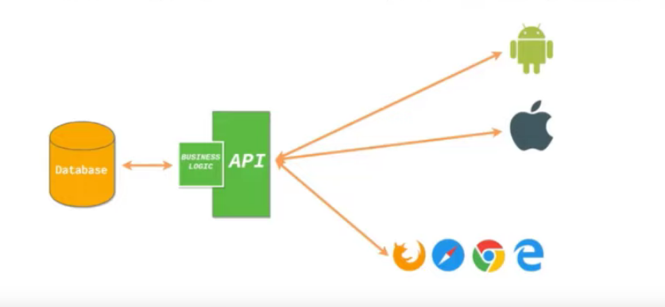

Las distintas partes de la app se comunican usando un formato, el más extendido es JSON (JavaScript object notation)

La manera de acceder a una API e interactuar con ella es usando los endpoints. Un endpoint es una URL que podemos usar para solicitar cierta información a la API o acceder a algún servicio.

### REST APIs vs RESTfull APIs

REST es un acrónimo de Representational State Transfer o transferencia de estado representacional, le agrega una capa muy delgada de complejidad y abstracción a HTTP. Mientras que HTTP es transferencia de archivos, REST se basa en la transferencia de recursos.

Una API RESTful es una API diseñada con los conceptos de REST:

Recurso: todo dentro de una API RESTful debe ser un recurso.
URI: los recursos en REST siempre se manipulan a partir de la URI, identificadores universales de recursos.
Acción: todas las peticiones a tu API RESTful deben estar asociadas a uno de los verbos de HTTP: GET para obtener un recurso, POST para escribir un recurso, PUT para modificar un recurso y DELETE para borrarlo.

REST es muy útil cuando:

Las interacciones son simples.
Los recursos de tu hardware son limitados.
No conviene cuando las interacciones son muy complejas.

REST means Representational State Transfer, define una arquitectura para crear WEB APIs usando el protocolo HTTP para la comunicación entre los diferentes componentes de la app. Para cumplir con esta arquitectura debe cumplir lo siguiente:

1. Los recursos deben ser accesibles vir URL endpoints
2. usar JSON o XML como formato de archivo
3. Stateless (una request no debe depender de ninguna otra request)
4. usar HTTP métodos para realizar acciones (GET,POST,PUT,DELETE, UPDATE)

La request tiene las siguientes partes:

1. A request line (describe la request para su implementación)
2. Request Header (contiene información adicional sobre el request)
3. Empty line (señales que la meta-info ha sido enviada)
4. Body (mensaje opcional)

La response tiene las siguientes partes:

1. Status line (contine el request status code, si la reuqest es exitosa o no)
2. Request Headers Fields (info adicional sobre la request)
3. Empty line (señales que la meta-info ha sido enviada)
4. Body (opcional)

algunos ejemplos de status code son:

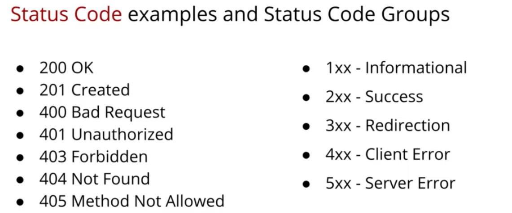

# Practicando algo de código

## Realizando requests con python

Crear el venv e instalar el modulo requests

```
pip install requests
```

Este módulo me permite hacer llamadas a URLs, el objeto devuelto es del tipo `<class 'requests.structures.CaseInsensitiveDict'>`. Este objeto tiene varios atributos (status_code,headers,el contenido del body que lo obtenemos con text)

```python
import requests

def main():
    response = requests.get('http://www.google.com')
    print(f'Status code {response.status_code}') # Status code 200
    print(f'Headers code {response.headers}') #
    print(f'type {type(response.headers)}') # type <class 'requests.structures.CaseInsensitiveDict'>
    print(f'content-type {response.headers["Content-type"]}') # content-type text/html; charset=ISO-8859-1
    print(f'object response {response.text}') # el contenido del body en este caso es contente-type text/html


if __name__ == "__main__":
    main()
```

Podemos usar este módulo para hacer llamadas a una API, para ello usaremos una API pública [JsonPlaceHolder](https://jsonplaceholder.typicode.com/guide/)

```python
import requests

def getJsonPlaceHolder():
    response = requests.get('https://jsonplaceholder.typicode.com/posts/1')

    if response.status_code not in [200,201]:
        print(f'status code: {response.status_code}' )
        raise Exception('there was an erro"')
    print(response.status_code)
    print(response.headers['Content-type'])

    data = response.json()

    print(f'Posts number 1:  {data}')

if __name__ == '__main__':
    getJsonPlaceHolder()
```

Podemos pasar parámetros a la URLs como https://jsonplaceholder.typicode.com/posts/1?param=1&param2=2 aunque hay una manera más elegante de hacer, mediante un diccionario

```python
payload = {'param1':'uno','param2':'dos',}

response = requests.get('https://jsonplaceholder.typicode.com/posts/1', params=payload )

```

# Config VSCode para debug

configurar vs code par que el debug ejecute en terminal. Poner esta configuración en la carpeta ".vscode-> launch.json" en la raíz del proyecto

```
{
    // Use IntelliSense para saber los atributos posibles.
    // Mantenga el puntero para ver las descripciones de los existentes atributos.
    // Para más información, visite: https://go.microsoft.com/fwlink/?linkid=830387
    "version": "0.2.0",
    "configurations": [
        {
            "name": "Python: Django",
            "type": "python",
            "request": "launch",
            "program": "${workspaceFolder}\\manage.py",
            "args": [
                "runserver"
            ],
            "django": true,
            "justMyCode": true
        },
        {
            "name": "Python: Django Shell",
            "type": "python",
            "request" : "launch",
            "program" : "${workspaceFolder}\\manage.py",
            "args": [
                "shell"
                ],
                "django": true,
                "justMyCode": true

        }
    ]
}
```
# Crear proyecto con Django

0. creo el directorio que contendrá el proyecto

1. dentro creamos un entorno virtual, con la versión de Python que desee, y lo activamos

```
python3.9 venv -m venv_

source venv_/bin/active
```

2. Inicializar repo de GIT

```
git init
```

3. Creo gitignore para excluir el virtual environment
4. Añado mi repo remoto en GITHUB

```
git remote add origin https://github.com/dmartin-projects/***
```

5. instalamos django

```
pip install django
```

6. iniciamos un proyecto de django

```
django-admin startproject nombre_proyecto .
```

con el punto al final sólo creará la carpeta nombre_proyecto y manage.py si no pusiera el punto se crea un nuevo directorio nombre_proyecto que contendrá a su vez otro directorio nombre_proyecto y el archivo manage.py

7. Creamos los directorios apps static templates

Para que el directorio apps funcione como un módulo y pueda ser llamado desde otras partes del proyecto hay que crear un archivo vacio `__init__.py`

8. Renombro el directorio nombre_proyecto a config
9. Sustituyo en el proyecto todas la referencias a nombre_proyecto por config
   La estructura debe ser la sieguiente


9. genero todas las tablas de la bbdd que usará django, ésta es del tipo sqlLite

```
python manage.py migrate
```

10. Creo un superuser para poder acceder a planel de control de django y a la bbdd

```
python manage.py createsuperuser
```

11. y arrancamos el servidor - http://127.0.0.1:8000/

```
python manage.py runserver
```

12. Para acceder al panel de admin - http://127.0.0.1:8000/admin

Y entramos con las credencialas del superuser creando anteriormente

Hasta aquí es lo básico, después para ir contruyendo el proyecto tendremos que ir creando las diferentes funcionalidades a modo de app dentro del directorio apps.

13. Para ello primero creamos con mkdir el directorio

```
mkdir apps/app_1
```

14.

```
python manage.py startapp app_1 apps/app_1
```

15. La registramos en el archivo de configuración settings.py del proyecto

```python
INSTALLED_APPS = [
    'django.contrib.admin',
    'django.contrib.auth',
    'django.contrib.contenttypes',
    'django.contrib.sessions',
    'django.contrib.messages',
    'django.contrib.staticfiles',
    # own apps
    'apps.app_1'
]
```

16. La estructura de la app creada es la siguiente


17. en el archivo apps.py de la aplicación ( proyecto/apps/app_1/apps.py)
    Tenemos que corregir el name.

```python
from django.apps import AppConfig


class SalesConfig(AppConfig):
    default_auto_field = 'django.db.models.BigAutoField'
    name = 'apps.sales'

```

18. En el archivo `models.py` generamos la lógica de la app(creamos una clase)
19. en el archivo `admin.py` es donde la registraremos esa clase para que funcione en nuestro royecto

```python
from django.contrib import admin

from .models import Url
# Register your models here.
admin.site.register(Url)
```

20. instalamos las librerías que necesitaremos para el proyecto

```
pip install xxx
```

21. generamos el archivo de `requirements.txt` para instalar el mismo entorno en otro lugar

```
pip freeze > requirements.txt
```

22. Para poder instalar estas librerias usando un archivo requirements.txt

```
pip install -r requirements.txt
```

23. en settings.py tenemos que añadir dónde django buscara ls static files y dónde guardará los archivos subidos por el user

```python
STATIC_URL = '/static/'
STATICFILES_DIRS = [
    os.path.join(BASE_DIR,'static')
]
MEDIA_URL= '/uploads/'
MEDIA_ROOT = os.path.join(BASE_DIR,'uploads')
```

24. Tenemos que añadir esta configuración al archivo de urls

```python
from django.contrib import admin
from django.urls import path

from django.conf import settings
from django.conf.urls.static import static

urlpatterns = [
    path('admin/', admin.site.urls),
]

urlpatterns+= static(settings.STATIC_URL,document_root=settings.STATIC_ROOT)
urlpatterns+= static(settings.MEDIA_URL,document_root=settings.MEDIA_ROOT)
```

## Buenas practicas django 

1. si tenemos que usar datos comprometidos, como passwords para la bbdd o  API keys podemos crear nuestras variables de entorno en el servidor (producción) o en un archivo .env en local (siempre debe ir en el mismo directorio dnd se encuentra settings.py). Sea como sea deberemos instalar el paquete `django-environ` que nos permitirá leer las variables de entorno del SSOO y tb podemos cargar un archivo .env si existiera.

En los archivos .env no poner nunca el valor de las variables entre comillas siempre NAME=David
Una ventaja de usar el paquete django-environ, es que podemos definir el tipo de dato de la variable por ej  `env.str('NAME')` or `env.bool('DEBUG')`

```python

# en settings.py


# environ init
environ.Env.read_env() # si hay archivo .env lo leerá y cargará las variables
env = environ.Env()
print(env.str('NAME')) 
```

2. Dividir el archivo settings.py en mínimo tres archivos, local.py, base.py, production.py y los guardamos en un directorio `settings` dentro del directorio `config`

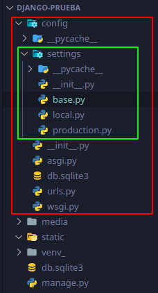

y borramos el archivo settings original

```python
# en base pondremos


import environ
from pathlib import Path

# Build paths inside the project like this: BASE_DIR / 'subdir'.
BASE_DIR = Path(__file__).resolve().parent.parent

# environ init
environ.Env.read_env()
env = environ.Env()
print(env.str('NAME'))
print(env.str('NAME2'))
  
 

# Quick-start development settings - unsuitable for production
# See https://docs.djangoproject.com/en/4.0/howto/deployment/checklist/

# SECURITY WARNING: keep the secret key used in production secret!
SECRET_KEY = 'django-insecure-xxxx'

# SECURITY WARNING: don't run with debug turned on in production!
DEBUG = True 

ALLOWED_HOSTS = []


# Application definition

BASE_APPS = [
    'django.contrib.admin',
    'django.contrib.auth',
    'django.contrib.contenttypes',
    'django.contrib.sessions',
    'django.contrib.messages',
    'django.contrib.staticfiles',
]

LOCAL_APPS = [
  'apps.miApp',
]
THIRD_APPS = [
  'rest_framework',
  
  ]

INSTALLED_APPS = BASE_APPS+LOCAL_APPS+THIRD_APPS


MIDDLEWARE = [
    'django.middleware.security.SecurityMiddleware',
    'django.contrib.sessions.middleware.SessionMiddleware',
    'django.middleware.common.CommonMiddleware',
    'django.middleware.csrf.CsrfViewMiddleware',
    'django.contrib.auth.middleware.AuthenticationMiddleware',
    'django.contrib.messages.middleware.MessageMiddleware',
    'django.middleware.clickjacking.XFrameOptionsMiddleware',
]

ROOT_URLCONF = 'config.urls'

TEMPLATES = [
    {
        'BACKEND': 'django.template.backends.django.DjangoTemplates',
        'DIRS': [],
        'APP_DIRS': True,
        'OPTIONS': {
            'context_processors': [
                'django.template.context_processors.debug',
                'django.template.context_processors.request',
                'django.contrib.auth.context_processors.auth',
                'django.contrib.messages.context_processors.messages',
            ],
        },
    },
]

WSGI_APPLICATION = 'config.wsgi.application'


# Password validation
# https://docs.djangoproject.com/en/4.0/ref/settings/#auth-password-validators
AUTH_PASSWORD_VALIDATORS = [
    {
        'NAME': 'django.contrib.auth.password_validation.UserAttributeSimilarityValidator',
    },
    {
        'NAME': 'django.contrib.auth.password_validation.MinimumLengthValidator',
    },
    {
        'NAME': 'django.contrib.auth.password_validation.CommonPasswordValidator',
    },
    {
        'NAME': 'django.contrib.auth.password_validation.NumericPasswordValidator',
    },
]


# Internationalization
# https://docs.djangoproject.com/en/4.0/topics/i18n/
LANGUAGE_CODE = 'en-us'
TIME_ZONE = 'UTC'
USE_I18N = True
USE_TZ = True
# Static files (CSS, JavaScript, Images)
# https://docs.djangoproject.com/en/4.0/howto/static-files/
STATIC_URL = 'static/'
DEFAULT_AUTO_FIELD = 'django.db.models.BigAutoField'
```


```python
# en local

from .base import *
import os

# SECURITY WARNING: don't run with debug turned on in production!
DEBUG = True 

ALLOWED_HOSTS = []

# Database
# https://docs.djangoproject.com/en/4.0/ref/settings/#databases

DATABASES = {
    'default': {
        'ENGINE': 'django.db.backends.sqlite3',
        'NAME': BASE_DIR / 'db.sqlite3',
    }
}

# Static files (CSS, JavaScript, Images)
# https://docs.djangoproject.com/en/4.0/howto/static-files/

STATIC_URL = '/static/'
STATICFILES_DIRS = (BASE_DIR, 'static')
MEDIA_URL = '/media/'
MEDIA_ROOT = os.path.join(BASE_DIR, 'media')
```

```python

# en producction

from .base import *
import os
# SECURITY WARNING: don't run with debug turned on in production!
DEBUG = True 

ALLOWED_HOSTS = []
# Database
# https://docs.djangoproject.com/en/4.0/ref/settings/#databases

DATABASES = {
    'default': {
        'ENGINE': 'django.db.backends.sqlite3',
        'NAME': BASE_DIR / 'db.sqlite3',
    }
}

# Static files (CSS, JavaScript, Images)
# https://docs.djangoproject.com/en/4.0/howto/static-files/

STATIC_URL = 'static/'
```

**Finalmente debemos cambiar algunos archivos como manage.py, wsgi.py y asgi.py**

```python
# en manage.py

def main():
    """Run administrative tasks."""
    os.environ.setdefault('DJANGO_SETTINGS_MODULE', 'config.settings.local')

# en wsgi.py
os.environ.setdefault('DJANGO_SETTINGS_MODULE', 'config.settings.local')

# en asgi.py
os.environ.setdefault('DJANGO_SETTINGS_MODULE', 'config.settings.local')
```

y ya estaría todo listo para arrancar el server.


A partir de aquí ya podemos empezar a desarrollar la lógica y las plantillas html.


# Crear una API con django

## Gestión de archvos staticos con django

por defecto django buscara archivos static (css, jspng,..) dentro del directorio de cada una de las apps que vayamos creando. También podremos guardar nuestros archivos html dentro de cada app. Para que esto funcione tiene que seguir una estructura.

```
nombre_app
         |
         static
              |
              nombre_app
                        |
                         -css
                         -js
```

si seguimos esa estructura podremos acceder directamente a los archivos static sin necesidad de especificar una ruta. Para ello ponemos al principio del archivo HTML ``. Luego accedemos a los archivos con:

```html
<link rel="stylesheet" href="" />
```

Pero lo recomendable es tener los archivos static fuera de las apps, concretamente en la raíz del proyecto para ello debemos especificar en settings.py dónde se encuentran. Para settear esta funcionalidad usamos `STATICFILES_DIRS`

```python

STATICFILES_DIRS = [
     os.path.join(BASE_DIR,'static')
]
```

una vez hecho esto debemos acceder a los archivos

```html
<link rel="stylesheet" href="" />
```

Tanto en desarrollo como en deploy el q tiene q estar sí o sí es `STATIC_URL`.

**STATIC_URL** is the URL location of static files located in
STATIC_ROOT

**STATICFILES_DIRS** tells Django where to look for static files in a Django project, such as a top-level static folder(additional location for static files)

**STATIC_ROOT** is the folder location of static files when collecstatic is run

**STATICFILES_STORAGE** is the file storage engine used when collecting static files with the collecstatic command.

En primer lugar crearemos una API usando django únicamente para después ver las diferencias al usar django rest framework

En primer lugar instalamos django y pillow

```
pip install django pillow
```

creamos un file requeriments.txt

```
pip freeze > requirements.txt
```

1. iniciamos un proyecto django

```
django-admin startproject onlineStore

```

esto crea esta estructura

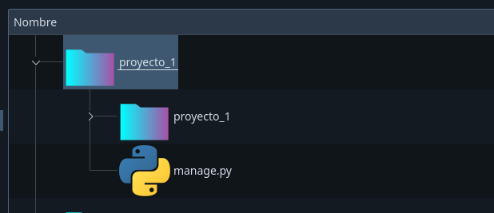

ahora bien puede ser que queramos crear directamente el proyecto dentro de un directorio para que no nos vuelva a repetir la carpeta el comando es

```
django-admin startproject onlineStore .

```

con el punto al final solo creará la carpeta proyecto_1 y manage.py

1. exportamos la bbdd

```
python manage.py migrate
```

con el comando migrate lo que hacemos es ejecutar todas las sentencias `sql` para generar un archivo tipo `.sqlite3` que contiene la bbdd, o podemos abrir con `dbeaver`

1. creamos el superuser para logearnos en el panel de django

```
python manage.py createsuperuser
```

4. corremos el servidor

```
python manage.py runserver
```

este server corre en `localhost:8000`

en `localhost:8000/admin` podemos entrar en el administrador de django con las credenciales del superuser creado anteriormente.

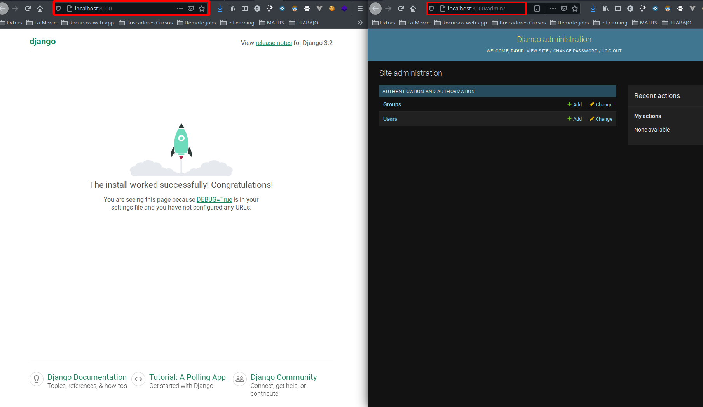

Hay una manera de correr el servidor más fácilmente que es en la sección debug de vsCode configurarlo para un proyecto django, esto nos creará un archivo launch.json para configurar dónde se encuentra el archivo manage.py y nos dará opciones de que comando ejecutar, podemos especificar q sea `runserver`

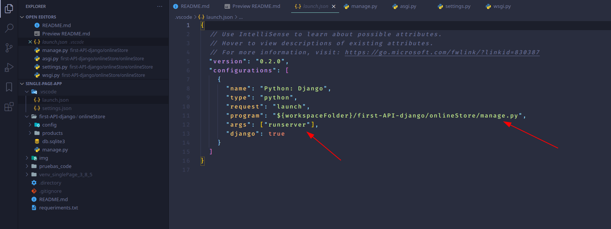

Ahora ya tenemos creado nuestro proyecto django a partir de aquí creamos todas aquellas aplicaciones que usarems en el proyecto, básicamnete los modelos(productos,users...)

Todas las django apps son pequeñas apps dentro de nuestro proyecto django. Cada una de estas apps pueden ser entendidas como objetos que jugaran un papel en nuestra app, cada una de estas apps genera una tabla en la bbdd.

Entre los archivos que contiene las apps tenemos el model.py que nos pemite definir que atributos tendrá ese objeto y métodos, posteriormente esos atributos se tranformaran en campos de la tabla en la bbdd y cada objeto creado será un regisro en la tabla.

1. Creamos app products

```
python manage.py startapp products
```

---

- TIP

Hasta aquí es lo habitual para crear un proyecto django. Cuando se crea el proyecto el asistente de django crea una carpeta, proyecto_1, la cual podemos cambiar el nombre sin más y dentro de ésta otra del mismo nombre proyecto_1 que es la que contiene los archivos de configuración.

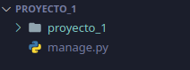
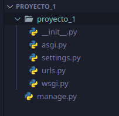

Para evitar confusiones podemos cambiar el nombre de la carpeta interna por otro, por ejemplo config. Si lo hacemos debemos entrar en el archivo de settings.py y en manage.py y cambiar en las rutas por el nombre nuevo.

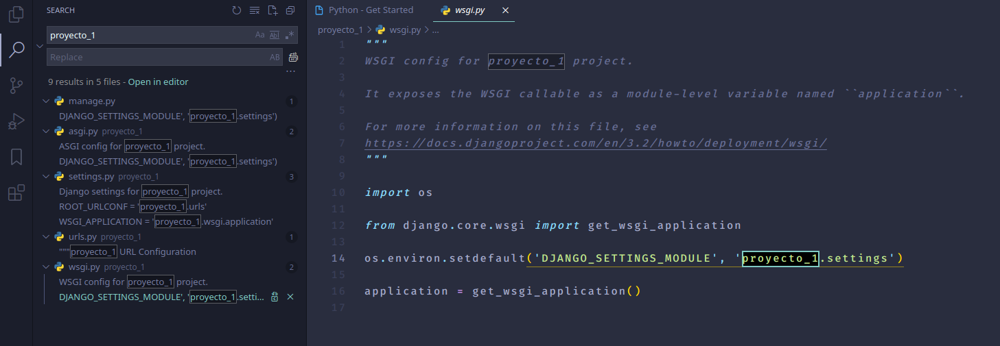

Una vez hecho esto vamos a crear diferentes apps dentro de nuestro proyecto, para que quede todo más ordenado podemos hacer un directorio apps y guardarlas allí. Para ello primero debemos crear el directorio apps y dentro directorios vacíos con el nombre de las apps.

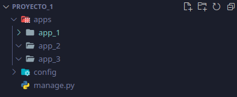

Ahora creamos las apps con django y le damos una ruta concreta, primero dando el nombre de la app y después el path.

```
python manage.py startapp app_1 apps/app_1
```

Ahora el directorio queda organizado de la siguiente manera

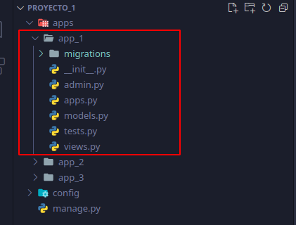

Para que django reconozca el directorio apps como un paquete y por tanto podamos importar el código a modo de módulos, hay que crear dentro un archivo `__init__.py` habitualmente este archivo puede estar vacío. Después para registrar estas apps en setting.py sería usando notaciónd e punto `apps.app_1`

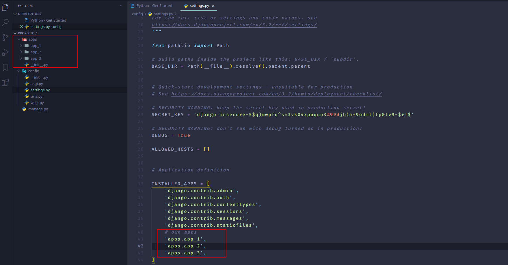

Finalmente hay que modificar el archivo `apps.py` de la app que menos creado y en el campo nombre añadir `app.nombreApp`

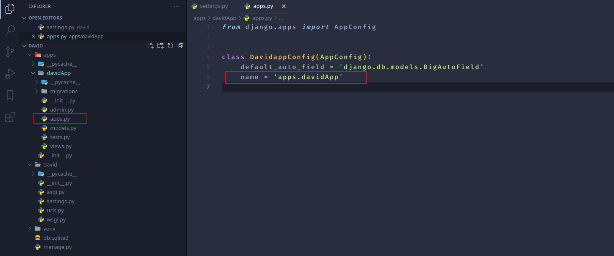

---

Creamos los modelos de esta app, necesitamos manufacturer y products
cuando creamos un product este tiene como FK (llave foranea) a Manufacturer

La diferencia entre textField y CharFIeld es que textFeld no tiene limitación de carcateres.

```python
from django.db import models

# Create your models here.

class Manufacturer(models.Model):
    name = models.CharField(max_length=255)
    location =models.CharField(max_length=255)
    active= models.BooleanField(default=True)

    def __str__(self):
        return self.name

class Product(models.Model):
    manufacturer = models.ForeignKey(Manufacturer,
                                    on_delete=models.CASCADE,
                                    related_name="products")
    name = models.CharField(max_length=255)
    description = models.TextField(blank=True, null=True)
    photo = models.ImageField(blank=True, null=True)
    price = models.FloatField()
    shipping_cost = models.FloatField()
    quantity = models.PositiveIntegerField()

    def __str_(self):
        return self.name
```

El atributo `related_name` nos permite hacer una query reversa, es decir desde una instancia de manufacturer sacar todos los products relacionados con esa instancia de manufacturer. **realmente crea un campo en el modelo de la foreigkey, con el nombre que le damos, en este caso products dentro de manufacturer**.

Para hacer la reversa tb lo podemos hacer en la clase que no tiene la foreign key añadimos el método:

```python
def get_items(self):
  return self.item_set.all()
# esto traerá todos los "item" objetos del otro modelo con el q está relacionado mi instancia.
```

Si no quisieramos crear este tipo de relación debemos especificarlo `related_name='+'`

Una vez hemos creado nuestros modelos en el apartado `INSTALLED_APPS` del archivo setting.py incluimos nuestro nueva app (products)

```python
INSTALLED_APPS = [
    'django.contrib.admin',
    'django.contrib.auth',
    'django.contrib.contenttypes',
    'django.contrib.sessions',
    'django.contrib.messages',
    'django.contrib.staticfiles',

    # our apps
    'products'
]
```

y actualizamos la bbdd mediante el comando

```
python manage.py makemigrations
python manage.py migrate
```

2. Creamos una vista para products

Una de las maneras más sencillas de crear vistas en django es utilizando los modulos `DetailViews y ListViews`

También creamos nuestras templates en formato html en un directorio templates dentro de la app products

En el archivo views.py de products

```python
# módulos para la creación de vistas
from django.views.generic.detail import DetailView
from django.views.generic.list import ListView

# importamos nuestro modelo
from .models import Products,Manufacturer

class ProductDetailView(DetailView):
    model = Products
    template_name = 'products/products_detail.html'

class ProductListView(ListView):
    model = Products
    template_name = 'products/products_list.html'
```

ahora creamos las templates

- product_detail.html

```html
<!DOCTYPE html>
<html lang="en">
  <head>
    <meta charset="UTF-8" />
    <meta http-equiv="X-UA-Compatible" content="IE=edge" />
    <meta name="viewport" content="width=device-width, initial-scale=1.0" />
    <title>{{object.name}}</title>
  </head>
  <body>
    <p>Product: {{object.name}}</p>
    <p>Manufacturar: {{object.manufacturer}}</p>
    <p>Quantity: {{object.quantity}}</p>
    <p>Description: {{object.description}}</p>
    <p>Price: {{object.price}}</p>
    <p>Shipping cost: {{object.shipping_cost}} €</p>

    
  </body>
</html>
```

- product_list.html

```html
<!DOCTYPE html>
<html lang="en">
  <head>
    <meta charset="UTF-8" />
    <meta http-equiv="X-UA-Compatible" content="IE=edge" />
    <meta name="viewport" content="width=device-width, initial-scale=1.0" />
    <title>Product list</title>
  </head>
  <body>
    
    <p>Product: {{product.name}}</p>
    <p>Manufacturar: {{product.manufacturer}}</p>
    <p>Price: {{product.price}}</p>
    
  </body>
</html>
```

3. ahora solo nos queda añadir la url, primero creamos un archivo `urls.py `dentro de products. Como la vista ProductDetail nos tiene que mandar un id de producto en la url le pasamos "/product/<int:pk>/", la vista productList se cargará como homePage por eso no especificamos nada

```python
from django.urls import path
from .views import ProductDetailView, ProductListView


urlpatterns = [
    path("", ProductListView.as_view(),name='product-list'),
    path("/product/<int:pk>/", ProductDetailView.as_view(),name='product-detail'),
]
```

Ahora tenemos que ir al urls.py del proyecto principal y añadir las urls de products

```python
from django.contrib import admin
from django.urls import path, include

urlpatterns = [
    path('admin/', admin.site.urls),
    path("",include('products.urls'))
]

```

Como vamos a usar media files cuando hemos especificado los campos en el modelo no hemos concretado dónde se iban a guardar los archivos tipo imagen tenemos que hacerlo en el
urls.py del proyecto (no el de la app), el destino se fijará para entorno de desarrollo es decir cuando ejecutemos el mode DEBUG del proyecto para ello hacemos:

Aunque hay q tener en cuenta que actualmente se suele usar servicios en la nube, firebase, aws..., para servir archivos estáticos.

```python
from django.contrib import admin
from django.urls import path, include

from django.conf.urls.static import static
from django.conf import settings

urlpatterns = [
    path('admin/', admin.site.urls),
    path("",include('products.urls')),

]

if settings.DEBUG:
    urlpatterns+= static(settings.MEDIA_URL, document_root=settings.MEDIA_ROOT)
```

Estamos haciendo referencia a dos variables no especificadas en el archivo settings MEDIA_URL y MEDIA_ROOT así que lo añadimos al final del archivo

los static files son los que necesita la app tipo js, css e imagenes
y los media files son los que subirán los usuarios de la app como avatares, csv, pdf,...

```python
import os

STATIC_URL = '/static/'

STATICFILES_DIRS = [
     os.path.join(BASE_DIR,'static')
]

MEDIA_ROOT= os.path.join(BASE_DIR,'uploads')
MEDIA_URL= "/media/"
```

recordemos que BASE_DIR es el absolute path de nuestro proyecto (/home/david/Programacion/PYTHON/Proyectos/django-reports-project/src)
la constante `__file__` da la ruta hasta el archivo dnd se encunetra **file**

**STATIC_URL**: Es la localización URL base desde la cual se servirán los archivos estáticos, por ejemplo en una CDN. Se usa para variables de plantilla estáticas a las que se acceden en nuestra plantilla base (ver Django Tutorial Part 5: Creating our home page).

**STATIC_ROOT**: Es la ruta absoluta a un directorio en el que la herramienta "collectstatic" de Django reunirá todos los archivos estáticos referenciados en nuestras plantillas. Una vez recopilados, podrán ser cargados como un grupo a donde hayan de ser alojados.

**STATICFILES_DIRS**: Relaciona directorios adicionales en los que la herramienta collestatic de Django debería buscar archivos estáticos.

<!-- **************************************** -->

1.  Una vez hecho esto tenemos que reflejarlo en el archivo urls.py añadiendo las url patterns

```python
from django.contrib import admin
from django.urls import path,include

from django.conf import settings
from django.conf.urls.static import static

urlpatterns = [
    path('admin/', admin.site.urls),
]
# extendemo la list


urlpatterns+= static(settings.STATIC_URL, document_root=settings.STATIC_ROOT)
urlpatterns+= static(settings.MEDIA_URL, document_root=settings.MEDIA_ROOT)
```

19. Escribimos nuestra template base.html

`` : permite cargar los archivos staticos guardados en la carpeta static y nos permte usar los archivos sin tener que poner la ruta

```html

<!DOCTYPE html>
<html lang="en">
  <head>
    <!-- Required meta tags -->
    <meta charset="utf-8" />
    <meta name="viewport" content="width=device-width, initial-scale=1" />

    <!-- favicon -->
    <link rel="shortcut icon" href="" />

    <!-- Bootstrap CSS -->
    <link
      href="https://cdn.jsdelivr.net/npm/bootstrap@5.0.0-beta2/dist/css/bootstrap.min.css"
      rel="stylesheet"
      integrity="sha384-BmbxuPwQa2lc/FVzBcNJ7UAyJxM6wuqIj61tLrc4wSX0szH/Ev+nYRRuWlolflfl"
      crossorigin="anonymous"
    />

    <!-- jquery -->
    <script src="https://code.jquery.com/jquery-3.3.1.min.js" defer></script>

    <!-- Dropzone js -->
    <link rel="stylesheet" href="" />
    <script src="" defer></script>
  </head>
</html>
```

Finalemte en el archivo admin.py de products, que nos permite crear una instancia de products dese el admin panel de Django,

```python
from django.contrib import admin

# Register your models here.

from .models import Products, Manufacturer

admin.site.register(Products)
admin.site.register(Manufacturer)
```

Hasta aquí lo que hemos hecho es recuperr la info de la bbdd y pintarla en pantalla mediante el sistema de templates de Django.

Para transformar esto en un API lo que tenemos que hacer es devolver esa info en un formato de datos, nosotros elegimos JSON. De tal manera que tendremos dos end-points uno que nos devolverá una lista de ptroductos y otro que nos devolverá el detalle de cada producto.

Entonces ya no nocesitaremos las vistas, la clase DetailView ni ListView del archivo views.py de products. En su defecto necesitaremos implementar una clase `JsonResponse` que nos permite transformar los datos que vienen de la bbdd en un formato JSON.

Serializar es el proceso de convertir el estado de un objeto (los datos que contiene en un momento concreto) en un formato que permita almacenar esa info o enviarla por internet. Este formato puede ser archivos de texto, binarios. JSON,..El proceso opuesto se conoce como deserialización

Para adptar nuestro poroyecto modificamos los archivos de products:

- views.py

```python
from .models import Product, Manufacturer
from django.http import JsonResponse

def productList(request):
    products = Product.objects.all()
    data = {"products": list(products.values())}# .values("pk","name")
    response = JsonResponse(data)
    return response
```

- urls

```python
from django.urls import path
from .views import productList

urlpatterns = [
    path('products/',productList,name="product-list"),
]

```

y normalmente cuando usamos una API la url del endpoint empieza por api/ así que modificamos el archivo urls.py del proyecto genral

```python
from django.contrib import admin
from django.urls import path, include

from django.conf import settings
from django.conf.urls.static import static

urlpatterns = [
    path('admin/', admin.site.urls),
    path("api/", include('apps.products.urls'))

]

urlpatterns+= static(settings.MEDIA_URL, document_root=settings.MEDIA_ROOT)
```

Creamos el segundo end-point, product-details

views.py, contendrá un response en caso que exista el id del producto con los detalles de éste y otra response en caso que el producto no exista. La respuesta de que no existe el recurso sigue una estructura básica:

1. status 404 (que informa al cliente que el recurso no existe)
2. un JSON con info legible con dos campos message y code

```python
def productList(request, pk):

    try:
        product = Product.objects.get(pk=pk)
        data = {"product":{
            "name"          : product.name,
            "manufacturer"  : product.manufacturer.name,
            "description"   : product.description,
            "photo"         : product.photo.url,
            "price"         : product.price,
            "shipping_cost" : product.shipping_cost,
            "quantity"      : product.quantity
        }}
        response = JsonResponse(data)
    except Product.DoesNotExist:
        response = JsonResponse({
            "error":{
                "code"      :404,
                "message"  : "product not found"
            }
        }, status=404)
    return response
```

ahora añadimos nuestra vista al urls.py

```python
from django.urls import path
from .views import productList,product_detail #ProductDetailView,ProductListView

urlpatterns = [
    path('products/',productList,name="product-list"),
    path('product/<int:pk>/',product_detail,name="product-detail"),

]
```

Creamos dos end-points más:

1. manufacturers/ para obteer todas las manufacturer activas
2. manufacturer/id/ para ver el detail de las manufacturer

```python
def manufacturer_list(request):
    manufacturer = Manufacturer.objects.filter(active=True)
    data = {"manufacturers": list(manufacturer.values())}# .values("pk","name")
    response = JsonResponse(data)
    return response

def manufacturer_detail(request, pk):
    try:
        manufacturer = Manufacturer.objects.get(pk=pk)
        data = {"manufacturer":{
            "name"          : manufacturer.name,
            "location"      : manufacturer.location,
            "active"        : manufacturer.active,
            "products"      : list(manufacturer.products.all().values())
        }}
        response = JsonResponse(data)
    except Manufacturer.DoesNotExist:
        response = JsonResponse({
            "error":{
                "code"      :404,
                "message"  : "manufacturer not found"
            }
        }, status=404)
    return response
```

```python
from django.urls import path
from .views import productList,product_detail, manufacturer_list, manufacturer_detail
urlpatterns = [
    path('products/',productList,name="product-list"),
    path('product/<int:pk>/',product_detail,name="product-detail"),

    path('manufacturers/',manufacturer_list,name="manufacturer_list"),
    path('manufacturer/<int:pk>/',manufacturer_detail,name="manufacturer_detail"),
]
```

# Django Rest Framework - DRF

## Que es DRF ?

Es un paquete de herramientas para construir una web API. Es un paquete de django que se instala usando pip.

## Primer DRF project - newsAPI -

1. Instalamos el paquete

```
pip install djangorestframework
```

2. Creamos un proyecto django newsAPI

para que tenga esta estructura

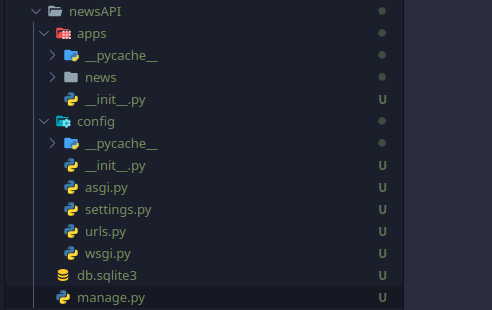

3. creamos los modelos para nuestra app news y lo registramos en admin.py

```python
from django.db import models

class Article(models.Model):
    author          = models.CharField(max_length=255)
    title           = models.CharField(max_length=255)
    description      = models.CharField(max_length=255)
    body            = models.TextField()
    location        = models.CharField(max_length=255)
    publication_date = models.DateField()
    active          = models.BooleanField(default=True)
    created_at      = models.DateField(auto_now_add=True) # da una fecha cuando se crea la instancia
    updated_at      = models.DateField(auto_now=True) # cada vez que se guarda un cambio en la instancia se actualiza la fecha
    # los campos que son auto_ no aparecen en el panel de admin al crear la instancia
    def __str__(self):
        return f'{self.title} - by - {self.author}'
```

### Serializer

Hasta aquí hemos empezado como un proyecto django normal.

Ahora implementaremos uno de los componentes más importantes que DRF introduce, Serializer. Para ello utilizaremos las clases Serializer y ModelSerializer.

Estas clases nos permitirán convertir datos complejos como querysets y model instances a Python data type el cual será fácilmente renderizado a un formato JSON.

Esas clases también proveen la deserialización, volver a convertir el JSON en data.

Para implementar esto empezamos crando dentro de nuestra app news un folder api que contiene el archivo serializers.py

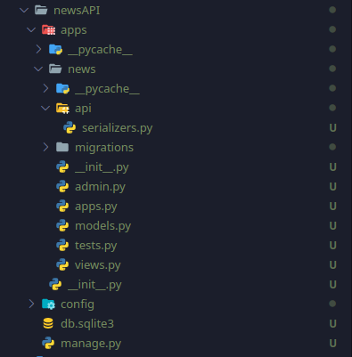

Creamos una clase `ArticleSerializer` con los campos del modelo `Article`que queremos serializar. Tenemos que poner exactamente el mismo nombre para que lo coja bien.

```python
from rest_framework import serializers
from apps.news.models import Article

class ArticleSerializer(serializers.Serializer):
    id                  = serializers.IntegerField(read_only=True)
    author              = serializers.CharField()
    title               = serializers.CharField()
    description         = serializers.CharField()
    body                = serializers.CharField()
    location            = serializers.CharField()
    publication_date    = serializers.DateField()
    active              = serializers.BooleanField()
    created_at          = serializers.DateTimeField(read_only=True)
    updated_at          = serializers.DateTimeField(read_only=True)

    def create(self, validated_data):
        print(validated_data)
        return Article.objects.create(**validated_data)

    def update(self, instance, validated_data):
        instance.author = validated_data.get('author', instance.author)
        instance.title = validated_data.get('title', instance.title)
        instance.description = validated_data.get('description', instance.description)
        instance.body = validated_data.get('body', instance.body)
        instance.location = validated_data.get('location', instance.location)
        instance.publication_date = validated_data.get('publication_date', instance.publication_date)
        instance.active = validated_data.get('active', instance.active)
        # obviamente no podemos modificar ni el id ni create_ar update_at xq los hemos puesto como read_only
        instance.save()
        return instance
```

Una vez creada nuestra clase serializer podemos probarla en el shell de django, para ello `python manage.py shell` una vez entramos en la consola:

```
>>> from apps.news.models import Article
>>> from apps.news.api.serializers import ArticleSerializer
>>> article_instance = Article.objects.first()
>>> type(article_instance)
<class 'apps.news.models.Article'>
>>> serializer = ArticleSerializer(article_instance)
>>> type(serializer)
<class 'apps.news.api.serializers.ArticleSerializer'>
>>>serializer
ArticleSerializer(<Article: title_1 - by - author_1>):
    id = IntegerField(read_only=True)
    author = CharField()
    title = CharField()
    description = CharField()
    body = CharField()
    location = CharField()
    publication_date = DateField()
    active = BooleanField()
    create_at = DateTimeField(read_only=True)
    updated_at = DateTimeField(read_only=True)

```

Con el atributo data mostramos los datos del objeto tipo serializer en formato dictionary.

```
>> serializer.data
{'id': 2, 'author': 'author_1', 'title': 'title_1', 'description': 'descriotion_1', 'body': 'wrgregerhehee54', 'location': 'spain', 'publication_date': '2021-05-24', 'active': True, 'updated_at': '2021-05-24T12:29:40.173576Z'}
```

para reconocer que es un data type de python podemos fijarnos en el bool que está escrito en mayúscula (True)

Ahora podemos renderizar este objeto serializer en un JSON para ello importamos el render JSONRender de DRF

```
>>> from rest_framework.renderers import JSONRenderer
>>> json = JSONRenderer().render(serializer.data)
>>> json
b'{"id":2,"author":"author_1","title":"title_1","description":"descriotion_1","body":"wrgregerhehee54","location":"spain","publication_date":"2021-05-24","active":true,"updated_at":"2021-05-24T12:29:40.173576Z"}'
```

vemos que los que devuelve el render() es un byte-string(por eso empieza b'...') y eso es pq el motivo de esto es eviar la respuesta como HTTP stream.

Ahora debemos deserializar el objeto. Para ello debemos parsear este byte-string en un python native data-type

```
>>> import io
>>> from rest_framework.parsers import JSONParser
>>> stream = io.BytesIO(json)
>>> data = JSONParser().parse(stream)
>>> data
{'id': 2, 'author': 'author_1', 'title': 'title_1', 'description': 'descriotion_1', 'body': 'wrgregerhehee54', 'location': 'spain', 'publication_date': '2021-05-24', 'active': True, 'updated_at': '2021-05-24T12:29:40.173576Z'}
>>> type(data)
<class 'dict'>
```

Volvemos a recuperar nuestro objeto de python en forma de dictionary pero lo queremos como instancia de Article.

```
>>> serializer = ArticleSerializer(data=data)
>>> serializer.is_valid()
True
>>> serializer.validated_data
OrderedDict([('author', 'author_1'), ('title', 'title_1'), ('description', 'descriotion_1'), ('body', 'wrgregerhehee54'), ('location', 'spain'), ('publication_date', datetime.date(2021, 5, 24)), ('active', True)])

>>> serializer.save()

{'author': 'author_1', 'title': 'title_1', 'description': 'descriotion_1', 'body': 'wrgregerhehee54', 'location': 'spain', 'publication_date': datetime.date(2021, 5, 24), 'active': True}
<Article: title_1 - by - author_1>

>>> Article.objects.all()
<QuerySet [
            <Article: title_1 - by - author_1>,
            <Article: title_1 - by - author_1>
        ]
>
```

Cuando hacemos save() lo convierte en tipo Article.

Cuando hacemos `Article.objects.all()` estamos usando el ORM de python.
Las consultas con este ORM nos devuelven un querySet que al final es una lista de objetos de un modelo determinado. Para poder ver esa lista
podemos utilizar el método `nuestra_queryset.values_list()`

### Creando una API view

Una vez sabemos usar serializer podemos crear nuestra primera API view. Para ello DRF nos provee de dos wrappers

1. api_view decorator, para trabajar con Function Bases API views
2. APIView class, para trabajar con class Bases API View

Esta API view nos permite visualizar, mediante un UI, los datos extraidos de la bbdd sin necesidad de usar programas externos como postman.

#### View_decorator

Para usar el api_view decorator, creamos dentro del directorio api un archivo views.py

```python
from rest_framework import status
from rest_framework.decorators import api_view
from rest_framework.response import Response

from apps.news.models import Article
from apps.news.api.serializers import ArticleSerializer

# 1º api view
@api_view(['GET', 'POST'])
def article_list_create_api_view(request):
    if request.method == 'GET':
        articles = Article.objects.filter(active=True)
        serializer = ArticleSerializer(articles, many=True)
        return Response(serializer.data)
    elif request.method == 'POST':
        serializer = ArticleSerializer(data=request.data)
        if serializer.is_valid():
            serializer.save()
            return Response(serializer.data, status= status.HTTP_201_CREATED)
        return Response(serializer.errors, status=status.HTTP_400_BAD_REQUEST)

# 2º api view
@api_view(['GET', 'PUT','DELETE'])
def article_detail_api_view(request,pk):
    try:
        article = Article.objects.get(pk=pk)

    except Article.DoesNotExist:
        return Response({"error":{
            "code":404,
            "message": "article not found"
        }}, status=status.HTTP_404_NOT_FOUND)

    if request.method == 'GET':
        print('************************************')
        print(type(article))
        serializer = ArticleSerializer(article)
        return Response(serializer.data)

    elif request.method == 'PUT':
        serializer = ArticleSerializer(article,data=request.data)
        if serializer.is_valid():
            serializer.save()
            return Response(serializer.data)
        return Response(serializer.errors, status=status.HTTP_400_BAD_REQUEST)
    elif request.method == 'DELETE':
        article.delete()
        return Response(status=status.HTTP_204_NO_CONTENT)

```

Cuando usamos el filter, lo q nos devuelve es un querySet que no es más que una lista con objetos del tipo del modelo. Si hacemos get nos devuelve directamente el objeto

```python
from django.urls import path
from apps.news.api.views import article_list_create_api_view,article_detail_api_view

urlpatterns= [
    path("articles/", article_list_create_api_view, name="article-list"),
    path("articles/<int:pk>", article_detail_api_view, name="article-detail")
]

```

Finalmente añadimos este urlpattern a urls del proyecto

```python
from django.contrib import admin
from django.urls import path, include

urlpatterns = [
    path('admin/', admin.site.urls),
    path('api/', include('apps.news.api.urls'))
]

```

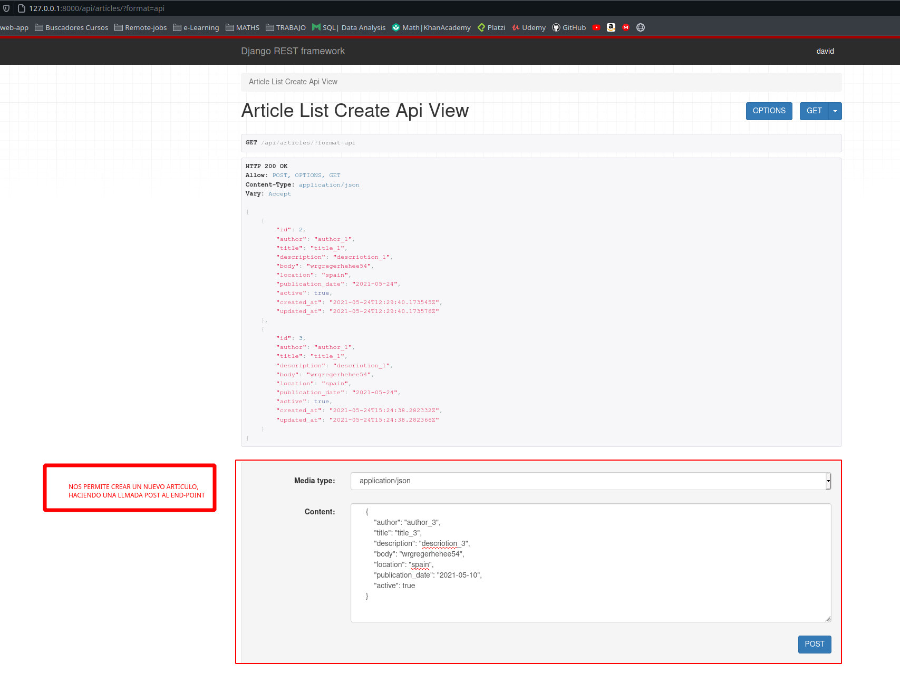

Si nos fijamos en el return usamos la clase Response() de DRF ésta me permite, renderizar la respuesta de manera automática, django escoge el método que más se ajuste, si es JSON usando el JSONResponse.

#### API view class

Creamos las clases necesarias en view.py

```python

from rest_framework import status
from rest_framework.response import Response

# imports for APIView class
from rest_framework.views import APIView
from rest_framework.generics import get_object_or_404

# import for APIVIew decorator
from rest_framework.decorators import api_view

from apps.news.models import Article
from apps.news.api.serializers import ArticleSerializer

# 1ª APIview Class

class ArticleListCreateAPIView (APIView):

    def get(self,request):
        articles = Article.objects.filter(active=True)
        serializer = ArticleSerializer(articles, many=True)
        return Response(serializer.data)

    def post(self,request):
        serializer = ArticleSerializer(data=request.data)
        if serializer.is_valid():
            serializer.save()
            return Response(serializer.data, status= status.HTTP_201_CREATED)
        return Response(serializer.errors, status=status.HTTP_400_BAD_REQUEST)


class ArticleDetailAPIView(APIView):

    def get_object(self,pk):
        article = get_object_or_404(Article, pk=pk)
        return article

    def get(self,request,pk):
        article = self.get_object(pk)
        serializer = ArticleSerializer(article)
        return Response(serializer.data)

    def put(self,request, pk):
        article = self.get_object(pk)
        serializer = ArticleSerializer(article,data=request.data)
        if serializer.is_valid():
            serializer.save()
            return Response(serializer.data)
        return Response(serializer.errors, status=status.HTTP_400_BAD_REQUEST)

    def delete(self,request,pk):
        article = self.get_object(pk)
        article.delete()
        return Response(status=status.HTTP_204_NO_CONTENT)
```

### Validation en DRF

Es importante comprobar con el método `is_valid()` que el proceso de serialización ha funcionado correctamente is los datos se han serializado bien.

Este proceso de validación lo podemos customizar y añadir un field-level validation y un object-level validation.

DRF ofrece varios built-in validators que nos permite validar desde fechas, usuarios,...

Para añadir validators propios podemos añadir un campo `slug` a nuestras clases o una subclass `class Meta` a nuestra clase `ArticleSerializer`.

También podemos añadir validadores en nuestros modelos importando la clase `MinValueValidator / MaxValueValidator` del módulo `django.core.validators`.Esto se ve en el segundo proyecto

En nuestro caso vamos a añadir una serie de métodos de validación a nuestra clase serializaer.

serializers.py

```python
from rest_framework import serializers
from apps.news.models import Article

class ArticleSerializer(serializers.Serializer):
    id                  = serializers.IntegerField(read_only=True)
    author              = serializers.CharField()
    title               = serializers.CharField()
    description         = serializers.CharField()
    body                = serializers.CharField()
    location            = serializers.CharField()
    publication_date    = serializers.DateField()
    active              = serializers.BooleanField()
    created_at          = serializers.DateTimeField(read_only=True)
    updated_at          = serializers.DateTimeField(read_only=True)

    def create(self, validated_data):
        print(validated_data)
        return Article.objects.create(**validated_data)

    def update(self, instance, validated_data):
        instance.author = validated_data.get('author', instance.author)
        instance.title = validated_data.get('title', instance.title)
        instance.description = validated_data.get('description', instance.description)
        instance.body = validated_data.get('body', instance.body)
        instance.location = validated_data.get('location', instance.location)
        instance.publication_date = validated_data.get('publication_date', instance.publication_date)
        instance.active = validated_data.get('active', instance.active)
        # obviamente no podemos modificar ni el id ni create_ar update_at xq los hemos puesto como read_only
        instance.save()
        return instance

    # object validation
    def validate(self,data):
        """ check that description and title are diferent """
        if data["title"] == data["description"]:
            raise serializers.ValidationError("Title and description must b different")
        return data
    # Field validation
    def validate_title(self,value):
        """ check that len(title) is large than 10 caracters """
        if len(value)< 10:
            raise serializers.ValidationError("Title is too short")
        return value
```

### model serializer class

Es una clase que nos permite crear serializers basados en los modelos que definimos. También crea automáticamnete los validators y los métodos de crear y actualizar.

```python
from rest_framework import serializers
from apps.news.models import Article

from datetime import datetime
from django.utils.timesince import timesince


# using ModelSerializer class

class ArticleSerializer(serializers.ModelSerializer):

    time_since_publication = serializers.SerializerMethodField()

    def get_time_since_publication(self,object):
        publication_date = object.publication_date
        now = datetime.now()
        time = timesince(publication_date, now)
        return time

    class Meta:
        model = Article
        exclude=("id",) # serializa todos los campos menos el id se le pasa una tuple
        #fields = "__all__" # all the fields of the model
        #fields = ("title","description", "body") # some fields

```

Utilizando `serializers.SerializerMethodField()` podemos crear campos nuevos que no aparecen en la bbdd, para ello creamos un método que empiece por get_NombreDelMethodField y en ese métdo generamos la lógica para devolver un dato.
Ahora nuestro article tiene estos campos:

```JSON
{
    "time_since_publication": "1 week, 3 days",
    "author": "author_1",
    "title": "title_1",
    "description": "descriotion_1 - UPDATED",
    "body": "wrgregerhehee54",
    "location": "spain",
    "publication_date": "2021-05-24",
    "active": true,
    "created_at": "2021-05-24T12:29:40.173545Z",
    "updated_at": "2021-05-30T11:40:37.709338Z"
}
```

Vamos a probar nuestro nuevo serializaer desde django shell

```
>>> from apps.news.api.serializers import ArticleSerializer
>>> articleSerializer = ArticleSerializer()
>>> print(repr(articleSerializer))
ArticleSerializer():
    time_since_publication = SerializerMethodField()
    author = CharField(max_length=255)
    title = CharField(max_length=255)
    description = CharField(max_length=255)
    body = CharField(style={'base_template': 'textarea.html'})
    location = CharField(max_length=255)
    publication_date = DateField()
    active = BooleanField(required=False)
    created_at = DateTimeField(read_only=True)
    updated_at = DateTimeField(read_only=True)
```

si usamos el método repr() nos el string del model de django. Podemos usar directamente `print(articleSerializer)`

Podemos añadir validaciones

```python
from rest_framework import serializers
from apps.news.models import Article

from datetime import datetime
from django.utils.timesince import timesince


# using ModelSerializer class

class ArticleSerializer(serializers.ModelSerializer):

    time_since_publication = serializers.SerializerMethodField()

    def get_time_since_publication(self,object):
        publication_date = object.publication_date
        now = datetime.now()
        time = timesince(publication_date, now)
        return time

    # object validation

    def validate(self,data):
        """ check that description and title are diferent """
        if data["title"] == data["description"]:
            raise serializers.ValidationError("Title and description must b different")
        return data
    # Field validation

    def validate_title(self,value):
        """ check that len(title) is large than 10 caracters """
        if len(value)< 10:
            raise serializers.ValidationError("Title is too short")
        return value

    class Meta:
        model = Article
        #exclude=("id",)
        fields = "__all__" # all the fields of the model
        #fields = ("title","description", "body") # some fields
```

### Nested relationship

Creamos un nuevo modelo, Journalist con una relación de one-to-many con articles. Las relaciones anidadas es cuando queremos dentro de un modelo, por ejemplo journalist, contiene otro modelo por ejemplo en un journalist tenemos un array de todos los articles q ha escrito, por lo tanto objetos del modelo article. Cuando mostramos la info de journalist queremos que tb aparezca todo los datos de los articles q ha escrito.

```python
from django.db import models


class Journalist(models.Model):
    first_name = models.CharField(max_length=60)
    last_name = models.CharField(max_length=60)
    biography = models.TextField(blank=True)

    def __str__ (self):
        return f'{self.first_name} {self.last_name}'


class Article(models.Model):
    #author          = models.CharField(max_length=255)
    author          = models.ForeignKey(Journalist, on_delete=models.CASCADE, related_name="articles")
    title           = models.CharField(max_length=255)
    description      = models.CharField(max_length=255)
    body            = models.TextField()
    location        = models.CharField(max_length=255)
    publication_date = models.DateField()
    active          = models.BooleanField(default=True)
    created_at      = models.DateTimeField(auto_now_add=True) # da una fecha cuando se crea la instancia
    updated_at      = models.DateTimeField(auto_now=True) # cada vez que se guarda un cambio en la instancia se actualiza la fecha
    # los campos que son auto_ no aparecen en el panel de admin al crear la instancia
    def __str__(self):
        return f'{self.title} - by - {self.author}'
```

Cuando accedemos a la api en el campo author nos da la primary del author

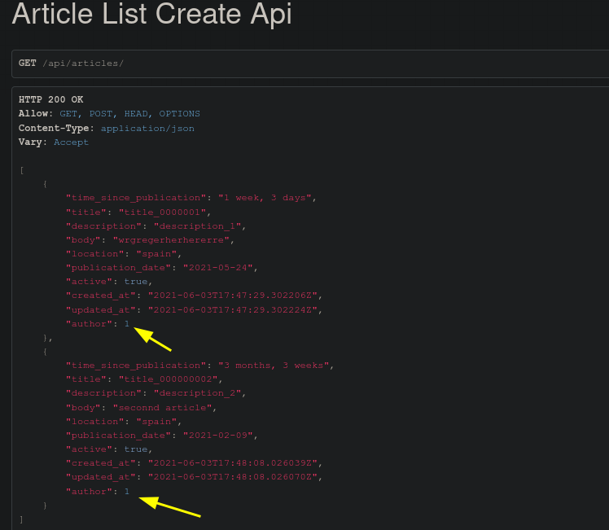

Si quisieramos mostrar los datos del author, por ejemplo el nombre en el serializer añadimos lo siguiente

```python

class ArticleSerializer(serializers.ModelSerializer):

    time_since_publication = serializers.SerializerMethodField()
    author = serializers.StringRelatedField()
    # code...
```

Para poder recuperar todos los datos del objeto relacionado con article, osea Journalist debemos crear un nuevo serializer.

```python
class JournalistSerializer (serializers.ModelSerializer):
    class Meta:
        model  = Journalist
        fields = "__all__"

class ArticleSerializer(serializers.ModelSerializer):

    time_since_publication = serializers.SerializerMethodField()
    author = JournalistSerializer()
# code....
```

ahora cuando cargamos los articles nos da todos los datos del author

```JSON
[
    {
        "id": 1,
        "time_since_publication": "1 week, 3 days",
        "author": {
            "id": 1,
            "first_name": "journalist_1",
            "last_name": "last_name_1",
            "biography": "first  journlaist"
        },
        "title": "title_0000001",
        "description": "description_1",
        "body": "wrgregerherhererre",
        "location": "spain",
        "publication_date": "2021-05-24",
        "active": true,
        "created_at": "2021-06-03T17:47:29.302206Z",
        "updated_at": "2021-06-03T17:47:29.302224Z"
    }
]
```

Esta aproximación tiene el problema que para crear un article debemos pasar todos los datos del author. Lo que haremos es crear el campo articles en JournalistSerializer y que cuando carguemos un journalist nos de todos los articles pero que para crear un journalist no sea necesario pasarle articles pq en el modelo originario de la bbdd no tiene ese campo.

```python
class JournalistSerializer (serializers.ModelSerializer):

    articles = ArticleSerializer(read_only=True, many=True)
    class Meta:
        model  = Journalist
        fields = "__all__"
```

Al poner read_only ese campo solo será usado como lectura, su hubieramos puesto eso mismo en author de Article no serviría como solución pq en la tabla articles author hace referencia a una foreign key por lo q es neceario en la creación del articulo así que la única solución es poner el campo articles en journalist.

#### Hyperlink related field

Otra manera de generar nested relationship es usando los un compo tipo `hyperlink related field` es un campo que nos permite tener un acceso directo a un end-point para obtener los datos de un recurso específico.

Para crear este hyperlink crearemos un campo en `JournalistSerializer` tipo `HyperlinkedRelatedField` y le pasamos como uno de los parámetros el nombre de la url que nos generará los datos.

```python

class JournalistSerializer (serializers.ModelSerializer):

    articles = serializers.HyperlinkedRelatedField(many=True,
                                                   read_only=True,view_name="article-detail")
    #articles = ArticleSerializer(read_only=True, many=True)
    class Meta:
        model  = Journalist
        fields = "__all__"
```

En el archivo views tenemos que retocar el get de Journalist

```python
class JournalistListCreateAPIView(APIView):
#CreateAPIView
    def get(self,request):
        journalist = Journalist.objects.all()
        serializer = JournalistSerializer(journalist,
                                          many=True,
                                          context={'request': request})
        return Response(serializer.data)
```

Ahora los datos que nos devuelve el end-point journalistlist tienen estee aspecto, en la list de articles nos da una url del endpoint para obtener los datos

```JSON

[
    {
        "id": 1,
        "articles": [
            "http://127.0.0.1:8000/api/articles/1",
            "http://127.0.0.1:8000/api/articles/2"
        ],
        "first_name": "journalist_1",
        "last_name": "last_name_1",
        "biography": "first  journlaist"
    },
    {
        "id": 2,
        "articles": [
            "http://127.0.0.1:8000/api/articles/3"
        ],
        "first_name": "journalist_2",
        "last_name": "last_name_2",
        "biography": "second  journlaist"
    }
]
```

## Segundo DRF project - ebooksAPI -

En este segundo proyecto se tratarán conceptos más avanzados de DRF.

Una vez creada la estructura básica del proyecto y hecho las odificaciones pertinentes creamos nuestros modelos.

### modelos

```python
from django.db import models
from django.core.validators import MinValueValidator, MaxValueValidator

# Create your models here.

class Ebook(models.Model):
    title               = models.CharField(max_length=250)
    author              = models.CharField(max_length=250)
    description         = models.TextField(max_length=250)
    publication_date    = models.DateField()

    def __str__(self):
        return self.title

class Review(models.Model):

    ebook           = models.ForeignKey(Ebook,
                                         on_delete=models.CASCADE,related_name='reviews')

    created_at      = models.DateTimeField(auto_now_add=True)
    updated_at      = models.DateTimeField(auto_now=True)
    review_author   = models.CharField(max_length=250, blank=True, null=True)
    review          = models.TextField(blank=True,null=True)
    rating          = models.PositiveIntegerField(validators=[
                                                        MinValueValidator(1),MaxValueValidator(5)
                                                        ])
    def __str__(self):
        return self.rating

```

Registramos los modelos

```python
from django.contrib import admin
from .models import Ebook,Review

# Register your models here.

admin.site.register(Ebook)
admin.site.register(Review)

```

### Serializers

Creamos los serializers

```python
from rest_framework import serializers
from apps.ebooks.models import Ebook,Review

class ReviewSerializer(serializers.ModelSerializer):
    class Meta:
        model   = Review
        fields  = "__all__"

class EbookSerializer(serializers.ModelSerializer):

    reviews = ReviewSerializer(many=True, read_only=True)
    class Meta:
        model   = Ebook
        fields  = "__all__"
```

Hasta aquí podemos montar las vitas, APIView class, y añadir las urls para tener los datos con una API-UI.

Introduciremos conceptos nuevos GenericAPIView y Mixins.

### GenericAPIView class and Mixins

GenericAPIView es una clase que extiende de APIView class vista en el primer proyecto pero que incorpora muchos métodos útiles. Como por ejemplo para crear un CRUD. Esta GenericAPIView class se usa amenudo con `Mixins` son clases que añaden funcionalidades extra a nuestras vistas.

Es importante notar que las Mixins classes proveen métodos, action methods, como list(), create() en lugar de tener que crear los métodos get() post() nosotros mismos como hicimos anteriormente con la clase APIView.

Creamos la vista para ebooks

```python
from rest_framework import generics
from rest_framework import mixins

from apps.ebooks.models import Ebook
from apps.ebooks.api.serializers import EbookSerializer

class EbookListCreateAPIView(mixins.ListModelMixin,
                            mixins.CreateModelMixin,
                            generics.GenericAPIView):

    # recuperamos todos los objetos del model ebook
    ebooks = Ebook.objects.all()
    serializer_class = EbookSerializer

    def get(self,request, *args, **kargs):
        return self.list(request,*args, **kargs )

    def post(self,request, *args, **kargs):
        return self.create(request,*args, **kargs )

```

estos son los datos que nos da la APIView

```JSON
{
    "id": 1,
    "reviews": [],
    "title": "title_1",
    "author": "author_1",
    "description": "some text",
    "publication_date": "2021-04-01"
}
```

como en Reviews hemos añadido un campo ebooks que es la foreignkey cn un atributo related_name='reviews'
`ebook = models.ForeignKey(Ebook, on_delete=models.CASCADE,related_name='reviews')`cuando nos muestra la info de ebooks nos da ese campo cn todas las reviews de ese libro, pero no se encuentra en la bbdd.

### Generic classes - Concrete View Classes

Cada Concrete View Classes extends GenericAPIView class y esos Mixins que ofrecen diferentes funcionalidades.
Por ejemplo la clase `ListCreateAPIView` extends de GenericAPIView class más mixins.ListModelMixin,mixins.CreateModelMixin

```python
from rest_framework import generics
from rest_framework import mixins

from apps.ebooks.models import Ebook
from apps.ebooks.api.serializers import EbookSerializer

# Usando concrete Generic class

class EbookListCreateAPIView(generics.ListCreateAPIView):
    queryset = Ebook.objects.all()
    serializer_class = EbookSerializer

class EbookDetailAPIView(generics.RetrieveUpdateDestroyAPIView):
    queryset = Ebook.objects.all()
    serializer_class = EbookSerializer

```

Estas clases necesitas dos atributos el `queryset` y `serializer_class`

Con soolo esas 4 líneas de código me crea un CRUD, ver una lista de todos los ebooks, crear uno nuevo, ver el detalle de uno en concreto, modificarlo o borrarlo

En el caso de la reviews la concrete class `CreateAPIView` que me genera una APIView para crear instancias de reviews pero en nuestro caso ésta está relacionada con un ebook, entonces podemos customeizar la clase. En realidad podriamos dejarla así:

```python
class ReviewCreateAPIView(generics.CreateAPIView):
    queryset = Review.objects.all()
    serializer_class = ReviewSerializer
#----------------------------------------------------------------------------
class ReviewDetailAPIView(generics.RetrieveUpdateDestroyAPIView):
    queryset = Review.objects.all()
    serializer_class = ReviewSerializer
```

añadir las urls

```python
urlpatterns= [
    path('ebooks/', EbookListCreateAPIView.as_view(), name="ebook-list"),
    path('ebooks/<int:pk>',EbookDetailAPIView.as_view(), name='ebook-detail' ),
    path('ebooks/<int:pk>/review/',ReviewCreateAPIView.as_view(), name='ebook-review' ),
    path('reviews/<int:pk>',ReviewDetailAPIView.as_view(), name='review-detail' ),
]
```

Si lo dejamos así podríamos crear una review pasando el id del ebook pero en el formulario de creación de la review me permite escoger a que libro asociar esa review.

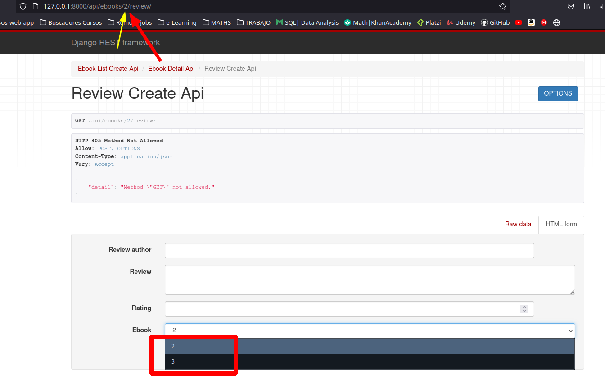

he modificado el modelo de ebook para que me diera la id, pero se ve cómo voy a escribir la review del ebook 2 y en cambio en el formulario tengo un campo para seleccionar a qué libro quiero asociar a review.

Para arreglar esto primero en ReviewSerializer excluyo el campo ebook para que no m lo muestre el formulario y así no poderlo escoger.

```python
class ReviewSerializer(serializers.ModelSerializer):
    class Meta:
        model   = Review
        #fields  = "__all__"
        exclude = ('ebook',)
```

y modificamos la clase ReviewCreateAPIView

```python
#----------------------------------------------------------------------------
# CreateAPIView, utiliza un mixins para crear el modelo (mixins.CreateModelMixin) éste contiene un método perform_create que lo q hace es un serializer.save(), como los datos que le llegan del formulario ahora le falta la foreingKey (ebook), pq la excluimos en ReviewSerializer tenemos que sobreescribir este método y recuperar la FK de la url y cuando llamamos a serializer.save() le pasamos el libro directamente, de este moddo no nos da error
class ReviewCreateAPIView(generics.CreateAPIView):
    queryset = Review.objects.all()
    serializer_class = ReviewSerializer

    def perform_create(self, serializer):

        ebook_pk= self.kwargs.get('pk')# la pk del ebook se la pasamos por la url
        ebook   = get_object_or_404(Ebook, pk=ebook_pk)
        serializer.save(ebook=ebook)

#----------------------------------------------------------------------------
```

### Permission systems

Django rest framework nos provee de una serie de clases de autenticación, podemos añadir diferentes permisos a cada una de las vistas que tenemos. Para añadir autenticaciones debemos hacerlo desde el archivo setting.py del proyecto, lo podemos añadir al final del archivo.

```python

REST_FRAMEWORK = {
    'DEFAULT_PERMISSION_CLASSES': (
        'rest_framework.permissions.IsAuthenticated',
    )
}
```

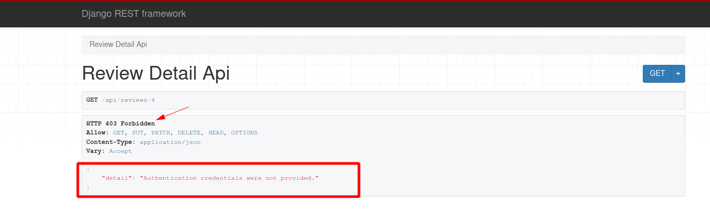

Alñadiendo esto bloquea todos los endpoints pq hemos etteado una política de privacidad global.

Podemos especificar otra clase como `IsAuthenticatedOrReadOnly` q nos permite leer la info pero no modificarla **UPDATE** or hacer un **POST**

```python
REST_FRAMEWORK = {
    'DEFAULT_PERMISSION_CLASSES': (
        'rest_framework.permissions.IsAuthenticatedOrReadOnly',
    )
}
```

Esto crea permisos globales para que cada vista tenga sus permisos vamos a views.py

```python
from rest_framework import permissions

class EbookListCreateAPIView(generics.ListCreateAPIView):
    queryset = Ebook.objects.all()
    serializer_class = EbookSerializer
    permission_classes = [permissions.IsAuthenticatedOrReadOnly]

```

Podemos crearnos un usuario standard en el panel admin

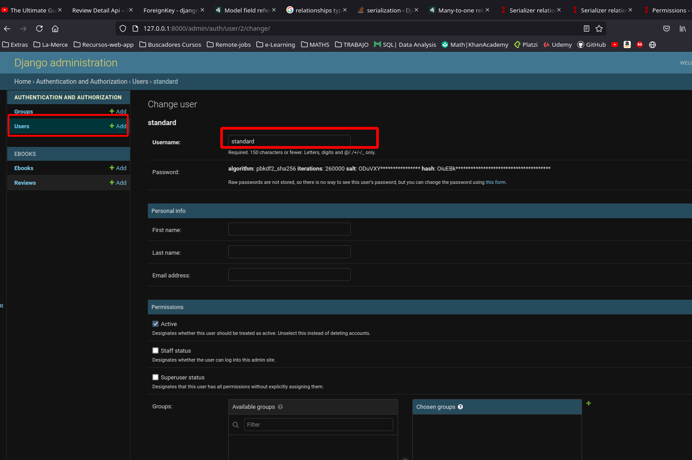

DRF nos crea un interfaz para loguearnos, para ello en el archivo urls del proyecto debemos añadir el siguiente url

```python
from django.contrib import admin
from django.urls import path, include

urlpatterns = [
    path('admin/', admin.site.urls),
    path('api/',include('apps.ebooks.api.urls')),
    path('api-auth/',include('rest_framework.urls')),

]
```

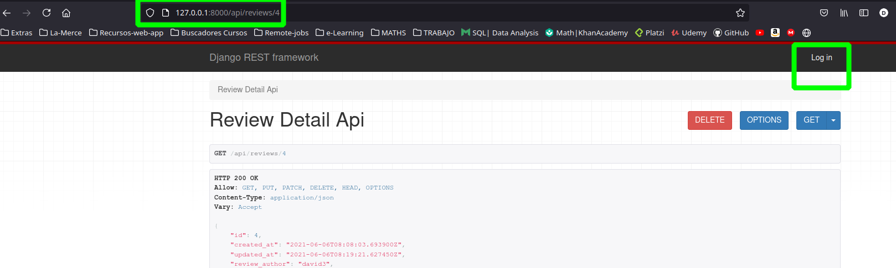

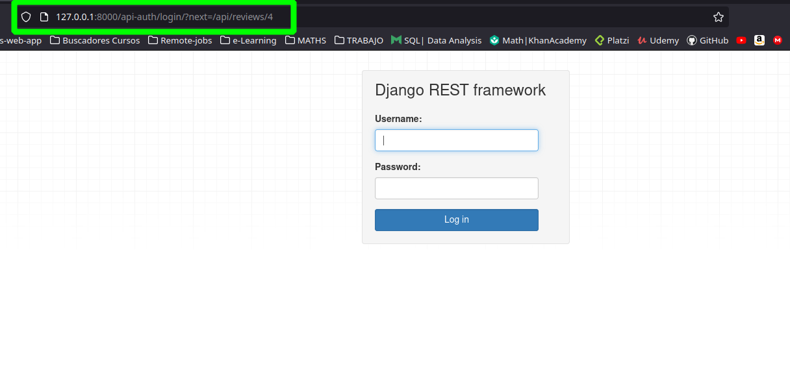

nos podems loguear con cualquier usuario creado.

Para gestionar los permisos creamos un archivo permissions.py en api

```python
from rest_framework import permissions

class IsAdminUserOrReadOnly(permissions.IsAdminUser):

    def has_permission(self,request,view):
        is_admin = super().has_permission(request,view)
        return request.method in permissions.SAFE_METHODS or is_admin
```

Si estás logeado como admin tienes privilegios pero si no solo puedes ejecutar métodos seguros(no cambian la bbdd)
SAFE_METHODS = GET HEAD OPTIONS, en ningún caso podemos cambiar el contenido de la bbdd

Una vez creado esta clase la incrporamos a nuestras vistas

```python
from apps.ebooks.api.permissions import IsAdminUserOrReadOnly

# Usando concrete Generic class

class EbookListCreateAPIView(generics.ListCreateAPIView):
    queryset = Ebook.objects.all()
    serializer_class = EbookSerializer
    permission_classes = [IsAdminUserOrReadOnly]

class EbookDetailAPIView(generics.RetrieveUpdateDestroyAPIView):
    queryset = Ebook.objects.all()
    serializer_class = EbookSerializer
    permission_classes = [IsAdminUserOrReadOnly]
```

#### Permisos para modificar reviews

Vamos a añadir permisos a los users creadores de reviews para que las puedan borrar o modificar.

Para ello vamos a modificar Review model para unirlo a User model usando una foreign key.

Primero borramos todas las reviews para no incurrir en errores.

```python
from django.contrib.auth.models import User

class Review(models.Model):

    ebook           = models.ForeignKey(Ebook,on_delete=models.CASCADE,related_name='reviews')
    review_author   = models.ForeignKey(User, on_delete=models.CASCADE)

    created_at      = models.DateTimeField(auto_now_add=True)
    updated_at      = models.DateTimeField(auto_now=True)
    review          = models.TextField(blank=True,null=True)
    rating          = models.PositiveIntegerField(validators=[MinValueValidator,MaxValueValidator])
    def __str__(self):
        return str(self.rating)

```

Despues de hacer esta modificción debemos exportar los cambios así q hacemos un `python manage.py makemigrations` pero nos saltará el siguiente error

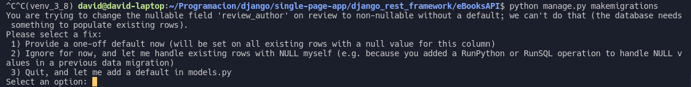

cogemos la primera opción, que nos dé un valor por defecto, y después le entramos ese valor `None`

Finalmente hacemos un `python manage.py migrate`

Ahora tenemos que modificar el serializer

```python

class ReviewSerializer(serializers.ModelSerializer):

    # como el nombre del autor vendrá en la request debemos indicarlo
    review_author = serializers.StringRelatedField(read_only=True)

    class Meta:
        model   = Review
        #fields  = "__all__"
        exclude = ('ebook',)
```

y lo indicamos en la review y añadimos un permission para que se pueda leer la api o modificar datos si estás autenticado

```python
class ReviewCreateAPIView(generics.CreateAPIView):
    queryset = Review.objects.all()
    serializer_class = ReviewSerializer
    permission_classes = [permissions.IsAuthenticatedOrReadOnly]

    def perform_create(self, serializer):

        ebook_pk= self.kwargs.get('pk')# la pk del ebook se la pasamos por la url
        ebook_recuperado   = get_object_or_404(Ebook, pk=ebook_pk)
        review_author  = self.request.user
        # ebook(nombre del campo q aparecerá en el formulario=ebook_recuperado
        serializer.save(ebook=ebook_recuperado, review_author = review_author)
```

Si lo dejamos así hay dos problemas....un mismo usuario puede añadir varias reviews y otro user puede modificar reviews de otro user.

```python
from rest_framework.exceptions import ValidationError
# CreateAPIView, utiliza un mixins para crear el modelo (mixins.CreateModelMixin) éste contiene un método perform_create que lo q hace es un serializer.save(), como los datos que le llegan del formulario ahora le falta la foreingKey (ebook), pq la excluimos en ReviewSerializer tenemos que sobreescribir este método y recuperar la FK de la url y cuando llamamos a serializer.save() le pasamos el libro directamente, de este moddo no nos da error
class ReviewCreateAPIView(generics.CreateAPIView):
    queryset = Review.objects.all()
    serializer_class = ReviewSerializer
    permission_classes = [permissions.IsAuthenticatedOrReadOnly]

    def perform_create(self, serializer):

        ebook_pk= self.kwargs.get('pk')# la pk del ebook se la pasamos por la url
        ebook_recuperado   = get_object_or_404(Ebook, pk=ebook_pk)
        review_author  = self.request.user
        # ebook(nombre del campo q aparecerá en el formulario=ebook_recuperado
        # comprobamos si hay una review previa de ese libro del mismo autor
        review_queryset = Review.objects.filter(ebook=ebook_recuperado, review_author=review_author)
        # si existe generaremos un error
        if review_queryset.exists():
            raise ValidationError("you have already reviewd this eBook")
        # si no existe el código continua y se graba
        serializer.save(ebook=ebook_recuperado, review_author = review_author)
```

Ahora cuando intentamos añadir otra review n el mismo ebook nos dará un error.

También tenemos que añadir restricciones para que un usuario no pueda modificar las reviews de otros users. Añadimos en el archivo permission
una nueva clase

```python
from rest_framework import permissions

class IsAdminUserOrReadOnly(permissions.IsAdminUser):

    def has_permission(self,request,view):
        is_admin = super().has_permission(request,view)
        return request.method in permissions.SAFE_METHODS or is_admin

class IsReviewAuthorOrReadOnly(permissions.BasePermission):

    def has_object_permission(self, request, view, obj):
        if request.method in permissions.SAFE_METHODS:
            return True
        return obj.review_author == request.user

```

y añadimos el permiso a la vista ReviewDetailAPIView

```python
class ReviewDetailAPIView(generics.RetrieveUpdateDestroyAPIView):
    queryset = Review.objects.all()
    serializer_class = ReviewSerializer
    permission_classes = [IsReviewAuthorOrReadOnly]

```

con este cambio ya no nos aparece el formulario para modificar la review para otros users

### Paginación

DRF nos ofrece una serie de clases que nos permiten generar diferentes
tipos de paginación. La más común es la que pasamos la página por la url.

La paginación como los permisos pueden establecerse de manera global en la app o a vistas concretas.
Para hacerlo de manera gobal basta con añadir el siguiente código en el setting.py del proyecto

```python
REST_FRAMEWORK = {
    'DEFAULT_PAGINATION_CLASS': 'rest_framework.pagination.LimitOffsetPagination',
    'PAGE_SIZE': 100 # podemos modificar el numero de items x pagina
}
```

#### Paginación por vistas

Añadimos en la carpeta api un archivo `pagination.py`

```python

from rest_framework.pagination import PageNumberPagination

class SmallSetPagination(PageNumberPagination):
    page_size = 3

```

Esta clase la importamos en las vistas y para usarla hay que definir una variable pagination_class

```python

from apps.ebooks.api.pagination import SmallSetPagination
class EbookListCreateAPIView(generics.ListCreateAPIView):
    queryset = Ebook.objects.all()
    serializer_class = EbookSerializer
    permission_classes = [IsAdminUserOrReadOnly]
    pagination_class    = SmallSetPagination
```

Una vez establecida la paginación es importante ordenar los items paara una correcta visualización
para ello añadimos order_by()

```python

class EbookListCreateAPIView(generics.ListCreateAPIView):
    queryset = Ebook.objects.all().order_by("-id")
    serializer_class = EbookSerializer
    permission_classes = [IsAdminUserOrReadOnly]
    pagination_class    = SmallSetPagination

```

Ponemos -id para que me lo ordene al revés...los últimos items añadidos se mostrarán primero

## Tercer DRF project - quotesAPI -

Proyecto resumen de todo lo que hemos hecho hasta ahora

## Cuarto DRF project - UserProfileAPI -

En este proyecto crearemos una app que me permitirá crear perfiles
de usuario. Usaremos `signals`un módulo de django que permite crear
senders para notificar a los receivers que alguna acción se ha producido.

senders y receivers son decorators

Usaremos signals para notificar al objeto User que se ha creado una instancia
de Profile.

Como vamos a getsionar fotos para los users debenos setear el url y el path donde
se encontrarán estos archivos. Para ello en el archiv setings.py del proyecto

```python
MEDIA_URL = '/media/'
MEDIA_ROOT = 'uploads'
```

Tenemos que añadir estas direcciones al archivo ulrs-py del proyecto

```python
from django.conf.urls.static import static
from django.conf import settings

urlpatterns += static(settings.MEDIA_URL,document_root=settings.MEDIA_ROOT)

```

### Extender la funcionalidad del Django User model

Crearemos un modelo que extenderá al objeto User integrado en DRF
esto nos permitirá potenciar ese modelo y q users puedan tener una avatar, una
biografía,etc

Crearemos un segundo modelo que será ProfileStatus model.

Usaremos el Django User model para autenticarnos

- Models:

```python

from django.db import models
#importamos Django User model
from django.contrib.auth.models import User

class Profile(models.Model):
    # queremos que un único user tenga acceso a un único Profile por eso one OneToOneField
    user    = models.OneToOneField(User,on_delete=models.CASCADE)

    bio     = models.CharField(   max_length=255,blank=True)
    city    = models.CharField(   max_length=255,blank=True)
    avatar  = models.ImageField(       null=True,blank=True)

    def __str__(self):
        return self.user.username

class ProfileStatus(models.Model):
    user_profile    = models.ForeignKey(Profile,on_delete=models.CASCADE)
    status_content  = models.CharField(max_length=255)
    created_at      = models.DateTimeField(auto_now_add=True)
    updated_at      = models.DateTimeField(auto_now=True)

    def __str__(self):
        return str(self.user_profile)

```

regisramos los modelos

```python
from django.contrib.admin.sites import site
from apps.profiles.models import Profile,ProfileStatus

admin.site.register(Profile)
admin.site.register(ProfileStatus)
```

Cuando django hace el registro para el panel admin utiliza el plural y para ello
simplemente añade una `s` en algunos casos como ProfileStatus el plural es `es` así que
para modifar esto hay que añadir una clase `Meta` en el modelo.

```python
class ProfileStatus(models.Model):
    user_profile    = models.ForeignKey(Profile,on_delete=models.CASCADE)
    status_content  = models.CharField(max_length=255)
    created_at      = models.DateTimeField(auto_now_add=True)
    updated_at      = models.DateTimeField(auto_now=True)

    class Meta:
        verbose_name_plural = "statuses"

    def __str__(self):
        return str(self.user_profile)
```

Ahora vemos como en el admin panel nos pone el plural que le indicamos

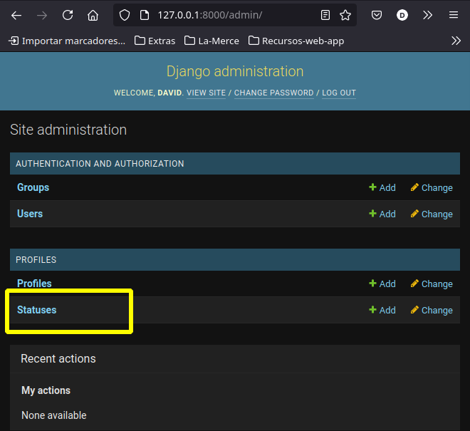

### Añadir Signals al proyecto

Cualquier cambio que se de en la app será notificado gracias a signals.

Crearemos un archivo `signals.py` en la app que nos interesan las notificaciones

Crearemos una notificación de tal manera que User será el sender y el receptor
será una función que crearemos. Cada vez que se cree un nuevo User o uno existente sea modificado
se generará una notificación.

```python
from django.contrib.auth.models import User
from django.db.models.signals import post_save
from django.dispatch import receiver
from apps.profiles.models import Profile

@receiver(post_save,sender=User)
def create_profile(sender,instance,created,**kwargs):
    print(f'Created: {created}')
    # si se ha creado una instancia nueva se genera un nuevo profile
    if created:
        Profile.objects.create(user=instance)
```

Creamos una función que será el receptor y el sender será User, de tal manera que
cuando se hace la función de guardar un user se dispara la función pero esta evalua si
se ha creado una instancia nueva de user o es un update, si se ha creado un user nuevo
la función creará una nueva instancia de profile, que está asociado al user y el resto de campos
en blanco.

Tenemos que añadir lo siguiente en el archivo `__init__.py`de la app profile

```python
default_app_config= "apps.profiles.apps.ProfilesConfig"
```

y añadir en el archivo `apps.py` de apps.profiles lo siguiente:

```python
from django.apps import AppConfig


class ProfilesConfig(AppConfig):
    default_auto_field = 'django.db.models.BigAutoField'
    name = 'apps.profiles'

    def ready(self):
        import apps.profiles.signals
```

Ahora cuando creamos un nuevo user automáticamnete se crea un nuevo profile asociado a ese user.

### Serializers

Hacemos una carpeta api y dentro el archivo serializers.py

En el ProfileSerializer especificamos que tando el campo user como el avatar serán de solo lectura. Eso es pq
haremos un serializer específico con un end-point para modificar el avatar

```python
from rest_framework import serializers
from apps.profiles.models import Profile,ProfileStatus

class ProfileSerializer(serializers.ModelSerializer):

    user    = serializers.StringRelatedField(read_only=True)
    avatar  = serializers.ImageField(read_only=True)

    class Meta:
        model   = Profile
        fields  = '__all__'

class ProfileAvatarSerializer(serializers.ModelSerializer):

    class Meta:
        model   = Profile
        fields  = ('avatar',)

class ProfileStatusSerializer(serializers.ModelSerializer):

    user_profile = serializers.StringRelatedField(read_only=True)
    class Meta:
        model   = ProfileStatus
        fields  = '__all__'
```

### Autentication in DRF

La autenticación es un sistema que nos permite asociar la request entrante con una serie de credenciales de
identificación. Obteniendo así información crítica como el usuario que envia la petición.

Hasta ahora hemos usado el sistema de permisos para poder permitir el acceso o no a ciertos funcionalidades, este sistema
se basa en el tipo de usuario, si es admin, basic user,...

Es importante diferenciar authentication y permissions.
Authentication siempre se activa al principio de cada vista, antes de que se checkee la autorización y antes que cualquier código sea ejecutado.

La authentication por si mismo no permito o bloquea la request entrante, simplemente identifica las credenciales con las que se hizo la request.

DRF nos provee de diferentes sistemas de autehntication.
Existe un standard de autenticación llamado `JWT (JSON Web Tokens)` que se puede implementar fácilmente en DRF utilizando third party packages.

#### sistemas de autenticación

##### Basic authentication

Es el sistema más primitivo y menos seguro de autenticación suministrado por DRF.
El ciclo de request/response es el siguiente:

1. El cliente hace la peti HTTP al server
2. El server responde con response HTTP 401 que contiene `www-Authenticate header`explicando como autenticarse
3. el cliente envia las auth credentials en base 64 con el authorization header(las credentials no están encriptadas)
4. el servidor evalua las credenciales de acceso y responde con un 200 o 403

##### Token authentication

Este es el sistema ideal para smartphones y desktop clientes.

El ciclo de request/response es el siguiente:

1. El cliente envia su credenciales de autenticación desde el principio
2. el servidor comprueba las credenciales y si son válidas crea un `exclusive signed token` tipo string que es devuelto al cliente
   como response.
3. El cliente envía su token en el `authorization header` en cada request subsiguiente
4. el server comprueba el token y si es valido permite que la request se procese.

Este sistema es usado en single page application como react o vueJS

En muchos casos este token se guarda en una cookie o en el localstorage del navegador.
Aunque es muy peligroso guardarlo en el localstorage del navegador pq es fácilmente accesible a
ataques tipo XSS.

Usar a `httpOnly cookie` es mucho más recomendable xq esta cookie no es accesible por JavaScript.

##### Session authentication

Es el sistema recomendado por DRF para el proceso de autenticación.

Las sessiones es el sistema más seguro y más apropiado para clientes q usen AJAX que se están ejecutando en el mismo contexto que
tu website. Usa una combinación de sessions y cookies.

El ciclo de request/response es el siguiente:

1. User envia sus credenciales normalmente usando un login form
2. el server comprueba si son correctas y responde creando un `object session`que se guardará en la bbdd enviando de vuelta
   al cliente un session ID
3. El session ID se guarda en una cookie en el navegador y formará parte de todas las request enviadas al server el cual comprobará esa ID cada vez
4. cuando el cliente cierra la sesión la cookie con la session ID es eliminada y tb lo es en la bbdd. En la siguiente log in se creará otra nueva

Si la autenticación via session es exitosa DRF creará para nosotros un user object el cual es accesible via `request.user`
Para request no autenticadas se crea una instancia tipo AnonymousUser.

Una vez establecida la session autentication DRF solicitará para cada request con un método HTTP unsafe (PUT,PATCH,POST,DELETE) un
CSRF token (Cross-site Request Forgery) que deberá ser enviado junto a la petición.

##### JSON Web Tokens - JWT

JWT es un nuevo standard que puede ser usado en una autenticación basad en tokens.

La principal diferencia respecto a otros token-based standard es q JWT no requiere validación con la bbdd.

JWT se puede usar fácilmente en DRF potenciando REST-API usando el paquete django-rest-framework-simplejwt, instalable por pip.

### Implementando Django-REST-Auth package

Este paquete nos permitirá crear unos end-points para el registro y la autenticación de usuers.

Gracias a estos end-points los clientes de android y iOS se podrán comunicar con los servicios de nuestra web app via REST.

En primer lugar añadimos a setting.py

```python

REST_FRAMEWORK = {
    'DEFAULT_AUTHENTICATION_CLASSES': [
        'rest_framework.authentication.SessionAuthentication',
        'rest_framework.authentication.TokenAuthentication',
    ]
}
```

de este modo tenemos el proyecto para funcionar con sessions y con token authentication

tenemos que registrarlo en installer_apps

```python
INSTALLED_APPS = [
    'django.contrib.admin',
    'django.contrib.auth',
    'django.contrib.contenttypes',
    'django.contrib.sessions',
    'django.contrib.messages',
    'django.contrib.staticfiles',
    # own apps
    'rest_framework',
    'apps.profiles',
    # auth
    'rest_framework.authtoken'
]
```

Esto nos permitirá grabar los tokens en la bbdd, por lo que debemos hacer un `migrate`

si vemos el admin panel ya nos aparece tokens

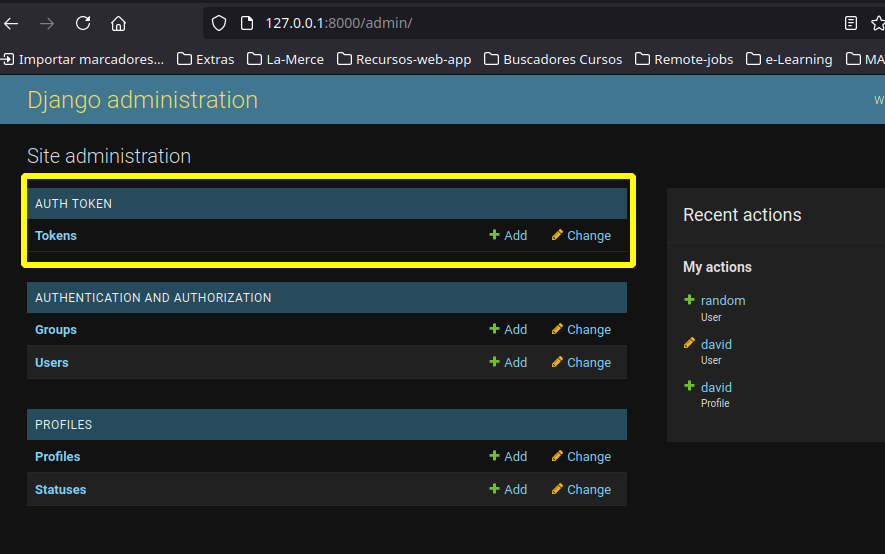

Ahora necesitamos instalar Django-REST-Auth

```shell
pip install django-rest-auth
```

Instalamos tb el modulo request

```shell
pip install requests
```

añadimos los nuevos módulos al urls.py del proyecto

```python
from django.contrib import admin
from django.urls import path,include
from django.conf.urls.static import static
from django.conf import settings


urlpatterns = [
    path('admin/', admin.site.urls),
    path('api-auth/',include('rest_framework.urls')),
    path('api/rest-auth/',include('rest_auth.urls'))
]

urlpatterns += static(settings.MEDIA_URL,document_root=settings.MEDIA_ROOT)

```

y en setting.py en installed_app

```python
INSTALLED_APPS = [
    'django.contrib.admin',
    'django.contrib.auth',
    'django.contrib.contenttypes',
    'django.contrib.sessions',
    'django.contrib.messages',
    'django.contrib.staticfiles',
    # own apps
    'rest_framework',
    'apps.profiles',
    # auth
    'rest_framework.authtoken',
    'rest_auth'

]
```

Podemos crear vistas para el login form que están incluidas en el DRF, pero en su lugar vamos a crear
nosotros una vista(cliente) que envie las credenciales para conectarse a la API, utilizando el módulo requests

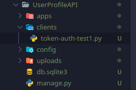

El cliente simplemente es una función q hace una petición a un end-point de login

```python
import requests

def client():
    credentials = {"username":"david", "password":"david"}
    response    = requests.post("http://127.0.0.1:8000/api/rest-auth/login/",data=credentials)

    print(f'status code {response.status_code}')
    response_data  = response.json()
    print(response_data)

if __name__ == "__main__":
    client()
```

Tenemos que ejecutar el script `python client-test.py`esta request me devuelve un token

```javaScript
status code 200
{'key': '204928f97af370db90492b848d7f476e531c5f07'}
```

este token se ha guardado en la bbdd y en cada petición a la API usará este token.

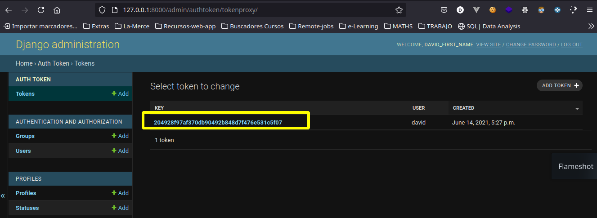

Vamos a crear unas vistas solo disponibles para usuarios autenticados.

Dentro del directorio API creamos view.py

```python
from rest_framework import generics, serializers
from rest_framework.permissions import IsAuthenticated
from apps.profiles.models import Profile
from apps.profiles.api.serializers import ProfileSerializer

class ProfileList(generics.ListAPIView):
    queryset            = Profile.objects.all()
    serializer_class    = ProfileSerializer
    permission_classes  = [IsAuthenticated]

```

y creamos urls.py

```python
from django.urls import path
from apps.profiles.api.views import ProfileList

urlpaterns = [
    path('profiles/',ProfileList.as_view(),name='profile-list')
]
```

añadimos estas urls en el archivo urls.py del proyecto

```python

from django.contrib import admin
from django.urls import path,include
from django.conf.urls.static import static
from django.conf import settings


urlpatterns = [
    path('admin/', admin.site.urls),
    path('api/',include('apps.profiles.api.urls')),
    path('api-auth/',include('rest_framework.urls')),
    path('api/rest-auth/',include('rest_auth.urls'))
]

urlpatterns += static(settings.MEDIA_URL,document_root=settings.MEDIA_ROOT)

```

Podemos crear un nuevo cliente para hacer la llamada al end-point profiles sin usar credentials

```python
import requests

def client():

    response    = requests.get("http://127.0.0.1:8000/api/profiles/")


    print(f'status code {response.status_code}')
    response_data  = response.json()
    print(response_data)


if __name__ == "__main__":
    client()
```

si lo dejamos así sin pasarle el token nos da el siguiente mensaje

```js
status code 403
{'detail': 'Authentication credentials were not provided.'}
```

podemos pasar a la request el token que tenemos guardado en la bbdd

```python

import requests

def client():

   token_header = 'Token 204928f97af370db90492b848d7f476e531c5f07'

   headers     = {'Authorization':token_header}

   response    = requests.get("http://127.0.0.1:8000/api/profiles/",headers=headers)


   print(f'status code {response.status_code}')
   response_data  = response.json()
   print(response_data)

if __name__ == "__main__":
   client()
```

```js

status code 200

[{'id': 1, 'user': 'david', 'avatar': 'http://127.0.0.1:8000/media/avatar_USER.png', 'bio': 'administrator', 'city': 'Barcelona'}, {'id': 2, 'user': 'random', 'avatar': None, 'bio': '', 'city': ''}]
```

Nos devuelve los usuarios que tenemos en la bbdd

#### Set up de los end-point del registro de users

Vamos a instalar un nuevo modulo como dependencia del paqueta `django-auth`.

```shell
pip install django-allauth
```

Una vez instalado el madulo lo tenemos que registrar en installed apps

```python
INSTALLED_APPS = [
    'django.contrib.admin',
    'django.contrib.auth',
    'django.contrib.contenttypes',
    'django.contrib.sessions',
    'django.contrib.messages',
    'django.contrib.staticfiles',
    'django.contrib.sites',
    # frameworks
    'rest_framework',
    'rest_framework.authtoken',
    # auth
    'rest_auth',
    'rest_auth.registration',

    'allauth',
    'allauth.account',
    'allauth.socialaccount',

    # own apps
    'apps.profiles',
]

```

tenemos que registrar estos tres pq allauth es un paquete muy potente que incluso nos permite
loguearnos usando cuentas de redes sociales.

y al final del archivo añadimos

```python

SITE_ID = 1

ACCOUNT_EMAIL_VERIFICATION   =   'none'
ACCOUNT_EMAIL_REQUIRED      = (True)

```

Una vez hemos añadido todos esas configuraciones tenemos que hacer un makemigrations y migrate.
Ahora en el panel admin nos aparecerá lo siguiente

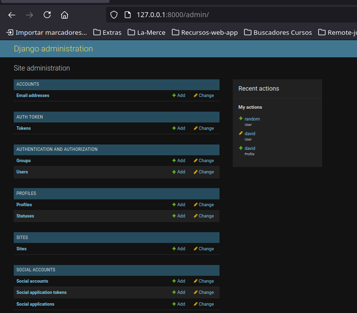

Finalmente tenemos que incluir los nuevos end-points

```python
from django.contrib import admin
from django.urls import path,include
from django.conf.urls.static import static
from django.conf import settings


urlpatterns = [
    path('admin/', admin.site.urls),
    path('api/',include('apps.profiles.api.urls')),
    path('api-auth/',include('rest_framework.urls')),
    path('api/rest-auth/',include('rest_auth.urls')),
    path('api/rest-auth/registration/',include('rest_auth.registration.urls')),
]

urlpatterns += static(settings.MEDIA_URL,document_root=settings.MEDIA_ROOT)

```

Creamos un nuevo client para probar el end-point de registro

```python
import requests

def client():
    data = {"username"  : "resttest",
            "email"     : "test@rest.com",
            "password1" : "changeme123",
            "password2" : "changeme123"
            }
    response    = requests.post("http://127.0.0.1:8000/api/rest-auth/registration/",data=data)

    print(f'status code {response.status_code}')
    response_data  = response.json()
    print(response_data)

if __name__ == "__main__":
    client()
```

La ejecución del script nos devuelve el token:

```js
status code 201
{'key': '328414ea38b1ee776f081f0461bc8e524b80b9ef'}
```

Con este código hemos generado un nuevo user con un profile asociado

Ahora podemos usar este token para acceder a los diferentes end-points de la plataforma

```python
import requests

def client():

    token_header = 'Token 328414ea38b1ee776f081f0461bc8e524b80b9ef'
    headers     = {'Authorization':token_header}

    response    = requests.get("http://127.0.0.1:8000/api/profiles/",headers=headers)

    print(f'status code {response.status_code}')
    response_data  = response.json()
    print(response_data)

if __name__ == "__main__":
    client()
```

Nos devuelve los users

```js
status code 200
[{'id': 1, 'user': 'david', 'avatar': 'http://127.0.0.1:8000/media/avatar_USER.png', 'bio': 'administrator', 'city': 'Barcelona'}, {'id': 2, 'user': 'random', 'avatar': None, 'bio': '', 'city': ''}, {'id': 3, 'user': 'resttest', 'avatar': None, 'bio': '', 'city': ''}]
```

### ViewSets and Routers

#### ViewSet classes

Nos permite combinar lógica para un conjunto de vistas relacionadas en un única clase la `ViewSet`. Ésta nos permite obtener una lista de elementos de la queryset pero
también obtener los detalles de una instancia del mismo model de la queryset.

Este tipo de clase supone una abstracción superior a APIViews.

ViewSet son de hecho otro tipo de Class Based view, que no nos suministra métodos tipo get() o post() si no
actions methods tales como lis() y create()

ViewSet se utilizan normalmnete con `router class` que nos permite obtener de manera automática la configuración de urls

En resumen si no usamos viewSet tenemos que escribir una class para cada end-point, list de profiles y otra clase para profile-detail, pero el código que contiene es esencialmnete el mismo, con las viewset
me permite crear un única clase que contenga dos vistas relacionadas, ambas se refieren al mismo modelo Profile, y configurar dos end-points asociados a estas vistas

El archivo views.py de profile lo modificamos

```python
from rest_framework import generics, serializers
from rest_framework.permissions import IsAuthenticated
from apps.profiles.models import Profile
from apps.profiles.api.serializers import ProfileSerializer

from rest_framework.viewsets import ReadOnlyModelViewSet


class ProfileViewSet(ReadOnlyModelViewSet):
    queryset            = Profile.objects.all()
    serializer_class    = ProfileSerializer
    permission_classes  = [IsAuthenticated]
```

y actualizamos el urls.py

```python
from django.urls import path
from apps.profiles.api.views import ProfileViewSet

profile_list    = ProfileViewSet.as_view({"get":'list'})
profile_detail  = ProfileViewSet.as_view({"get":'retrieve'})

urlpatterns = [
    path('profiles/',profile_list,name='profile-list'),
    path('profiles/<int:pk>',profile_detail,name='profile-detail'),
]
```

Con la misma clase `ProfileViewSet` podemos tener dos end-poits diferentes, list y details.

Podemos usar routers para que nos genere los end-points autométicamente

para ello:

```python
from django.urls import path, include
from rest_framework.routers import DefaultRouter
from apps.profiles.api.views import ProfileViewSet

router = DefaultRouter()
# pongo una r delante para indicar que es un router sring
router.register(r'profiles',ProfileViewSet)

urlpatterns = [

    path("",include(router.urls))

]

```

Ahora vamos a modifcar la clase para que podamos hacer uodates de las instancias, teniendo en cuenta que solo
los owners de los profiles pueden modificarlos

tenemos q crear permisos para que solo los owners puedan modificar profiles

```python
from rest_framework import permissions

class IsOwnProfileOrReadOnly(permissions.BasePermission):

    def has_object_permission(self, request, view, obj):
        if request.method in permissions.SAFE_METHODS:
            return True
        return obj.user == request.user
```

```python
from rest_framework import generics, serializers
from rest_framework.permissions import IsAuthenticated
from apps.profiles.models import Profile
from apps.profiles.api.serializers import ProfileSerializer

#from rest_framework.viewsets import ReadOnlyModelViewSet
from rest_framework import viewsets
from rest_framework import mixins

from apps.profiles.api.permissions import IsOwnProfileOrReadOnly


class ProfileViewSet(mixins.UpdateModelMixin,
                     mixins.ListModelMixin,
                     mixins.RetrieveModelMixin,
                     viewsets.GenericViewSet):

    queryset            = Profile.objects.all()
    serializer_class    = ProfileSerializer
    permission_classes  = [IsAuthenticated,IsOwnProfileOrReadOnly]
```

Ahora cuando accedemos al end-point podemos leer los profiles pero si accedemos al detalle del user logeado nos aparece el html para poder
modificarlo.

Vamos a crear las vistas para el model statusProfile

```python
from rest_framework import generics, serializers
from rest_framework.permissions import IsAuthenticated
from apps.profiles.models import Profile, ProfileStatus
from apps.profiles.api.serializers import ProfileSerializer, ProfileStatusSerializer

from rest_framework.viewsets import ModelViewSet
from rest_framework import viewsets
from rest_framework import mixins

from apps.profiles.api.permissions import IsOwnProfileOrReadOnly,IsOwnerOrReadOnly

class ProfileViewSet(mixins.UpdateModelMixin,
                     mixins.ListModelMixin,
                     mixins.RetrieveModelMixin,
                     viewsets.GenericViewSet):

    queryset            = Profile.objects.all()
    serializer_class    = ProfileSerializer
    permission_classes  = [IsAuthenticated,IsOwnProfileOrReadOnly]

class ProfileStatusViewSet(ModelViewSet):

    queryset            = ProfileStatus.objects.all()
    serializer_class    = ProfileStatusSerializer
    permission_classes  = [IsAuthenticated,IsOwnerOrReadOnly]
    # para conectar es status con el profile sobreescribimos el método create
    def perform_create(self, serializer):
        user_profile = self.request.user.profile
        serializer.save(user_profile=user_profile)
```

creamos sus permisos

```python
from rest_framework import permissions

class IsOwnProfileOrReadOnly(permissions.BasePermission):

    def has_object_permission(self, request, view, obj):
        if request.method in permissions.SAFE_METHODS:
            return True
        return obj.user == request.user


class IsOwnerOrReadOnly(permissions.BasePermission):

    def has_object_permission(self, request, view, obj):
        if request.method in permissions.SAFE_METHODS:
            return True
        return obj.user_profile == request.user_profile
```

y lo añadimos a urls.py

```python
from django.urls import path, include
from rest_framework.routers import DefaultRouter
from apps.profiles.api.views import ProfileViewSet,ProfileStatusViewSet

# profile_list    = ProfileViewSet.as_view({"get":'list'})
# profile_detail  = ProfileViewSet.as_view({"get":'retrieve'})

# urlpatterns = [
#     path('profiles/',profile_list,name='profile-list'),
#     path('profiles/<int:pk>/',profile_detail,name='profile-detail'),
# ]

router = DefaultRouter()
# pongo una r delante para indicar que es un router sring
router.register(r'profiles',ProfileViewSet)
router.register(r'status',ProfileStatusViewSet)

urlpatterns = [

    path("",include(router.urls))
]
```

ahora si vamos a api root podemos ver el registro de los end-points

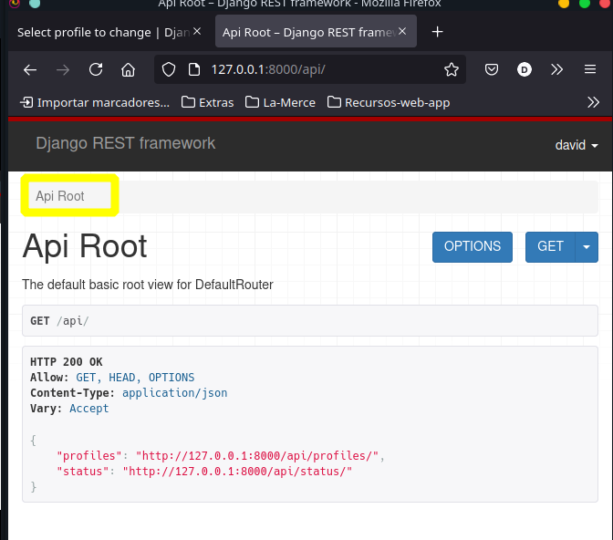

A veces usar viewset y routers al usar una abstracción tan alta no son útiles del todo, por ejemplo actualizar el avatar, por eso
hicimos un serializer específico para ello

añadimos la siguiente clase en views.py para hacer el update del avatar

```python

class AvatarUpdateView(generics.UpdateAPIView):

    serializer_class    = ProfileAvatarSerializer
    permission_classes  = [IsAuthenticated,IsOwnProfileOrReadOnly]

    def get_object(self):
        profile_object  = self.request.user.profile
        return profile_object
```

Añadimos permisos para que solo los owners puedan modificar su avatar

```python
from rest_framework import permissions

# parea que solo los owners de los profiles puedan modificar su perfil
class IsOwnProfileOrReadOnly(permissions.BasePermission):

    def has_object_permission(self, request, view, obj):
        if request.method in permissions.SAFE_METHODS:
            return True
        return obj.user == request.user

# para modificar el avatar del propio user
class IsOwnerOrReadOnly(permissions.BasePermission):

    def has_object_permission(self, request, view, obj):
        if request.method in permissions.SAFE_METHODS:
            return True
        return obj.user_profile == request.user.profile
```

Finalmente añadimos la url

```python
from rest_framework import permissions

# parea que solo los owners de los profiles puedan modificar su perfil
class IsOwnProfileOrReadOnly(permissions.BasePermission):

    def has_object_permission(self, request, view, obj):
        if request.method in permissions.SAFE_METHODS:
            return True
        return obj.user == request.user

# para modificar el avatar del propio user
class IsOwnerOrReadOnly(permissions.BasePermission):

    def has_object_permission(self, request, view, obj):
        if request.method in permissions.SAFE_METHODS:
            return True
        return obj.user_profile == request.user.profile
```

### Filter system en drf

Por defecto las vistas que hemos estado usando exponen la lista completa de elementos que contiene la queryset.
Sin embargo podemos mostrar solo ciertos resultados de esa queryset utilizando filtros.
Para ello debemos personalizar el método `get_queryset()`

Vamos a modificar la vista de profilestatus para que con el mismo end-point podemos pasarle un parámetro via url y nos filtre la queryset por ese parámetro.
Le pasaremos username y así nos mostrará solo el profilestatus de ese user si no le pasamos parámetro nos mostrará todos los profilestatus

```python
class ProfileStatusViewSet(ModelViewSet):

    serializer_class    = ProfileStatusSerializer
    permission_classes  = [IsAuthenticated,IsOwnerOrReadOnly]
# en lugar que nos arroje todos los profilestatus q solo nos muestre los del user q está logueado
    def get_queryset(self):
        queryset= ProfileStatus.objects.all()
        # comprobamos si está logeado o no, si lo está mandará un user en la request
        username = self.request.query_params.get('username',None)
        if username is not None:
            # nos filtra por username
            queryset = queryset.filter(user_profile__user__username=username)
        return queryset

```

al sobreescribir el método get_queryset debemos añadir `basename="status"` en el rauter

```python
from django.urls import path, include
from rest_framework.routers import DefaultRouter
from apps.profiles.api.views import AvatarUpdateView, ProfileViewSet,ProfileStatusViewSet

router = DefaultRouter()
# pongo una r delante para indicar que es un router sring
router.register(r'profiles',ProfileViewSet)
router.register(r'status',ProfileStatusViewSet, basename="status")

urlpatterns = [

    path("",include(router.urls)),
    path('avatar/',AvatarUpdateView.as_view(),name='avatar-update')

]
```

Ahora vamos a incorporar un filtro por ciudad

```python
from rest_framework.filters import SearchFilter

class ProfileViewSet(mixins.UpdateModelMixin,
                     mixins.ListModelMixin,
                     mixins.RetrieveModelMixin,
                     viewsets.GenericViewSet):

    queryset            = Profile.objects.all()
    serializer_class    = ProfileSerializer
    permission_classes  = [IsAuthenticated,IsOwnProfileOrReadOnly]
    filter_backends     = [SearchFilter]
    search_fields        = ["city"]
```

en la view nos aparecerá un boton filter donde podremos poner el nombre de la ciudad o bien usar la url:
`http://127.0.0.1:8000/api/profiles/?search=Madrid`

### Automated test

Utilizaremos el archivo test.py de nuestra app Profiles

```python
import json

from django.contrib.auth.models import User
from django.http import response
from django.urls import reverse
from rest_framework import status
from rest_framework.authtoken.models import Token
from rest_framework.test import APITestCase

from apps.profiles.api.serializers import ProfileSerializer
from apps.profiles.models import Profile

class RegistrationTestCase(APITestCase):
    def test_registration(self):
        data = {"username"  : "resttest3",
                "email"     : "test_test_test@rest.com",
                "password1" : "changeme1234",
                "password2" : "changeme1234"
                }
        response = self.client.post('/api/rest-auth/registration/',data)
        self.assertEqual(response.status_code,status.HTTP_201_CREATED)


```

Y para correr los test

```
python manage.py test
```

# Introduction to VueJS

## Que es VueJS?

Es un framework open source de JS para construir interfaces de usuario.
Utiliza reactive components y SPA(sinlge-page-application)

Se le conoce como progressive framework por su diseño, ya que permite crear tanto proyectos muy simples como muy complejos.

Según nuetsras necesidades podemos ir incorporando componentes de VueJS a nuestro proyecto desde

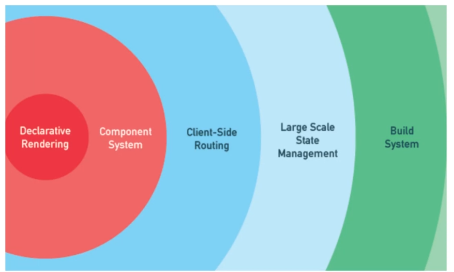

El ecosistema de vue está formado por una serie de proyectos complementarios que extienden el core view layer original.

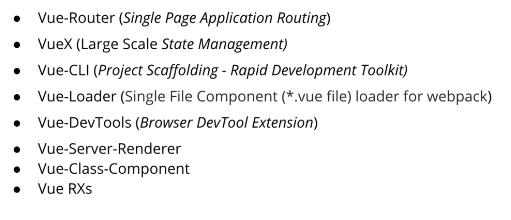

## Primera vue instance

Para utilizar vue pordemos hacerlo de varias formas, usando un CDN

```js
<script src="https://cdn.jsdelivr.net/npm/vue@2.5.16/dist/vue.js"></script>
```

después creamos un nuevo archivo js main.js desde dnd instanciaremos vue para ello lo básico es elegir dónde "montaremos" vue, lo que
se define mediante el atributo `el` element que hace referencia a un archivo html

```html
<!DOCTYPE html>
<html lang="en">
  <head>
    <meta charset="UTF-8" />
    <meta http-equiv="X-UA-Compatible" content="IE=edge" />
    <meta name="viewport" content="width=device-width, initial-scale=1.0" />
    <title>Hello vue</title>
    <style>
      .box {
        height: 100px;
        width: 100px;
        background-color: blue;
      }
    </style>
  </head>
  <body>
    <div id="app">
      <h1>{{message}}</h1>
      <h2 v-text="message"></h2>
      <h3>{{ value*5}}</h3>
      <h3>{{ "hello" + "VueJS"}}</h3>
      <h3>{{ (10/2)*5}}</h3>
      <h3>{{ Math.random()}}</h3>
      <h3>{{ message.split('').reverse().join('-')}}</h3>
      <!-- using v-bind for attirbutes -->
      
      <br />
      <a v-bind:href="link">google</a>
      <br />
      <a :href="link">google_v2</a>
      <br />
    </div>

    <script src="https://cdn.jsdelivr.net/npm/vue@2.5.16/dist/vue.js"></script>
    <script src="main.js"></script>
  </body>
</html>
```

cada uno de estos atributos que asociamos a la instancia de vue podemos hacer referencia a ellos desde html usando
v-bind: o simplemente : => `v-bind:src` o `:src`

```js
var app = new Vue({
  el: "#app",
  data: {
    message: "hello world",
    value: 5,
    imgSrc:
      "",
    link: "https://www.google.es",
  },
});
```

## Events and methods

Vue pued escuchar eventos del DOM y ejecutar un método definido en nuestra vue app.

podriamos usar JS básico pero podemos hacer que al clickar el button genere un evento usando `v-on:nombreEvento`

```html
<div id="app">
  <div>{{ counter }}</div>
  <button v-on:click="counter+=1">click me!</button>
  <button @click="counter+=5">click me v2!</button>
  <button @click="incrementCounter">click me v3!</button>
  <br /><br />
  <div class="box" @mouseover="overTheBox"></div>
</div>
```

```js
var flag = true;
var app = new Vue({
  el: "#app",
  data: {
    counter: 0,
  },
  methods: {
    incrementCounter() {
      this.counter += 10;
    },
    overTheBox() {
      console.log("over the box");
      box = document.getElementsByClassName("box")[0];
      console.log(box);
      if (flag) {
        box.style.background = "red";
        flag = false;
      } else {
        box.style.background = "blue";
        flag = true;
      }
    },
  },
});
```

podemos usar la forma abrebiada de `v-on:` => `@`

podemos añadir métodos en la vue app y ejecutarla al `@click` o `@mouseover`

## Conditional Rendering

Nos permite mostrar ciertos elementos en la app cuando ciertas condiciones se dan.
Para ello vamos a utilizar ciertas directivas como `v-if` `v-else` `v-else-if` `v-show`

Podmeos crear una web page que mostrará una cosa u otra según el user está autenticado o no.

en cuando cambie las condiciones vue lo detecta y cambia los datos de la webpage sin tener que recargar la pagina.

```js
var app = new Vue({
  el: "#app",
  data: {
    auth: false,
  },
});
```

```html
<div id="app">
  <h1 v-if="auth">Your user profile</h1>
  <h1 v-else>Login to access your profile</h1>
</div>
```

```js
var app = new Vue({
  el: "#app",
  data: {
    product: "sunglasses",
    quantity: 150,
    sale: true,
  },
});
```

```html
<div id="app">
  <h1>Product : {{ product }}</h1>
  <h2 v-if="quantity>=20">Available</h2>
  <h2 v-else-if="quantity>0  && quantity<20">limited availability</h2>
  <h2 v-else>sold out</h2>
  <br />
  <h3 v-show="sale">On Sale!</h3>
</div>
```

La diferencia entre `v-show` es que cuando la condición no se cumple le añade un display=false pero
el elemento sigue en el html en cambio con `v-if`si no se cumple el elemento tampoco se pinta en el html.

## Class and style binding

Usando la directiva `v-bind`podemos cambiar los estilos css.

```html
<link
  rel="stylesheet"
  href="https://cdn.jsdelivr.net/npm/bootstrap@5.0.1/dist/css/bootstrap.min.css"
  integrity="undefined"
  crossorigin="anonymous"
/>
<style>
  .circle {
    width: 250px;
    height: 250px;
    border-radius: 50%;
  }
  .square {
    width: 250px;
    height: 250px;
  }
</style>
<div id="app">
  <div class="row justify-content-center mt-3">
    <div
      class="circle"
      v-bind:style="{backgroundColor:'green', border:'5px solid orange'}"
    ></div>
    <br />
    <div class="circle" v-bind:style="styleObject"></div>
    <br />
    <div
      v-bind:class="{circle: flag, square: !flag}"
      v-bind:style="styleObject"
    ></div>
    <button class="btn btn-success" @click="changeShape">change shape</button>
  </div>
</div>
```

```js
var app = new Vue({
  el: "#app",
  data: {
    flag: true,
    styleObject: {
      border: "5px solid blue",
      backgroundColor: "red",
    },
  },
  methods: {
    changeShape() {
      this.flag = !this.flag;
    },
  },
});
```

## list rendering v-for

permite crear iteraciones

```html
<div id="app">
  <h1>User list</h1>
  <ul>
    <li v-for="user in users">{{user}}</li>
  </ul>

  <h2>list of ten numbers</h2>
  <p v-for="number in 10">{{ number }}</p>

  <h2>list of complex users</h2>
  <ul v-for="user in users2">
    <li>
      {{ user.id }}
      <ul>
        <li>{{ user.name }}</li>
        <li>{{ user.profession }}</li>
      </ul>
    </li>
  </ul>
  <br />
  <h2>list of complex users using bootstrap</h2>
  <div class="card" v-for="user in users2" v-bind:key="user.id">
    <div class="card-body">
      <p><strong>Name:</strong>{{ user.name }}</p>
      <p><strong>profession:</strong>{{ user.profession }}</p>
    </div>
  </div>
</div>
```

```js
var app = new Vue({
  el: "#app",
  data: {
    users: ["alice", "bob", "robin", "batman"],
    users2: [
      { id: 1001, name: "david", profession: "teacher" },
      { id: 1002, name: "marc", profession: "nnfo" },
      { id: 1003, name: "pol", profession: "dddfff" },
      { id: 1004, name: "carl", profession: "vbbv" },
    ],
  },
});
```

## Computed properties

POdemos añadir lógica a nuestro código html pero eso lo hace un código menos legible,
para evitarlo se puede usar métodos pues computed properties es similar a los métodos
pero con la diferencia que los resultados del procesamiento son cacheados hasta que los valores cambien.

```html
<div id="app">
  <p>Method - 1: {{ getRandomNumber() }}</p>
  <p>Method - 2: {{ getRandomNumber() }}</p>
  <p>Method - 3: {{ getRandomNumber() }}</p>
  <br />
  <p>computed - 1: {{ getRandomNumberComputed }}</p>
  <p>computed - 2: {{ getRandomNumberComputed }}</p>
  <p>computed - 3: {{ getRandomNumberComputed }}</p>
</div>
```

```js
var app = new Vue({
  el: "#app",
  computed: {
    getRandomNumberComputed() {
      return Math.random();
    },
  },
  methods: {
    getRandomNumber() {
      return Math.random();
    },
  },
});
```

el resultado del computed vemos com queda cacheado

```

Method - 1: 0.6575631490335684

Method - 2: 0.49269438650814334

Method - 3: 0.34999346731377734
-------------------------------------
computed - 1: 0.6680868843327047

computed - 2: 0.6680868843327047

computed - 3: 0.6680868843327047
```

## forms and user input - v-model

la directiva v-model permite modificar los datos de nuestra vueJS app.

```html
<div id="app">
  <div class="row justify-content-center mt-3">
    <div
      class="circle"
      v-bind:style="{backgroundColor:color, border:'5px solid orange'}"
    ></div>
  </div>

  <div class="row justify-content-center mt-3">
    <input type="text" v-model="color" />
  </div>

  <div class="row justify-content-center mt-3">
    <p>Color data: {{ color }}</p>
  </div>
</div>
```

```js
var app = new Vue({
  el: "#app",
  data: {
    color: "green",
  },
});
```

```html
<div id="app">
  <div class="row justify-content-center mt-3">
    <div class="col-5">
      <p>Writte a message</p>
      <textarea
        class="form-control"
        placeholder="some text"
        cols="30"
        rows="10"
        v-model="text"
      >
      </textarea>
    </div>
    <div class="col-5">
      <p>message</p>
      <p>{{ text }}</p>
    </div>
  </div>

  <div class="row justify-content-center mt-3">
    <input type="checkbox" id="ckeckbox" v-model="checked" />
    <label for="checkbox">&nbsp;&nbsp;Value:{{checked}}</label>
  </div>

  <div class="row justify-content-center mt-3">
    <select name="city" id="city" v-model="city">
      <option>Rome</option>
      <option>bcn</option>
      <option>MADRID</option>
    </select>
    <span>&nbsp;&nbsp;Value:{{city}}</span>
  </div>
</div>
```

Ejemplo 2

```js
var app = new Vue({
  el: "#app",
  data: {
    text: "",
    checked: true,
    city: "",
  },
});
```

Ejemplo 3

En una single-page-app no queremos que la página se recargue así que cuando se manda datos al backend javascript está al cargo

cuando se genere un evento tipo submit añadimos prevent para evitar que la acción de submit, enviar datos a un end-point, y en cambio nos dispare
nuestro método.

```html
<div id="app">
  <p v-if="errors" class="mt-2" style="text-align:center">{{errors}}</p>
  <div class="row justify-content-center mt-3">
    <form @submit.prevent="onSubmit">
      <div class="form-group">
        <label for="commentText">Publish comment</label>
        <textarea
          class="form-control"
          id="commentText"
          cols="30"
          rows="10"
          v-model="comment"
        >
        </textarea>
      </div>
      <button class="btn btn-sm btn-primary" type="submit">Publish</button>
    </form>
  </div>
  <div class="conteiner mt-3">
    <div class="card" v-for="comm in comments">
      <div class="card-body">
        <p>{{comm}}</p>
      </div>
    </div>
  </div>
</div>
```

```js
var app = new Vue({
  el: "#app",
  data: {
    comment: null,
    comments: [],
    errors: null,
  },
  methods: {
    onSubmit() {
      if (this.comment) {
        let new_comment = this.comment;
        this.comments.push(new_comment);
        this.comment = null;

        if (this.errors) {
          this.errors = null;
        }
      } else {
        this.errors = "the comment has an error";
      }
    },
  },
});
```

## Components and props

- Components nos permite crear bloques de código reutilizable . En los components podemos escribir tanto HTML como JS.

- Props son un tipo especial de attributo que nos permite pasar datos entre componentes padre a hijo. Cuando un prop se pasa a un componente hijo éste se vuelve una nueva propiedad del componente hijo.

```html
<div id="app">
  <component_comment
    v-for="(comment_,index) in comments"
    :comment_del_component="comment_"
    :key="index"
  >
  </component_comment>
</div>
```

```js
// component child

// comment component
// como el prop comment es necesario para el funcionamiento del component tenemos que poner required True
Vue.component("component_comment", {
  props: {
    comment_del_component: {
      type: Object,
      required: true,
    },
  },
  template: ` 
    <div class="card"> 
        <div class="card-body">
            <p>{{comment_del_component.username}}</p>
            <p>{{comment_del_component.content}}</p>
        </div>
    </div>        
    `,
});
// instanciamos una vue app
//component parent
var app = new Vue({
  el: "#app",
  data: {
    comments: [
      { username: "david", content: "first comment" },
      { username: "david_2", content: "first comment" },
      { username: "david_3", content: "first comment" },
      { username: "david_4", content: "first comment" },
    ],
  },
});
```

En este ejemplo estamos pasando datos del parent al child

al añadir el campo key podemos ver en el navegador com se pasa al componente

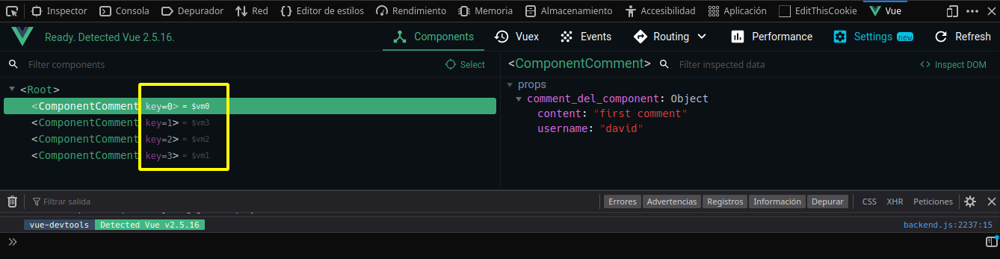

## $emit

Nos permite enviar datos de un componente hijo al padre mediante $emit.

```html
<!DOCTYPE html>
<html lang="en">
  <head>
    <meta charset="UTF-8" />
    <meta name="viewport" content="width=device-width, initial-scale=1.0" />
    <meta http-equiv="X-UA-Compatible" content="ie=edge" />
    <title>Components and $emit</title>
    <link
      rel="stylesheet"
      href="https://stackpath.bootstrapcdn.com/bootstrap/4.3.1/css/bootstrap.min.css"
      integrity="sha384-ggOyR0iXCbMQv3Xipma34MD+dH/1fQ784/j6cY/iJTQUOhcWr7x9JvoRxT2MZw1T"
      crossorigin="anonymous"
    />
  </head>
  <body>
    <div id="app">
      <comment-list
        :comments_del_hijo="comments_lista_del_padre"
        @submit-comment="addNewComment"
      ></comment-list>
    </div>

    <script src="https://cdn.jsdelivr.net/npm/vue@2.6.9/dist/vue.js"></script>
    <script src="main.js"></script>
  </body>
</html>
```

```js
// comment list component
Vue.component("comment-list", {
  props: {
    comments_del_hijo: {
      type: Array,
      required: true,
    },
  },
  data: function () {
    return {
      new_comment: null,
      comment_author: null,
      error: null,
    };
  },
  methods: {
    submitComment() {
      if (this.new_comment && this.comment_author) {
        this.$emit("submit-comment", {
          username: this.comment_author,
          content: this.new_comment,
        });

        this.new_comment = null;
        this.comment_author = null;

        if (this.error) {
          this.error = null;
        }
      } else {
        this.error = "please fill out both fields!";
      }
    },
  },
  template: `
        <div class="mt-2">
            <div class="container">
                <single-comment
                    v-for="(comment, index) in comments_del_hijo"
                    :comment="comment"
                    :key="index"
                ></single-comment>
                <hr>
                <h3>{{ error }}</h3>
                <form @submit.prevent="submitComment" class="mb-3">
                    <div class="form-group">
                        <label for="commentAuthor">Your Username</label>
                        <input class="form-control"
                            id="commentAuthor"
                            type="text"
                            v-model="comment_author"> 
                    </div>
                    <div class="form-group">
                        <label for="commentText">Add a comment</label>
                        <textarea class="form-control"
                                id="commentText"
                                rows="3"
                                cols="40"
                                v-model="new_comment">
                        </textarea>
                    </div>
                    <button class="btn btn-sm btn-primary"
                            type="submit"
                            >Publish
                    </button>
                </form>
                
            </div>
        </div>
    `,
});

// single comment component
Vue.component("single-comment", {
  props: {
    comment: {
      type: Object,
      required: true,
    },
  },
  template: `
        <div class="mb-2">
            <div class="card">
                <div class="card-header">
                    <p>Published by: {{ comment.username }}</p>
                </div>
                <div class="card-body">
                    <p>{{ comment.content }}</p>
                </div> 
            </div>
        </div>
    `,
});

var app = new Vue({
  el: "#app",
  data: {
    comments_lista_del_padre: [
      { username: "alice", content: "first comment!" },
      { username: "bob", content: "hello world!" },
      { username: "ironman", content: "new armor coming soon!" },
      { username: "superman", content: "kryptonite is bad!" },
    ],
  },
  methods: {
    addNewComment(new_comment) {
      this.comments_lista_del_padre.push(new_comment);
    },
  },
});
```

# Proyecto final

- slug
  Un slug es una cadena sin caracteres especiales, en minúsculas y con guiones en lugar de espacios, óptima para ser utilizada en URLs. Un ejemplo de slug podría ser /ejemplo/150/esto-es-un-slug.

¿Qué ventajas tiene usar esto?. Una de las principales ventajas es el SEO, los buscadores tienen en cuenta las palabras en las url’s para establecer la relevancia en sus resultados.

Vamos a usar un model user customizado así que tenemos que especificarlo en el `settings.py`

```python
# custom user model
AUTH_USER_MODEL = "users.CustomUser"
```

# Integrar react con Django

Es muy sencillo solo necesitamos en nuestra raíz del proyecto django crear una app react

```
npx create-react-app todo-react
```

Un vez creada entro en la react-app y ejecuto

```
npm run build
```

nos quedará una estructura similar a esto

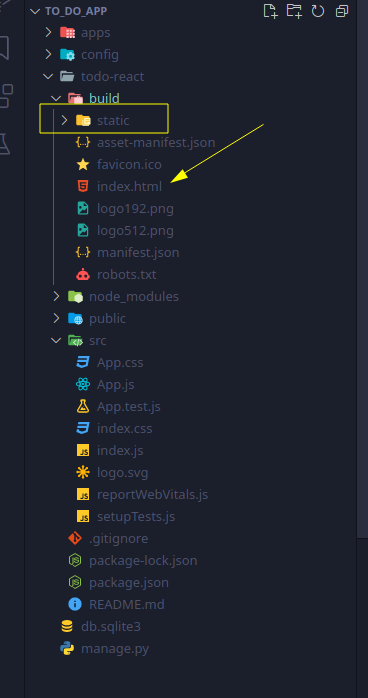

Entonces solo tenemos que enlazar el sistema de pantillas y los archivos static con django pra ello:

```python
TEMPLATES = [
    {
        'BACKEND': 'django.template.backends.django.DjangoTemplates',
        'DIRS': [
             os.path.join(BASE_DIR,'todo-react/build'),
        ],
        'APP_DIRS': True,
        'OPTIONS': {
            'context_processors': [
                'django.template.context_processors.debug',
                'django.template.context_processors.request',
                'django.contrib.auth.context_processors.auth',
                'django.contrib.messages.context_processors.messages',
            ],
        },
    },
]

STATICFILES_DIRS = [
    os.path.join(BASE_DIR,'todo-react/build/static')
]

```

Y en el url.py del proyecto cargamos la vista

```python
from django.contrib import admin
from django.urls import path
from django.views.generic import TemplateView


urlpatterns = [
    path('admin/', admin.site.urls),
    path('',TemplateView.as_view(template_name="index.html"))
]
```

Arrancamos el servior de django y nos cargará el index.html de reeact.

# Hacer deploy de nuestro proyecto django en heroku

Importante tener una cosa en cuenta:

1. Heroku no lee archivos `.env ` por lo que debemos crear las variables de entorno en la plataforma, usando la consola o bien desde la interfaz gráfica de la web. Esto permite que en nuestro proyecto podamos leer variables desde un archivo `.env` (recordar añadirlo al gitignore)para cuando estemos desarrollando y luego si no existe ese archivo q lea las variables de entorno...sería algo así

```python
from dotenv import dotenv_values # pip insatll
import os

config = dotenv_values(".env")
DATABASE_URI = config.get("mongo_url")

#ensures that if we have a system environment variable, it uses that instead
if os.getenv("DATABASE_URI"): DATABASE_URI = os.getenv("DATABASE_URI")
```

https://developer.mozilla.org/es/docs/Learn/Server-side/Django/Deployment

Intalamos heroku en nustro sistema

```
sudo snap install --classic heroku
```

Necesitamos instalar dos librerias

```
pip install gunicorn django-on-heroku
```

una vez instalado creamos en la raíz de nuestro proyecto un archivo `runtime.txt` con la ersión de python que estamos usando

```
python-3.9.5
```

Muy importante escribir la primera en mayúscula de Procfile.
creamos también un archivo `Procfile` con el siguiente contenido

```
web: gunicorn config.wsgi --log-file -
```

Tenemos que crear un archivo requirements.txt

```
pip freeze > requirements.txt
```

En el settings.py del proyecto añadimos, LOS IMPORTS necesarios

```python
import django_on_heroku
import dj_database_url
import os

# permitimos todos los host

ALLOWED_HOSTS = [
  'url-shortner-django-project.herokuapp.com',
    '127.0.0.1'
]

# SECURITY WARNING: don't run with debug turned on in production!
DEBUG = False

# cambiaos ddbb
DATABASES = {
    'default': dj_database_url.config()
}

LOGIN_URL = '/login'

# si los archivos static los tengo fuera de las apps tengo q especificar dónde están

STATICFILES_DIRS =[
    os.path.join(BASE_DIR,'static')
]

# al final del archivo
django_on_heroku.settings(locals())

```

finalmente en la terminal nos logueamos a heroku

```
heroku login
```

nos abrirá el navegador y completamos el login. Volvemos a la terminal para crear nuestra app en heroku

```
heroku create url-shortner-django-project
```

añadimos a remote los repos de heroku

```
git remote add heroku https://git.heroku.com/url-shortner-django-project.git
```

creamos una bbdd en heroku

```
heroku addons:create heroku-postgresql:hobby-dev
```

si tenemos más de una app en heroku nos pedirá q especifiquemos así q hacemos:

```
heroku addons:create --app dmartin-projects heroku-postgresql:hobby-dev
```

subimos el proyecto

```
git push heroku main
```

si hacemos push desde otra rama q no sea la principal hay q especificarlo

```
git push heroku2 heroku-b-new-settings:main
```

si en heroku tenems este overwie en la app, **no Dyno**

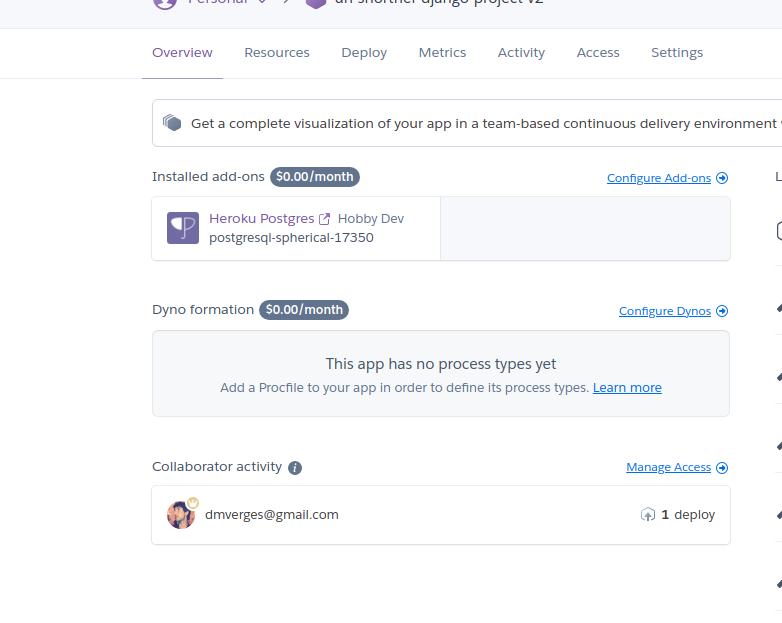

es pq falta cargar la bbdd, para ello en la consola de heroku o desde la terminal local

```
# en heroku
python manage.py makemigrations
python manage.py migrate

# termonal local
heroku run python manage.py makemigrations

```

Poner el DEBUG en `False`

si queremos acceder al panel de admin desde heroku
añadimos esto en el sttings.py

```
LOGIN_URL = '/login'
```

y accedemos mediante la url del proyecto + `admin/login/`

```
https://url-shortner-django-project.herokuapp.com/admin/login
```

para poder acceder tenemos q crearnos un superuser en el servidor de heroku así q en terminal corremos

```
heroku run python manage.py createsuperuser
```

Si queremos logearnos en la terminal de nuestro proyecto en heroku

```
heroku run bash -a dmartin-projects
```

Así estaremos corriendo comandos de terminal en heroku de nuestro proyecto en concreto desde local

Si queremos crear una variable global en heroku

```
heroku config:set --app dmartin-projects SENDGRIP_API_KEY=xxx

```

No es recomendable tener las API KEY en el código así que mejor hacer un archivo `.env` donde guardaremos las variables de entorno para niuestro proyecto

1. instalamos paquete `environ` `pip install django-environ`
2. creamos archivo `.env`en el mismo nivel q nuestro archivo settings.py
   1. `echo API_KEY=loQueSea > .env` **no poner str entrcomillas**
3. Si queremos añadir más usar `>>`
   1. `echo BBDD=loQueSea >> .env`
4. Para comprobar que está bien introducido `cat .env`
5. PAra usar las variables importamos

   1. ```python
        import environ
        # Initialise environment variables
        env = environ.Env()
        env.read_env(env.str('ENV_PATH', 'sendgrid.env'))

        # las usamos en el código
        mi_API_KEY= env('SENDGRID_API_KEY')
      ```

Finalmente podemos conectar la bbdd de heroku (postgresql) con con dbeaver. En el apartado overview de nuestra app en heroku le damos a heroku postgres de ahí a settings y database credentials. Rellenamos los datos en dbeaver y listo.

Para que la comunicación entre el front y el back sea segura python implementa `csrf_token`
https://www.stackhawk.com/blog/django-csrf-protection-guide/

# Enviar mails desde heroku

Si uso sendGrid no tengo q cambiar nada en settings

0. Instalar sendgrid en heroku desde la terminal `heroku run --app dmartin-projects pip install sendgrid`
1. o generar un nuevo requirements.txt habiendo instalado sendgrid en venv local y subirlo
2. Abrir cuenta en sendgrid
3. crear un sender en `sendgrid.com`
   1. Establecer un mail sender, si pongo uno de `gmail` recordar habilitar uso desde apps poco seguras en: `myaccount.google.com/lesssecureapps`
   2. generar mi API KEY
4. implementar el siguiente código

```python

from sendgrid import SendGridAPIClient
from sendgrid.helpers.mail import Mail
# Create your views here.

@csrf_protect
def send_mail(request):

    if(request.method=='POST'):
        post_data = json.loads(request.body.decode("utf-8"))
        name = post_data.get('name')
        mail = post_data.get('email')
        msg = post_data.get('msg')

        if name and mail and msg:
            message = Mail(
                from_email='email.sender.dmv@gmail.com', # el sender
                to_emails=['dmvergues@gmail.com'],      # dónde recibiré el mail
                subject='email enviado desde tu PERSONAL WEB PAGE', # título del mail
                html_content=f'<p>Mensaje enviado por {name} - {mail}</p><p>{msg}</p>' # contenido puede ser escrito en html
            )
            try:
              # introduzco mi API KEY
                sg = SendGridAPIClient('yourAPIKEY')
                response = sg.send(message)
            except Exception as err:
                print({"data":err, "type":type(err)})
                return JsonResponse({"data":'error'})
            return JsonResponse({"data":'hello'})
        else:
            # In reality we'd use a form class
            # to get proper validation errors.
            return JsonResponse({"data":'el else'})

```
