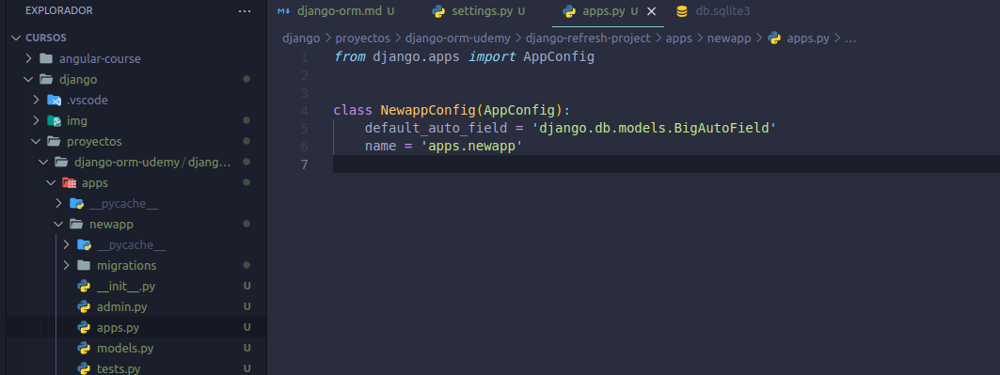
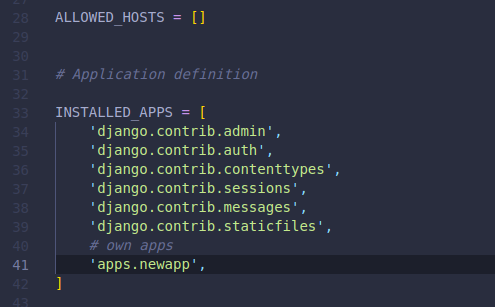
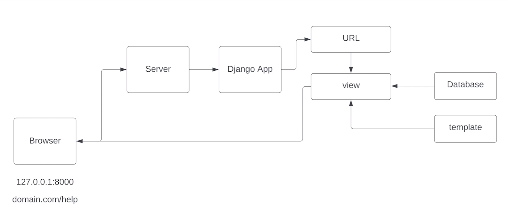
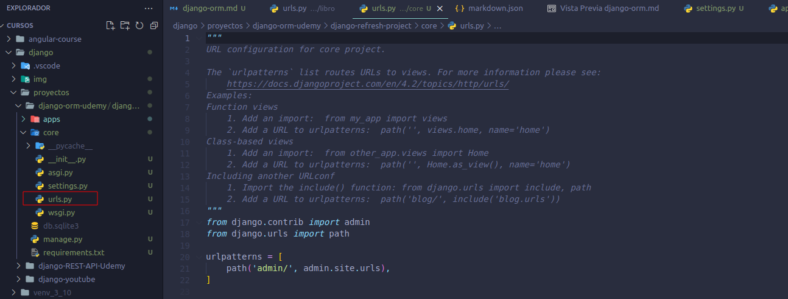
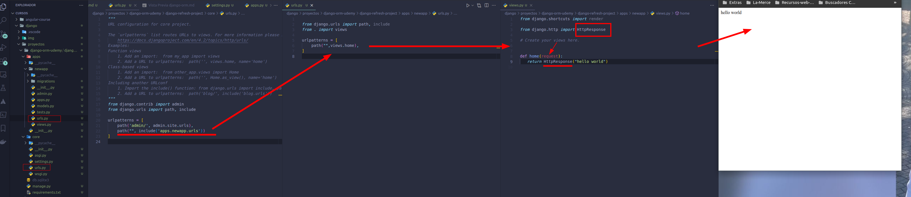
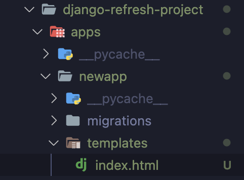
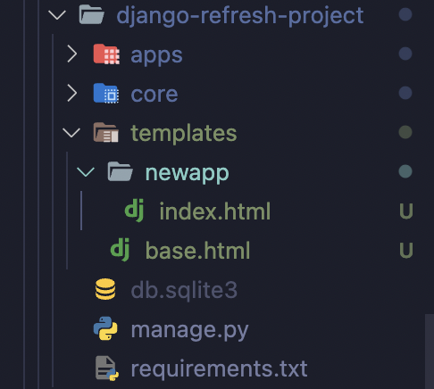

- [Django Database ORM Mastery](#django-database-orm-mastery)
  - [Create new Django project (Refresh)](#create-new-django-project-refresh)
    - [Django request-response cycle](#django-request-response-cycle)
    - [URLs](#urls)
    - [templates](#templates)
    - [views](#views)
  - [Object Relational Mapping (ORM)](#object-relational-mapping-orm)
    - [Models and fields](#models-and-fields)
    - [Django model manager](#django-model-manager)
    - [QuerySet API](#queryset-api)
    - [data base backend](#data-base-backend)
  - [Conectar Django project a postgres](#conectar-django-project-a-postgres)
    - [A un postgres local](#a-un-postgres-local)


# Django Database ORM Mastery

source: https://www.udemy.com/course/django-4x-orm-mastery/

## Create new Django project (Refresh)


1. Crear un direcorio con el nombre de nuestro proyecto y en ese directorio ejecutar el comando :

```
django-admin startproject projectName .

```
2. runserver

```python
python manage.py runserver
```

si queremos cambiar el puerto podemos especificarlo al final del comando 

```python
python manage.py runserver 8080

```
3. crear una app 

para ello podemos adoptar el enfoque de crear un directorio `apps` donde guardaremos todas las app q vayamos creando, para que este directorio funcione como un repo debemos crear en su interior un archivo `__ini__.py`.
Una vez hecho esto creamos las carpetas con el mismo nombre que tendrá nuestra app


creamos el árbol de directorio

```bash
mkdir -p apps/newapp
touch apps/__init__.py
```
creamos la app dentro 

```bash
python manage.py startapp newapp apps/newapp
```
Al crear la app dentro de un directorio debemos de modificar el archivo `apps.py` que se encuentra dentro de la nueva app 



4. Una vez creada la nueva applicación debemos registrarla para que django conozca su existencia. 



5. posteriormente tenemos que crear un superuser para poder entrar en el dashboard admin de django

```
python manage.py createsuperuser 
```

6. ejecutamos las migraciones para generar en la bbdd (sqlite) las tablas por defecto de django

```
python manage.py migrate
```

### Django request-response cycle



1. el user hace una request en el navegador, busca una url (127.0.0.1)
2. el servidor recoge esta petición y la lleva a django
3. en django busca si en el archivo de urls.py existe dicha url
4. si la encuentra la conecta con una view
5. las views son código que puede recoger datos de la bbdd(los modelos creados en el archivo `models.py`)y los pinta en una plantilla (html)
6. plantilla + datos es devuelto al browser del user


### URLs

en el directorio core de Django tenemos un archiv `url.py` donde guardamos las urls a las q responderá nuestra django app.



1. si dejamos el nombre de la url vacío `path('', admin.site.urls),` hace referencia a nuetsra homepage
2. el patrón que utilizamos para definir la url nunca empieza por "/" pero siempre termina con el "/"

Lo que haremos ahora es conectar ese archivo urls.py del core con los archivos urls.py de las distintas apps q vayamos creando, en nuestro caso de la app `newapp`
y estas urls conectarlas con una view 


por convención el name que le damos a la url es el mismo q el path

```python

urlpatterns = [
    path("home/", views.home, name='home')
]
```

### templates

son los archivos html que renderizará django en las vistas. Por defecto django va a buscar los archivos templates dentro del directorio de las apps, es decir si yo dejara la configuración de django por defecto me bastaría con crear un directorio `templates` dentro de nuestra app 



pero lo habitual es crear el directorio `templates` al mismo nivel que el archivo `manage.py`



para que esto funcione tenemos que modificar los settings por defecto de django, para ello modificamos el archivo `setting.py` de la siguinete manera

```python
TEMPLATES = [
    {
        'BACKEND': 'django.template.backends.django.DjangoTemplates',
        'DIRS': [os.path.join(BASE_DIR,'templates')],
        'APP_DIRS': True,
        'OPTIONS': {
            'context_processors': [
                'django.template.context_processors.debug',
                'django.template.context_processors.request',
                'django.contrib.auth.context_processors.auth',
                'django.contrib.messages.context_processors.messages',
            ],
        },
    },
]
```

Dentro de las plantillas podemos tener bloques y una plantilla puede extender de otra

```html
<!DOCTYPE html>
<html lang="en">
<head>
    <meta charset="UTF-8">
    <meta name="viewport" content="width=device-width, initial-scale=1.0">
    <title>Document</title>
</head>
<body>
    <h1>From base templale</h1>
    
</body>
</html>
```
```html



    <h2>Hello {{user.name}} from new app!</h2>


```

### views

Ahora mismo estamos enlazando las urls con la vista home, la vista no es más que una función python que debe devolver una respuesta HTTP como  por ejemplo :

```python

from django.http import HttpResponse

# Create your views here.     


def home(request):
   return HttpResponse("hello world") 
```
en lugar de generar nosotros la respuesta podemos renderizar una vista usando el método render que carga una archivo html y devuelve la respuesta HTTP por nosotros.

Así al método render siempre le debemos pasar:

    - la request
    - el path hacia el template
    - context(opcional) le mandamos datos a la vista

```python
from django.shortcuts import render

def home(request):
   return render(request, "newapp/index.html",context={'user':{'name':'david','age':39}}) 
```


## Object Relational Mapping (ORM)

El ORM de django se basa en 4 pilares:

- models(tables)/fields
- Django model manager
- QuerySet
- BackEnd (DataBase Systems)

### Models and fields 

Nuestra aplicación django se conectará a la base de datos y mediante la creación de Modelos, que no dejan de ser una clase python, crearemos las tablas dentro de esta bbdd.

Para ello en el archivo `models.py` creamos una clase que posteriormente se convertirá en una tabla dentro de la bbdd 

```python
from django.db import models

# Create your models here.

class Student(models.Model):

    firstname = models.CharField(max_length=100)
```

para convrtir la clase en código SQL debemos ejecutar el comando en consola

```
python manage.py makemigrations
```

esto generará dentro de la app un directorio `migrations` con las instrucciones para generar esta tabla. Cada modelo nuevo o cualquier modificación que hagamos en el modelo generará un nuevo fichero dentro de este direcorio.

Finalmente para que esto se refleje en la bbdd debemos ejecutar el comando 
```
python manage.py migrate
```

la tabla que se haya creado en la ddbb tendrá el siguiente nombre:
    nombreApp_nombreDelModelo = `newapp_studen`

Un detalle más es que de manera automática django genera una Primary key para esa tabla, siempre con el mismo nombre (id: integer)

### Django model manager 

Es una interface que nos suministra una serie de APIs como QuerySet API que facilita unos métodos para poder construir queries e interactuar con los datos. 

Por ejemplo si queremos obtener todos los registros de la tabla student haremos:

```
Student.objects.all()
#model   manager  QuerySet API method
```
Todos los modelos que creemos están asociados al manager `objects` así que todos lo modelos pueden acceder a la api querySet.

Podemos modificar este manager, cambiarle el nombre o añadir nuevos métodos.

Por defecto todos los modelos que creemos estarán asociados al model maneger `objects` pero podemos tener más de un model manager asociado a un mismo modelo, podemos extenderlos de objects y modificarlos añadiendo metodos nuevos.

### QuerySet API

Nos ofrece una serie de métodos para interactuar con la bbdd sin necesidad de escribir código SQL, de hecho escribimos codigo python que después el orm lo transforma a sql.

por ejemplo si queremos crear un registro en la bbdd utilizamos el metodo create.

```
from apps.newapp.models import Student

Student.objects.create(firstname='david')
```

y si queremos ver todos los registros usamos all()

```
Student.objects.all()
```
podemos ver las últimas queries realizadas en el orm con la siguiente oistrucciómn

```
from django.db import connection
print(connection.queries)

```
En terminos generales podemos distinguir dos tipos de métodos en la QuerySet API:

  - los que devuelven un querySet, como por ejemplo .filter()
    - un queryset se define como una colección de objetos del tipo del modelo
  - los q NO devuelven un querySet, como por ejemplo .get() o .create()

### data base backend

django es compatible con varias sistemas gestores de bbdd como postgresql, mysql, mariaDB, SQLite, Oracle. 

Está preconfigurado para trabajar con SQLite 


## Conectar Django project a postgres 

### A un postgres local

instalar el driver para conectar con postgres 

```
pip install psycopg2-binary
```

configurar la conexión en el archivo de settings

```python
DATABASES = {
    'default': {
        "ENGINE": "django.db.backends.postgresql_psycopg2",
        "NAME": 'orm_course',
        "USER": 'david',
        "PASSWORD": 'dmv1104',
        "HOST": "127.0.0.1",
        "PORT": "5432",
    }
}
 
```