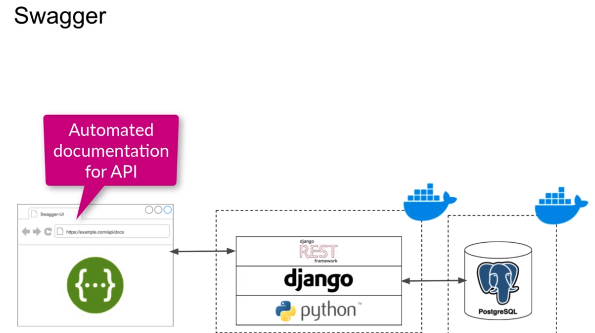
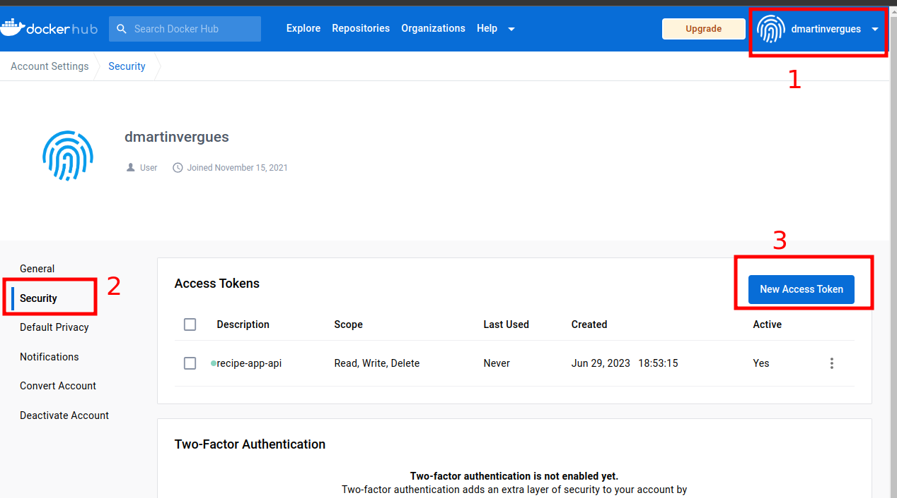
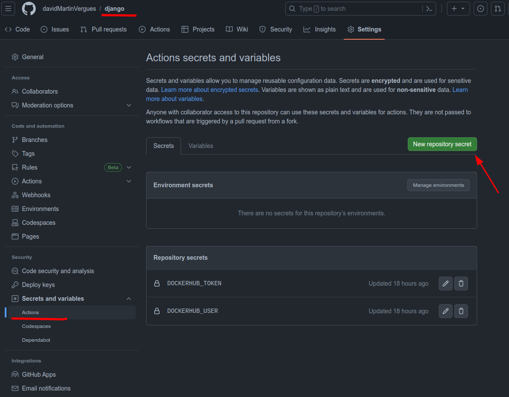

- [Django](#django)


# Curso Django creación Backend REST API

source : [Build a Backend REST API with Python & Django - Advanced (Udemy)](https://www.udemy.com/course/django-python-advanced/)

## Tecnologías que utilizaremos en el curso



También utilizaremos GitHub Actions con el objetivo de lanzar test automáticos cada vez que hagamos push al repo de github.

## Docker

Que beneficios nos trae docker para el desarrollo:

- Mayor consistencia entre el entorno de Desarrollo y producción ya que utilizaremos la misma imagen para ambos.
- Facilidad para colaborar ya que todos tienen las mismas dependencias
- Podemos especificar en archivos todas las dependencias tanto a nivel de SO como de nuestra app (Dockerfile)
- Permite dejar tu equipo local limpio

Para gestionar todas las dependencias y configurar el SSOO utilizaremos el Dockerfile

Con el objetivo de usar las github actions junto con dockerhub debemos configurar un par de cosas:

1. generar token en dockerhub para autenticarnos



2. registrar en nuestro repo de github 2 secrets:
   1. nombre del user de dockerhub
   2. token para acceder a dockerhub



### Docker configuration

* Crear Dockerfile, donde especificaremos todas las dependencias a nivel de Sistema Operativo.
* Docker Compose, define cómo nuestra imagen de docker debe ser usada para ejecutar nuestro servidor de desarollo. Definiremos:
  * Cada imagen será un servicio y cada uno recibirá un nombre
  * puertos de acceso
  * volúmenes

```dockerfile

FROM python:3.9-alpine3.13
LABEL maintainer="David Martin"

ENV PYTHONUNBUFFERED 1

COPY ./requirements.txt /tmp/requirements.txt
COPY ./app /app
WORKDIR /app
EXPOSE 8000

RUN python -m venv /py && \
    /py/bin/pip install --upgrade pip && \
    /py/bin/pip install -r /tmp/requirements.txt && \
    rm -rf /tmp && \
    adduser \
    --disabled-password \
    --no-create-home \
    django-user

ENV PATH="/py/bin:$PATH"

USER django-user

```

* ENV PYTHONUNBUFFERED 1
    esto es recomendable cuando ejecutamos python en un contenedor docker, esto le dice a python que no debe usar un buffer para la salida de este modo el output de python saldrá por consola

* ENV PATH="/py/bin:$PATH"
    permite añadir nuestro virtual environment a las variables de entorno de SSOO.


También es importante crear un archivo dockerignore para excluir distintos archivos


```dockerignore


# Git
.git
.gitignore

# Docker
.docker

# Python
app/__pycache__/
app/*/__pycache__/
app/*/*/__pycache__/
app/*/*/*/__pycache__/
.env/
.venv/
venv/

```
Finalmente podemos construir la imagen de docker para ello lanzamos el comando de desde la terminal especificando el path dnd se encuentra el **Dockerfile**

```
docker --build .

docker build ./recipe-api

```
### Docker configuration