- [Django](#django)
  - [creación de un proyecto django](#creación-de-un-proyecto-django)
  - [Estructura del proyecto](#estructura-del-proyecto)
  - [Modelo-vista-template](#modelo-vista-template)
  - [Aplicación de django](#aplicación-de-django)
  - [conexion con bbdd](#conexion-con-bbdd)
  - [Modelo en django](#modelo-en-django)
  - [Sitio de administración de Django](#sitio-de-administración-de-django)
      - [def __str__](#def-str)
      - [verbose_name / verbose_name_plural](#verbose_name--verbose_name_plural)
      - [ordenar los objetos - ordering](#ordenar-los-objetos---ordering)
  - [Relaciones entre django Models](#relaciones-entre-django-models)
  - [forms.py](#formspy)
  - [GEstión de las URL](#gestión-de-las-url)
      - [archivo global de urls](#archivo-global-de-urls)
      - [archivo urls de una app](#archivo-urls-de-una-app)
      - [views](#views)
      - [templates](#templates)


# Django 

Django sigue el patrón de diseño => M (modelo) - V (vista) - T (template)

## creación de un proyecto django 

1. creación del directorio del proyecto
2. creamos el virtual environment y lo activamos
3. instalamos django en el virtual environment `pip install django` o `pip install django==2.1`
4. creamos el proyecto `django-admin startproject biblioteca`
5. renombramos el directorio a `config` y hacemos los propio con todas las referencias a este 

## Estructura del proyecto

1. ### Archivo settings 

 **SECRET_KEY**, es única para cada proyecto. Está encriptada.  

 **DEBUG**, si está en True nos dará info sobre los posibles errores q ocurran y nos mostrará lo parte del código por eso en producción siempre debe estar false.  

 **ALLOWED_HOSTS**, cuando lo subimos a producción con esta variable indicamos las ip o el dominio válido que pueden acceder al proyecto.  

 **INSTALLED_APPS**, contendrá nuestras aplicaciones y las aplicaciones que django incluye como: 
  - django.contrib.admin -> sistema de administración
  - django.contrib.contenttypes
  - django.contrib.sessions
  - django.contrib.messages -> permite enviar mensajes de validación/errores
  - django.contrib.staticfiles -> sistema de usuarios y permisos  


 **MIDDLEWARE**, es como un plugin que se situa entre la comunicación de django y el cliente, todos los inputs y outputs pasan por los middlewares. En django se usan con un propósito de seguridad. por ejemplo está csrf ( que ya otros frameworks lo usan)
  -  'django.middleware.csrf.CsrfViewMiddleware', permite el envio de formularios  

 **ROOT_URLCONF**, es donde están las rutas principales de todo nuestro proyecto, apunta al archivo 'config/urls.py'   

 **templates**, fija la configuración para el sistema de plantillas. Django ya viene con un sistema de templates aunq tb soporta otros sistemas de plantillas como Jinja2 
  ```python
      TEMPLATES = [
      {
          'BACKEND': 'django.template.backends.django.DjangoTemplates', # sistema de plantillas a usar
          'DIRS': [], # la ruta donde encontrará los templates 
          'APP_DIRS': True, # en True indica que cuando el cliente solicite un template django la buscará en todo el proyecto incluid el directorio de apps 
          'OPTIONS': {
              'context_processors': [
                  'django.template.context_processors.debug',
                  'django.template.context_processors.request',
                  'django.contrib.auth.context_processors.auth',
                  'django.contrib.messages.context_processors.messages',
              ],
          },
      },
  ] 
  ```  

**WSGI_APPLICATION**, esto es para producción indica al servior cómo levantar nuetsra aplicación y como recibirá las comunicaciones.  

**DATABASES**, es la configuración de las bbdd q usará django por defecto usará sqlite3 pero puede usar postgresql, mysql mongodb.  

**AUTH_PASSWORD_VALIDATORS**, es una sección que se encanrga de validad los passwords de los users y pone ciertas restricciónes como de longitud del pwd o que no sea igual/parecido al nombre del user,...  

**sección de Internationalization**, puedes configurar el idioma, time_zone, etc   

sección de Static files (CSS, JavaScript, Images)
  STATIC_URL, especifica dnd estrán nuestros archivos estáticos, por defecto está configurado para que busque los archivos en un directorio llamado `static` dentro de cada app. podemos modificar esta config y hacer que django tb busque en otras ubicaciones añadiendo lo siguiente:
  ```python
  STATICFILES_DIRS = [
  BASE_DIR / "static", # creamos otro directorio static en la raiz del proyecto
  
  ] 
  ```
2. ### archivo urls

Es el arcivo principal de rutas para nuestro proyecto. Todo archivo urls.py tiene que tener su lista llamada `urlpatterns`

## Modelo-vista-template 

Habitualmente se trabaja con un patrón de diseño MVC (modelo vista controlador) donde el user interactua con una vista la cual está conectada a un controlador y este controlador es el q contiene la lógica por ejemplo conexión con la bbdd, el resultado obtenido x el controlador es presentado a la vista y ésta lo muestra al user de una manera entendible. 

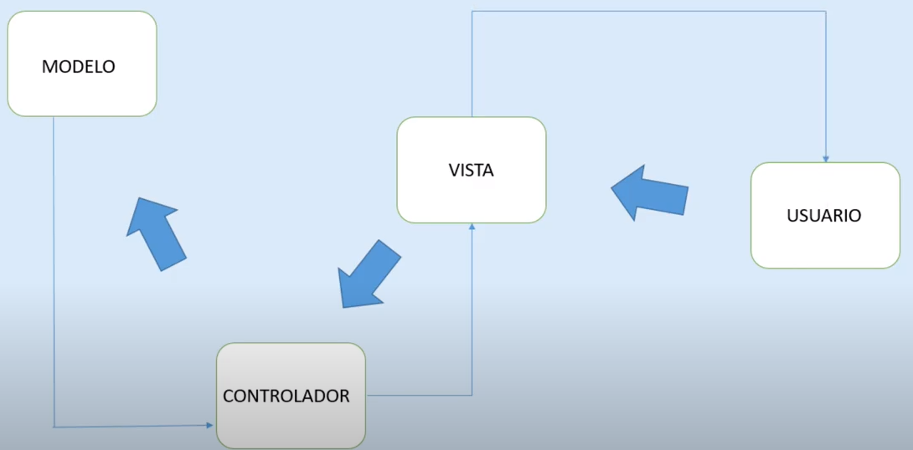

Pero django usa el patrón MVT (modelo vista template). En este caso el user realiza cualquier acción en el sitio web y esa acción es capturada por una URL que está conectada con una vista, la cual contiene la lógica y es capaz de gestionar la petición/request de user. Además la vista tiene asociada una manera de mostrar la info llamada template. La vista tb está asociado a un modelo que es el q interaccioona con la bbdd. 

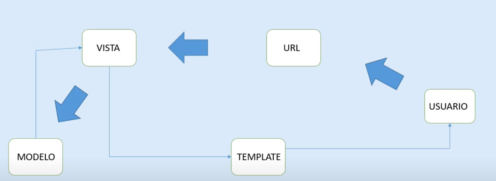

Para poder explicarlo tenemos que crear previamente una aplicación dentro del proyecto de django.

## Aplicación de django 

Las aplicaciones en django son un modo de dividir el proyecto en diferentes secciones, por ejemplo una app que gestione los users, otra que gestione otra parte del proyecto y así.

Para tener todo más organizado crearemos un directorio en la raíz del proyecto llamado `apps` donde guardaremos nuestras aplicaciones. Para que django lo reconozca como un modulo hay que añadir un archivo `__init__.py` 

Hay dos comando para crear una aplicación:

1. usando manage.py 
   Si escogemos este método previamente debemos crear el directorio de la app dentro de apps.
   1. `python manage.py startapp libro apps/libro `
2. usando el comando django-admin
   1. en este caso podemos situarnos directamente en el directorio apps y ejecutar el comando `django-admin startapp libro`

Posteriormente debemos registrar la nueva app en el archivo settings.py en la lista de INSTALLED_APPS como `apps.libro`.

1. ### Estructura de una aplicación

- directorio migrations 

Es donde se guardarán todos los archivos resultantes al realizar una migración. Una migración es cuando desde código python generamos una tabla en nuestro gestor de bbdd. 

- admin.py 

es dnd podemos registrar los modelos(tablas de bbdd) para que puedan ser reconocidos por el admin de django (localhost:8000/admin) 

- apps.py 

nos permite añadir configuraciones extra a nuestra aplicación. Debemos hacer una pequeña modificación al utilizar un directorio apps. 

```python
 from django.apps import AppConfig


class LibroConfig(AppConfig):
    default_auto_field = 'django.db.models.BigAutoField'
    name = 'apps.libro'

```

- models.py

es dnd crearemos los modelos, son una clase de python pero que representa una tabla en la bbdd. 

- test.py 

django incluye soporte para realizar test tanto de nuestra lógica de la app como de la creación de los modelos etc...

- views.py 

en este archivo es donde tendremos la lógica de la aplicación.

## conexion con bbdd

1. ### conexión a postgreSQL

Previamente debemos tener creada nuestra bbdd a la cual nos queremos conectar, en este caso biblioteca.

Para conectas django a postgtres debemos ayudarnos de una libreria extra `psycopg2` que la usaremos como conector entre django y postgres.

`pip install psycopg2`

si nos da errror instalar

```
sudo apt install build-essential
sudo apt install python3-dev
sudo apt install libxslt-dev libffi-dev libssl-dev
```
ahora configuramos el archivo setting.py.


```python


DATABASES = {
    'default': {
        'ENGINE': 'django.db.backends.postgresql_psycopg2',
        'NAME': 'unNombre',
        'USER':'unUSER',
        'PASSWORD':'unPASSWORD',
        'HOST':'unHOST',
        'POST':0000
    }
} 
```
Para no exponer datos importantes como nombre de usuario t password podemos optar por tenerlos guardados en un archivo .env y en producción guardarlos en variables de entorno. 

Así que haremos una comprobación, si existen variables de entorno llamadas USER,PASSWORD,HOST,POST las cogerá si no es el caso utilizará las del archivo .env

para ello debemos instalar `pip install python-dotenv` que me permite cargar las variables guardadas en un .env file. Para buscar variables de entorno utilizo el paquete `os`.

Para usar `dotenv` tenemos dos opciones o usamos la función `load_dotenv()` lo que cargará las variables guardadas en el archivo .env como si fueran variables de entorno por lo que serán accesibles mediante `os.getenv('NAME)` por defecto este modo no sobreescribe las variables de entorno si existiera.

el archivo .env debe estar en la raíz del proyecto.

```python
from dotenv import dotenv_values,load_dotenv
import os

# carga las variables contenidas en el archivo .env como si fueran de entorno
# si hubiera una variable de entorno con el mismo nombre no será sobreescrita.
load_dotenv() 

NAME = os.getenv('NAME')
USER = os.getenv('USER')
PASSWORD = os.getenv('PASSWORD')
HOST = os.getenv('HOST')
PORT = os.getenv('PORT')
```

otra opción sería guardar las variables del .env en un dict e ir accediendo a ellas
y luego comprobar si existen esas mismas variables en el entorno y sobreescribir la variable

```python

from dotenv import dotenv_values,load_dotenv
import os

config = dotenv_values(".env")

NAME = config.get("NAME")
USER = config.get("USER")
PASSWORD = config.get("PASSWORD")
HOST = config.get("HOST")
PORT = config.get("PORT")


if os.getenv('NAME') and \
   os.getenv('USER') and \
   os.getenv('PASSWORD') and \
   os.getenv('HOST') and \
   os.getenv('PORT'):

    NAME = os.getenv('NAME')
    USER = os.getenv('USER')
    PASSWORD = os.getenv('PASSWORD')
    HOST = os.getenv('HOST')
    PORT = os.getenv('PORT') 
```

2. ### conexión a MySQL

Previamente debemos tener creada nuestra bbdd a la cual nos queremos conectar, en este caso biblioteca. 

```sql
create database biblioteca;
```


Necesitamos una librería extra para la conexión con mySQL `pip install mysqlclient`
antes de instalar debemos instalar ciertas dependencias en nuestro SSOO mediante 

`sudo apt-get install python3-dev default-libmysqlclient-dev build-essential`

los settings serían:

```python
DATABASES = {
    'default': {
        'ENGINE': 'django.db.backends.mysql',
        'NAME':'unNOmbre',
        'USER':'unUSER',
        'PASSWORD':'unPASWWORD',
        'HOST':'unHOST',
        'PORT':0000
    }
}
 
```
ejecutamos las migraciones `python manage.py migrate` y para comprobar que ha generado las tablas en la bbdd, entramos en la consola de mysql y tecleamos: 

```sql
use biblioteca;

show tables;
```

## Modelo en django

source: https://docs.djangoproject.com/en/4.0/topics/db/models/

Son clases escritas en python que representan tablas en una bbdd. Estas clases deben heredar de `models.Model` parta que django entienda que de esta clase se puede crear una tabla en la bbdd. 

Hay que tener encuenta que si no especificamos una PrimaryKey django le asignará una por defecto (con nombre id, integerField y autoincremental). 

```python
class Autor(models.Model):
    id = models.AutoField(primary_key=True)
    nombre= models.CharField(max_length=200, blank=False,null=False)
    apellidos = models.CharField(max_length=200, blank=False,null=False)
    nacionalidad = models.CharField(max_length=100, blank=False,null=False)
    apellidos = models.TextField(blank=False,null=False)
    fecha_creacion = models.DateField('Fecha de creación',auto_now=True,auto_now_add=False)
```

una vez creado nuestro modelo debemos exportarlo a la bbdd para ello usamos el comando `python manage.py makemigrations`. Este comando crea un archivo en la carpeta migrations de la app identificando todos los modelos de nuestra app y generando una estructura para que posteriormente se convertido a lenguaje sql. para realizar esto debemos ejecutar `python manage.py migrate`.

Una vez hecho esto podemos acceder al modelo y comprobar que se ha creado correctamente entrando en la sección admin de django para ello arrancamos el server. `python manage.py runserver` por defecto en 127.0.0.1:8000 pero podemos especificar el puerto con `python manage.py runserver 127.0.0.1:8006/admin`. Para acceder necesitamos un password para ello creamos un superuser con `python manage.py createsuperuser`

1. ### auto_now vs auto_now_add 

- auto_now -> permite crear y actualizar la fecha cada vez que se ejecute un save() sobre el objeto

- auto_now_add -> solo añadirá la fecha solo en el momento de creación del objeto (aunq se ejecute más veces un save() sobre ese objeto la fecha no cambiará)


## Sitio de administración de Django 

Es una interfaz creada con una lógica propia y ofrece un panel de administración para el superuser. Podemos crear nuevos users, editarlos, borrarlos,...

Cuando hacemos un migrate django ya crea por defecto dos modelos, q aparecen en el admin, users y grupos.

Para django la capa de seguridad la realiza a través de una applicación que se llama `Authentication` y  `Authorization`. Esta applicación consta de dos modelos `Users`, `Groups`

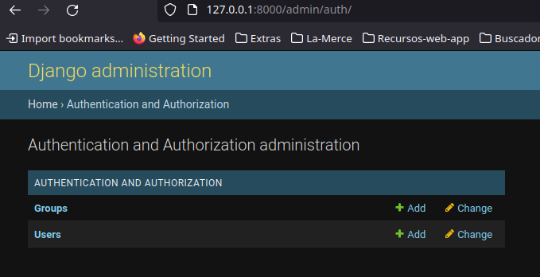

1. ### Grupos 

Nos permite crear un grupo y darle permisos. Esos permisos son los que ya trae django preparados para todo proyecto. Aunque podemos crear nuestros propios permisos.

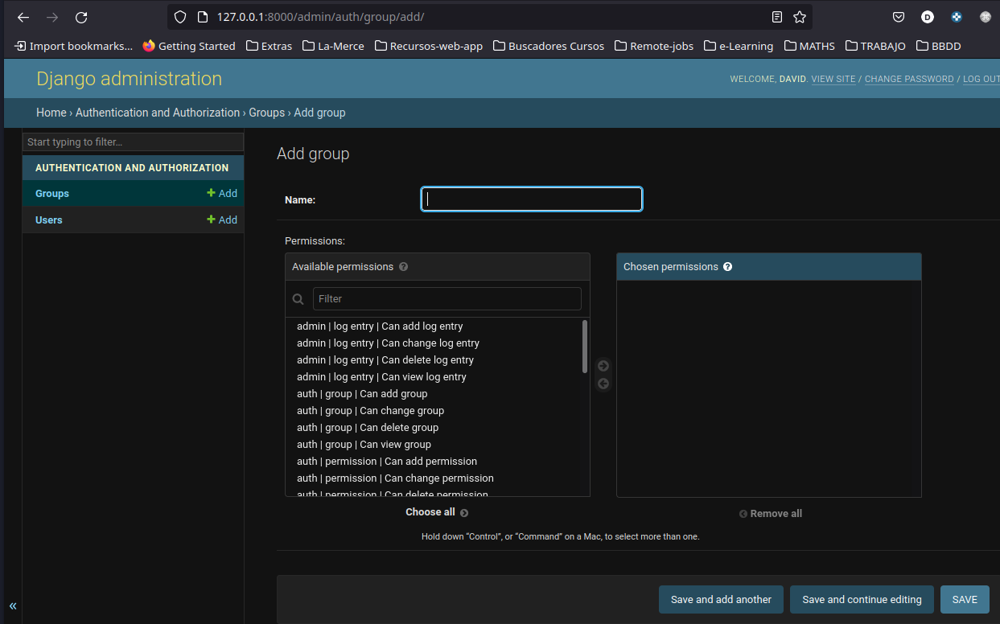

Cada vez que creamos un modelo y lo migramos django le atribuye 3 permisos de manera automática. Estos permisos son los de crear, modificar y eliminar el modelo. Por ejemplo en el proyecto biblioteca he creado una app Libro y en ella un modelo Autor, pues bien django crea 3 permisos relacionados con crear, leer,cambiar y editar un autor. 

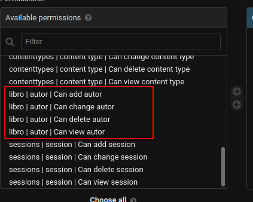

Ahora puedo crear un grupo (Supervisor Autores) que tendrá esos permisos para poder crear/leer/modificar/borrar un autor. Y solo esos permisos.

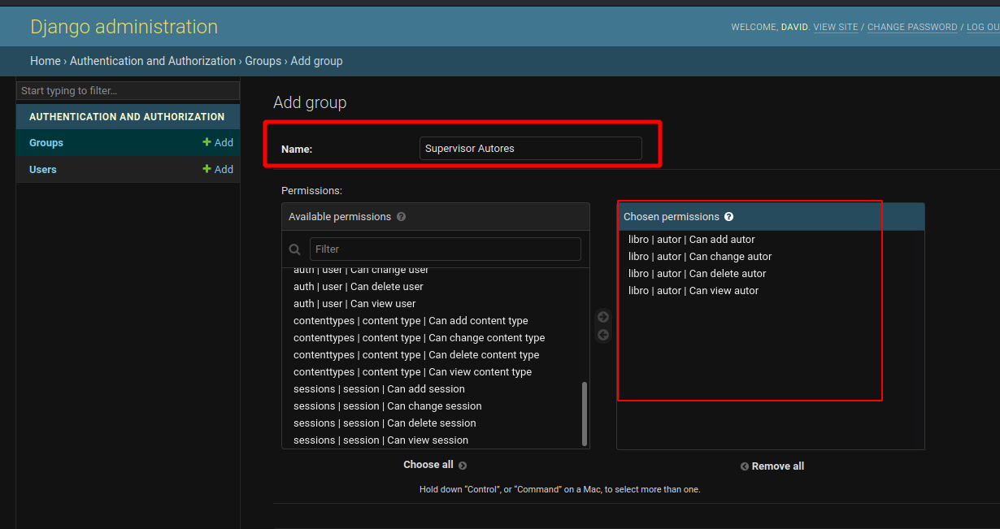

2. ### Usuarios 

Es donde realiza la gestión de todos los users. Cuando creamos nuestro superuser por consola, para poder acceder al admin, aparecerá aquí.

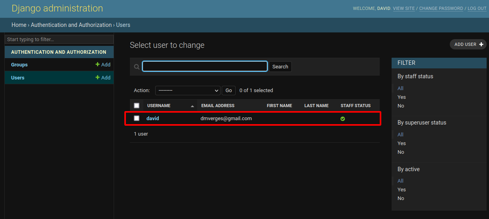

y si entramos en él podremos ver sus características 

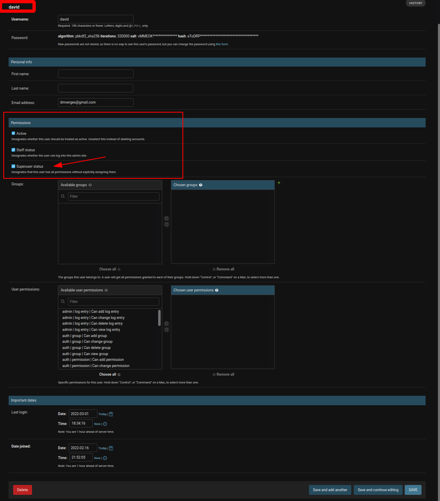

cosas a tener en cuenta de esta sección: 

- En la sección de password nos da la opción de modificarlo.
- la casilla staff-> cuando está clicada indica que el user puede entrar en el admin.

3. ### Registro de un modelo 

Una vez creado un modelo para que este aparezca y lo podamos usar en el admin tenemos que registrarlo. Para ello debemos incluir el siguiente código en el archivo `admin.py` de la aplicación.

```python
from django.contrib import admin

from .models import Autor
# Register your models here.

admin.site.register(Autor)
```

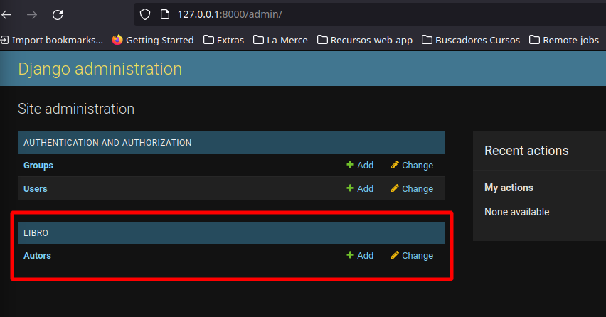

Una vez cargado el modelo podremos creat/leer/editar/borrar autores. 

4. ### dunder method in django model 

#### def __str__ 

Cuando creamos objetos de un modelo estos los veremos en el admin de la siguiente manera: 

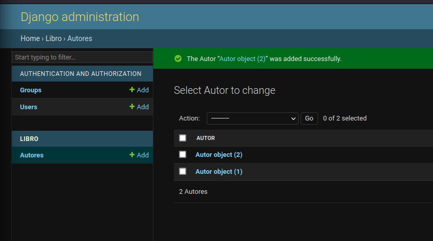

con esta visualización no podemos distinguir/reconocer que autor es así que para que la visualización del objeto sea más entendible podemos sobreescribir el método `__str__` del objeto 


```python
class Autor(models.Model):

    id = models.AutoField(primary_key=True)
    nombre= models.CharField('Nombres',max_length=200, blank=False,null=False)

    class Meta:
        verbose_name= 'Autor'
        verbose_name_plural = 'Autores'

    def __str__(self):
        return self.nombre 
```
el resultado de esta modificación es que ahora los objetos los visualizamos así:

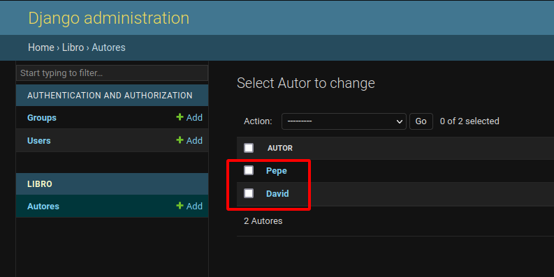

5. ### class Meta de los modelos en django

source https://docs.djangoproject.com/en/4.0/ref/models/options/
#### verbose_name / verbose_name_plural

Cuando creamos un modelo y lo registramos en el admin django lo pasa al plural, le añade una `s`. 

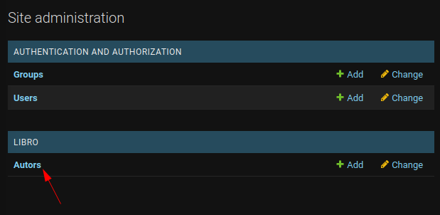

Para modificar este comportamiento de django debemos añaldir en el modelo una subclase `Meta`. Meta viene de metadatos, es decir datos extra que queremos añadir a nuestro modelo. 

```python
class Autor(models.Model):
    id = models.AutoField(primary_key=True)
    nombre= models.CharField(max_length=200, blank=False,null=False)
    apellidos = models.CharField(max_length=200, blank=False,null=False)
    nacionalidad = models.CharField(max_length=100, blank=False,null=False)
    apellidos = models.TextField(blank=False,null=False)
    
    class Meta:
        verbose_name= 'Autor'
        verbose_name_plural = 'Autores'  
```

Este `verbose_name` también se puede colocar en los campos y lo usamos para dar a los campos un nombre legible para los "humanos". NO MODIFICA EL NOMBRE DADO AL ATRIBUTO, SOLO QUE USARÁ EL VERBOSE_NAME CUANDO TENGA QUE MOSTRAR ESA INFO.

```python
descripcion= models.CharField(verbose_name = "Descripción", max_length=200, blank=False,null=False)
```

#### ordenar los objetos - ordering

A medida que vamos añadiendo objetos el primero en la lista es el más recientemente creado. Si queremos modificar ese comportamiento debemos añadir un campo `ordering` en la clase Meta.

```python
    class Meta:
        verbose_name= 'Autor'
        verbose_name_plural = 'Autores'
        ordering = ['nombre'] 
```

si el ordering lo defino como `[-nombre]` lo ordena al revés
 
## Relaciones entre django Models

Creamos otro modelo para establecer las distintas relaciones con autores. Este nuevo modelo será Libro.

1. ### on_delete

Hace referencia a qué sucede cuando borramos el registro/objeto al cual hace referencia la FK. 
En nuestro caso el modelo Libro tiene una FK que hace referencia a Autor pues qué sucedería, con ese Libro, si borramos el Autor.

1. CASCADE -> se borraría tb el libro
   
2. PROTECT OR RESTRICT -> no permite que se borre un Autor que ya tiene un libro asociado
   
3. SET_NULL -> pondría como null el campo Autor por lo que existiria un Libro con autor=Null 
   
4. SET_DEFAULT OR SET(...) -> especificamos un Autor alternativo como defecto 
   
5. DO_NOTHING -> no sucedería nada pero ese libro tendría un campo Autor que hace referencia a un Autor q ya no existe en la bbdd 

2. ### OneToOneField

En nuestro caso sería cuando un Libro solo puede tener un Autor y un Autor solo puede aber escrito un Libro.

Si establecemos una relación del tipo one-to-one usaremos un campo `OneToOneField` pero entonces estamos obligados a especificar dos atributos:

- modelo al cual hace referencia
- on_delete, qué sucede cuando borramos el registro/objeto al que hace referencia la `foreignKey`. 

```python
class Libro(models.Model):
    id = models.AutoField(primary_key=True)
    titulo = models.CharField('Titulo',max_length=255,blank=False,null=False)
    fecha_publicacion = models.DateField('Fecha de publicacion',blank=False,null=False)
    # RELACIONES ONE-TO-ONE
    autor_id  = models.OneToOneField(Autor, on_delete=models.CASCADE)
```
En este caso autor_id pasa a ser una `foreignKey` que hace referencia a un Autor, si se elimina el Autor al indicar `models.CASCADE` tb se eliminaría el libro pq es obligatorio que un libro tenga un autor. 

3. ### one-to-many

En nuestro caso sería cuando un Libro solo puede tener un Autor pero  un Autor puede haber escrito más de un Libro.

Para establecer una relación one-to-many debemos utilizar el tipo de campo `ForeignKey` 

```python
autor_id  = models.ForeignKey(Autor, on_delete=models.CASCADE)
```

4. ### many-to-many

En nuestro caso sería cuando un Libro puede tener más de un Autor y  un Autor puede haber escrito más de un Libro.

Para establecer este tipo de relaciones usaremos el tipo de campo `ManyToManyField` .

Con este tipo de relación no necesitamos el atributo on_delete.

```python
autor_id  = models.ManyToManyField(Autor) 
```

## forms.py

Para generar nuevos objetos de un modelo necesitamos un formulario para enviar datos a django. Con el objetivo de facilitarnos esta tarea django ya tiene una clase llamada Form, que crea los campos necesarios para cada modelo que tengamos. 

Para crear un formulario debemos importar `from django import forms`. 

La mejor manera de hacer esto es crear un archivo `forms.py` en la app y genrar clases que hereden de `forms` o de `forms.ModelForm` para cada modelo del q necesitemos un CRUD.

```python
from django import forms
from .models import Autor,Libro


class AutorForm(forms.ModelForm):
    class Meta:
        model= Autor
        fields = ['nombre', 'apellidos','nacionalidad','descripcion']

```

## GEstión de las URL

1. ### Enlazar la URL de una app con las URLs del proyecto

Para cada app creamos un archivo `urls.py` donde especificaremos todas las urls relacionadas con esa app y después importaremos ese archivo al urls.py global del proyecto.

Para poder hacer eso necesitamos, importar en el archivo global la función `include`, ésta nos permite incluir en la lista `urlpatterns` un archivo. Para ello pasaremos una tuple que consta de dos parámetros la ruta al archivo url que queremos incluir y un identificador.

#### archivo global de urls
```python
from django.contrib import admin
from django.urls import path, include

urlpatterns = [
    path('admin/', admin.site.urls),
    path('libro/',include(('apps.libro.urls','libro')))
]

```
#### archivo urls de una app

Para que django reconozca un archivo de urls éste debe contener una lista llamada `urlpatterns`
Entonces creamos ese archivo en la aplicación, en mi caso Libro.

```python
from django.urls import path
from .views import Home

urlpatterns = [
    path('', Home, name= 'index')
]

```

esta lista urlpatterns debe contener rutas. Una ruta consta de tres partes:
1. una url
2. nombre de la vista que debe renderizar
3. un nombre o identificador de toda la url, solo funciona cuando usamos el sistema de plantillas de django

#### views 

Creamos una vista lo más sencilla posible. Las vistas siempre deben recibir un parámetro request. En este caso utilizamos una función para renderizar la vista. La función render acepta dos parámetros el request y la ruta dónde se encuentra nuestra template.

```python
from django.shortcuts import render

# Create your views here.

def Home(request):
    return render(request,'libro/index.html') 
```
#### templates 

Para poder renderizar un template debemos indicar en el archivo de configuración `settings.py` dónde django debe buscar las templates para ello. 

```python
TEMPLATES = [
    {
        'BACKEND': 'django.template.backends.django.DjangoTemplates',
        'DIRS': [os.path.join(BASE_DIR,'templates')],
        'APP_DIRS': True,
        'OPTIONS': {
            'context_processors': [
                'django.template.context_processors.debug',
                'django.template.context_processors.request',
                'django.contrib.auth.context_processors.auth',
                'django.contrib.messages.context_processors.messages',
            ],
        },
    },
]
```
ya que la estructura del proyecto sería así 

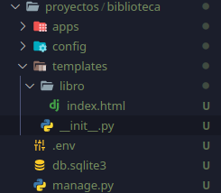