- [Django](#django)
  - [creación de un proyecto django](#creación-de-un-proyecto-django)
  - [Buenas practicas django](#buenas-practicas-django)
  - [Config VSCode para debug](#config-vscode-para-debug)
  - [Estructura del proyecto](#estructura-del-proyecto)
    - [Estructura del archivo settings](#estructura-del-archivo-settings)
  - [Modelo-vista-template](#modelo-vista-template)
  - [Aplicación de django](#aplicación-de-django)
    - [Estructura de una aplicación](#estructura-de-una-aplicación)
  - [conexion con bbdd](#conexion-con-bbdd)
    - [conexión a postgreSQL](#conexión-a-postgresql)
    - [conexión a MySQL](#conexión-a-mysql)
  - [Modelo en django](#modelo-en-django)
    - [auto\_now vs auto\_now\_add](#auto_now-vs-auto_now_add)
  - [Sitio de administración de Django](#sitio-de-administración-de-django)
    - [Grupos](#grupos)
    - [Usuarios](#usuarios)
    - [Registro de un modelo](#registro-de-un-modelo)
    - [dunder method in django model](#dunder-method-in-django-model)
      - [def __str__](#def-str)
    - [class Meta de los modelos en django](#class-meta-de-los-modelos-en-django)
      - [verbose\_name / verbose\_name\_plural](#verbose_name--verbose_name_plural)
      - [ordenar los objetos - ordering](#ordenar-los-objetos---ordering)
      - [abstract](#abstract)
      - [app\_label](#app_label)
      - [proxy](#proxy)
      - [permissions](#permissions)
  - [Relaciones entre django Models](#relaciones-entre-django-models)
    - [on\_delete](#on_delete)
    - [OneToOneField](#onetoonefield)
    - [one-to-many](#one-to-many)
    - [many-to-many](#many-to-many)
  - [forms.py](#formspy)
  - [Gestión de las URL](#gestión-de-las-url)
    - [Enlazar la URL de una app con las URLs del proyecto](#enlazar-la-url-de-una-app-con-las-urls-del-proyecto)
      - [archivo global de urls](#archivo-global-de-urls)
      - [archivo urls de una app](#archivo-urls-de-una-app)
      - [views](#views)
      - [templates](#templates)
  - [Views en django](#views-en-django)
    - [pros y contras de function-views](#pros-y-contras-de-function-views)
    - [pros y contras de class-views](#pros-y-contras-de-class-views)
    - [Generic class-based views](#generic-class-based-views)
  - [Gestión de archvos staticos con django](#gestión-de-archvos-staticos-con-django)
  - [Ejemplo de proyecto Django - API con class-based views](#ejemplo-de-proyecto-django---api-con-class-based-views)
  - [Function based views](#function-based-views)
    - [Crear un autor](#crear-un-autor)
      - [POST-is\_valid-save](#post-is_valid-save)
      - [views](#views-1)
      - [CSRF middleware](#csrf-middleware)
    - [Listar autores](#listar-autores)
      - [views](#views-2)
      - [urls](#urls)
      - [templates](#templates-1)
    - [editar autores](#editar-autores)
      - [views](#views-3)
      - [urls](#urls-1)
      - [templates](#templates-2)
    - [Eliminar autores](#eliminar-autores)
      - [models](#models)
      - [views](#views-4)
      - [urls](#urls-2)
      - [templates](#templates-3)
    - [Personalizar forms](#personalizar-forms)
      - [utilizando AutorForm](#utilizando-autorform)
      - [creando un objeto manualmente](#creando-un-objeto-manualmente)
  - [Sistema de templates django](#sistema-de-templates-django)
  - [Consultas básicas](#consultas-básicas)
  - [Enviar parámetros por URLs](#enviar-parámetros-por-urls)
  - [Blog con function based views](#blog-con-function-based-views)
    - [Personalizar django Admin](#personalizar-django-admin)
    - [Añadir una sección de escritura y edición de textos](#añadir-una-sección-de-escritura-y-edición-de-textos)
    - [Añadir archivos estáticos](#añadir-archivos-estáticos)
    - [Sistema de plantillas y categorias en templates](#sistema-de-plantillas-y-categorias-en-templates)
  - [Vistas basadas en clases](#vistas-basadas-en-clases)


# Django 

source : [curso de developer.pe (youtube)](https://www.youtube.com/playlist?list=PLMbRqrU_kvbTGg_oUKXyWi63Mo9Yoot9K)

Django sigue el patrón de diseño => M (modelo) - V (vista) - T (template)

## creación de un proyecto django 

0. creo el directorio que contendrá el proyecto

1. dentro creamos un entorno virtual, con la versión de Python que desee, y lo activamos

```
python3.9 venv -m venv_

source venv_/bin/active
```

2. Inicializar repo de GIT

```
git init
```

3. Creo gitignore para excluir el virtual environment
4. Añado mi repo remoto en GITHUB

```
git remote add origin https://github.com/dmartin-projects/***
```

5. instalamos django

```
pip install django

# o con una versión en concreto

pip install django==2.1
```

6. iniciamos un proyecto de django

```
django-admin startproject nombre_proyecto .
```

con el punto al final sólo creará la carpeta nombre_proyecto y manage.py si no pusiera el punto se crea un nuevo directorio nombre_proyecto que contendrá a su vez otro directorio nombre_proyecto y el archivo manage.py

7. Creamos los directorios apps static templates

Para que el directorio apps funcione como un módulo y pueda ser llamado desde otras partes del proyecto hay que crear un archivo vacio `__init__.py`

8. Renombro el directorio nombre_proyecto a config
9. Sustituyo en el proyecto todas la referencias a nombre_proyecto por config
   La estructura debe ser la sieguiente

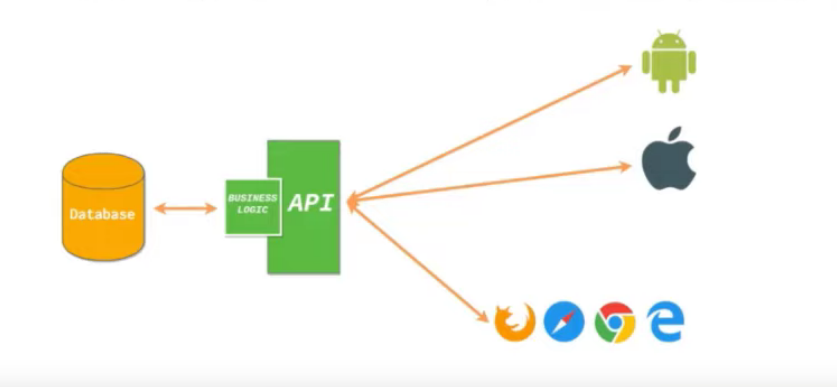

9. genero todas las tablas de la bbdd que usará django, ésta es del tipo sqlLite

```
python manage.py migrate
```

10. Creo un superuser para poder acceder a planel de control de django y a la bbdd

```
python manage.py createsuperuser
```

11. y arrancamos el servidor - http://127.0.0.1:8000/

```
python manage.py runserver
```

12. Para acceder al panel de admin - http://127.0.0.1:8000/admin

Y entramos con las credencialas del superuser creando anteriormente

Hasta aquí es lo básico, después para ir contruyendo el proyecto tendremos que ir creando las diferentes funcionalidades a modo de app dentro del directorio apps.

13. Para ello primero creamos con mkdir el directorio

```
mkdir apps/app_1
```

14.

```
python manage.py startapp app_1 apps/app_1
```

15. La registramos en el archivo de configuración settings.py del proyecto

```python
INSTALLED_APPS = [
    'django.contrib.admin',
    'django.contrib.auth',
    'django.contrib.contenttypes',
    'django.contrib.sessions',
    'django.contrib.messages',
    'django.contrib.staticfiles',
    # own apps
    'apps.app_1'
]
```

16. La estructura de la app creada es la siguiente


17. en el archivo apps.py de la aplicación ( proyecto/apps/app_1/apps.py)
    Tenemos que corregir el name.

```python
from django.apps import AppConfig


class SalesConfig(AppConfig):
    default_auto_field = 'django.db.models.BigAutoField'
    name = 'apps.sales'

```

1.  En el archivo `models.py` generamos los objetos que se guardarán en la bbdd(creamos una clase)
2.  en el archivo `admin.py` es donde la registraremos esa clase para que funcione en nuestro royecto

```python
from django.contrib import admin

from .models import Url
# Register your models here.
admin.site.register(Url)
```

20. instalamos las librerías que necesitaremos para el proyecto

```
pip install xxx
```

21. generamos el archivo de `requirements.txt` para instalar el mismo entorno en otro lugar

```
pip freeze > requirements.txt
```

22. Para poder instalar estas librerias usando un archivo requirements.txt

```
pip install -r requirements.txt
```

23. en settings.py tenemos que añadir dónde django buscara ls static files y dónde guardará los archivos subidos por el user

```python
STATIC_URL = '/static/'
STATICFILES_DIRS = [
    os.path.join(BASE_DIR,'static')
]
MEDIA_URL= '/uploads/'
MEDIA_ROOT = os.path.join(BASE_DIR,'uploads')
```

24. Tenemos que añadir esta configuración al archivo de urls

```python
from django.contrib import admin
from django.urls import path

from django.conf import settings
from django.conf.urls.static import static

urlpatterns = [
    path('admin/', admin.site.urls),
]

urlpatterns+= static(settings.STATIC_URL,document_root=settings.STATIC_ROOT)
urlpatterns+= static(settings.MEDIA_URL,document_root=settings.MEDIA_ROOT)
```

## Buenas practicas django 

1. si tenemos que usar datos comprometidos, como passwords para la bbdd o  API keys podemos crear nuestras variables de entorno en el servidor (producción) o en un archivo .env en local (siempre debe ir en el mismo directorio dnd se encuentra settings.py). Sea como sea deberemos instalar el paquete `django-environ` que nos permitirá leer las variables de entorno del SSOO y tb podemos cargar un archivo .env si existiera.

En los archivos .env no poner nunca el valor de las variables entre comillas siempre NAME=David
Una ventaja de usar el paquete django-environ, es que podemos definir el tipo de dato de la variable por ej  `env.str('NAME')` or `env.bool('DEBUG')`

```python

# en settings.py


# environ init
environ.Env.read_env() # si hay archivo .env lo leerá y cargará las variables
env = environ.Env()
print(env.str('NAME')) 
```

2. Dividir el archivo settings.py en mínimo tres archivos, local.py, base.py, production.py y los guardamos en un directorio `settings` dentro del directorio `config`

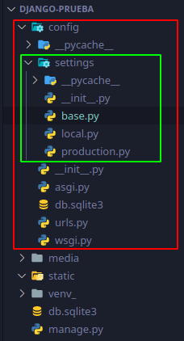

y borramos el archivo settings original

```python
# en base pondremos


import environ
from pathlib import Path

# Build paths inside the project like this: BASE_DIR / 'subdir'.
BASE_DIR = Path(__file__).resolve().parent.parent

# environ init
environ.Env.read_env()
env = environ.Env()
print(env.str('NAME'))
print(env.str('NAME2'))
  
 

# Quick-start development settings - unsuitable for production
# See https://docs.djangoproject.com/en/4.0/howto/deployment/checklist/

# SECURITY WARNING: keep the secret key used in production secret!
SECRET_KEY = 'django-insecure-xxxx'

# SECURITY WARNING: don't run with debug turned on in production!
DEBUG = True 

ALLOWED_HOSTS = []


# Application definition

BASE_APPS = [
    'django.contrib.admin',
    'django.contrib.auth',
    'django.contrib.contenttypes',
    'django.contrib.sessions',
    'django.contrib.messages',
    'django.contrib.staticfiles',
]

LOCAL_APPS = [
  'apps.miApp',
]
THIRD_APPS = [
  'rest_framework',
  
  ]

INSTALLED_APPS = BASE_APPS+LOCAL_APPS+THIRD_APPS


MIDDLEWARE = [
    'django.middleware.security.SecurityMiddleware',
    'django.contrib.sessions.middleware.SessionMiddleware',
    'django.middleware.common.CommonMiddleware',
    'django.middleware.csrf.CsrfViewMiddleware',
    'django.contrib.auth.middleware.AuthenticationMiddleware',
    'django.contrib.messages.middleware.MessageMiddleware',
    'django.middleware.clickjacking.XFrameOptionsMiddleware',
]

ROOT_URLCONF = 'config.urls'

TEMPLATES = [
    {
        'BACKEND': 'django.template.backends.django.DjangoTemplates',
        'DIRS': [],
        'APP_DIRS': True,
        'OPTIONS': {
            'context_processors': [
                'django.template.context_processors.debug',
                'django.template.context_processors.request',
                'django.contrib.auth.context_processors.auth',
                'django.contrib.messages.context_processors.messages',
            ],
        },
    },
]

WSGI_APPLICATION = 'config.wsgi.application'


# Password validation
# https://docs.djangoproject.com/en/4.0/ref/settings/#auth-password-validators
AUTH_PASSWORD_VALIDATORS = [
    {
        'NAME': 'django.contrib.auth.password_validation.UserAttributeSimilarityValidator',
    },
    {
        'NAME': 'django.contrib.auth.password_validation.MinimumLengthValidator',
    },
    {
        'NAME': 'django.contrib.auth.password_validation.CommonPasswordValidator',
    },
    {
        'NAME': 'django.contrib.auth.password_validation.NumericPasswordValidator',
    },
]


# Internationalization
# https://docs.djangoproject.com/en/4.0/topics/i18n/
LANGUAGE_CODE = 'en-us'
TIME_ZONE = 'UTC'
USE_I18N = True
USE_TZ = True
# Static files (CSS, JavaScript, Images)
# https://docs.djangoproject.com/en/4.0/howto/static-files/
STATIC_URL = 'static/'
DEFAULT_AUTO_FIELD = 'django.db.models.BigAutoField'
```


```python
# en local

from .base import *
import os

# SECURITY WARNING: don't run with debug turned on in production!
DEBUG = True 

ALLOWED_HOSTS = []

# Database
# https://docs.djangoproject.com/en/4.0/ref/settings/#databases

DATABASES = {
    'default': {
        'ENGINE': 'django.db.backends.sqlite3',
        'NAME': BASE_DIR / 'db.sqlite3',
    }
}

# Static files (CSS, JavaScript, Images)
# https://docs.djangoproject.com/en/4.0/howto/static-files/

STATIC_URL = '/static/'
STATICFILES_DIRS = (BASE_DIR, 'static')
MEDIA_URL = '/media/'
MEDIA_ROOT = os.path.join(BASE_DIR, 'media')
```

```python

# en producction

from .base import *
import os
# SECURITY WARNING: don't run with debug turned on in production!
DEBUG = True 

ALLOWED_HOSTS = []
# Database
# https://docs.djangoproject.com/en/4.0/ref/settings/#databases

DATABASES = {
    'default': {
        'ENGINE': 'django.db.backends.sqlite3',
        'NAME': BASE_DIR / 'db.sqlite3',
    }
}

# Static files (CSS, JavaScript, Images)
# https://docs.djangoproject.com/en/4.0/howto/static-files/

STATIC_URL = 'static/'
```

**Finalmente debemos cambiar algunos archivos como manage.py, wsgi.py y asgi.py**

```python
# en manage.py

def main():
    """Run administrative tasks."""
    os.environ.setdefault('DJANGO_SETTINGS_MODULE', 'config.settings.local')

# en wsgi.py
os.environ.setdefault('DJANGO_SETTINGS_MODULE', 'config.settings.local')

# en asgi.py
os.environ.setdefault('DJANGO_SETTINGS_MODULE', 'config.settings.local')
```

y ya estaría todo listo para arrancar el server.


A partir de aquí ya podemos empezar a desarrollar la lógica y las plantillas html.


> cuando instalamos django en un entorno virtual el framework se instala en la siguiente ruta:


## Config VSCode para debug

configurar vs code par que el debug ejecute en terminal. Poner esta configuración en la carpeta ".vscode-> launch.json" en la raíz del proyecto

```
{
    // Use IntelliSense para saber los atributos posibles.
    // Mantenga el puntero para ver las descripciones de los existentes atributos.
    // Para más información, visite: https://go.microsoft.com/fwlink/?linkid=830387
    "version": "0.2.0",
    "configurations": [
        {
            "name": "Python: Django",
            "type": "python",
            "request": "launch",
            "program": "${workspaceFolder}\\manage.py",
            "args": [
                "runserver"
            ],
            "django": true,
            "justMyCode": true
        },
        {
            "name": "Python: Django Shell",
            "type": "python",
            "request" : "launch",
            "program" : "${workspaceFolder}\\manage.py",
            "args": [
                "shell"
                ],
                "django": true,
                "justMyCode": true

        }
    ]
}
```

## Estructura del proyecto

Cuando creamos cualquier proyecto de django se genera una carpeta con el nombre del proyecto y dentro de esta otra carpeta con el mismo nombre, esta carpeta contiene los archivos de configuración de django (settings.py, urls.py, wsgi.py y asgi.py)  y un archivo `manage.py`. 


Este archivo es muy importante xq contendrá las configuraciones que tiene nuestro proyecto ya que establece como variable de entorno `DJANGO_SETTINGS_MODULE` nuestro archivo settings del proyecto.

### Estructura del archivo settings 

 **SECRET_KEY**, es única para cada proyecto. Está encriptada.  

 **DEBUG**, si está en True nos dará info sobre los posibles errores q ocurran y nos mostrará lo parte del código por eso en producción siempre debe estar false.  

 **ALLOWED_HOSTS**, cuando lo subimos a producción con esta variable indicamos las ip o el dominio válido que pueden acceder al proyecto.  

 **INSTALLED_APPS**, contendrá nuestras aplicaciones y las aplicaciones que django incluye por defecto como: 
  - django.contrib.admin -> sistema de administración
  - django.contrib.auth -> sistema de gestión de usuarios
  - django.contrib.contenttypes
  - django.contrib.sessions
  - django.contrib.messages -> permite enviar mensajes de validación/errores
  - django.contrib.staticfiles -> sistema de usuarios y permisos  


 **MIDDLEWARE**, es como un plugin que se situa entre la comunicación de django y el cliente, todos los inputs y outputs pasan por los middlewares. En django se usan con un propósito de seguridad. por ejemplo está csrf ( que ya otros frameworks lo usan)

  -  'django.middleware.csrf.CsrfViewMiddleware', permite el envio de formularios  

 **ROOT_URLCONF**, es donde están las rutas principales de todo nuestro proyecto, apunta al archivo 'config/urls.py'   

 **templates**, fija la configuración para el sistema de plantillas. Django ya viene con un sistema de templates aunq tb soporta otros sistemas de plantillas como Jinja2 
  ```python
      TEMPLATES = [
      {
          'BACKEND': 'django.template.backends.django.DjangoTemplates', # sistema de plantillas por defecto de Django
          'DIRS': [], # la ruta donde encontrará los templates 
          'APP_DIRS': True, # en True indica que cuando el cliente solicite un template django la buscará en todo el proyecto incluido el directorio de apps, si no queremos este comportamiento
                            # poner en False
          'OPTIONS': {  # opciones para el procesa de los templates como tal
              'context_processors': [
                  'django.template.context_processors.debug',
                  'django.template.context_processors.request',
                  'django.contrib.auth.context_processors.auth',
                  'django.contrib.messages.context_processors.messages',
              ],
          },
      },
  ] 
  ```  

**WSGI_APPLICATION**, esto es para producción indica al servidor cómo levantar nuestra aplicación y como recibirá las comunicaciones.  

```python

WSGI_APPLICATION = 'prueba.wsgi.application'

```


**DATABASES**, es la configuración de las bbdd q usará django por defecto usará sqlite3 pero puede usar postgresql, mysql mongodb.  

```python
DATABASES = {
    'default': {
        'ENGINE': 'django.db.backends.sqlite3',
        'NAME': os.path.join(BASE_DIR, 'db.sqlite3'),
    }
}
```


**AUTH_PASSWORD_VALIDATORS**, es una sección que se encanrga de validar los passwords de los users y pone ciertas restricciónes como de longitud del pwd o que no sea igual/parecido al nombre del user,...  

**sección de Internationalization**, puedes configurar el idioma, time_zone, etc   

```python
# Internationalization
# https://docs.djangoproject.com/en/3.0/topics/i18n/

LANGUAGE_CODE = 'en-us'

TIME_ZONE = 'UTC'

USE_I18N = True

USE_L10N = True

USE_TZ = True
```
**sección de Static files** (CSS, JavaScript, Images)

STATIC_URL, especifica dnd estrán nuestros archivos estáticos, por defecto está configurado para que busque los archivos en un directorio llamado `static` dentro de cada app. podemos modificar esta config y hacer que django tb busque en otras ubicaciones añadiendo lo siguiente:

```python

STATIC_URL = '/static/' # path dnd van a estar los archivos estatáticos, ruta q se accede desde el navegador

STATICFILES_DIRS = [

BASE_DIR / "static", # creamos otro directorio static en la raiz del proyecto, donde guardará los archivos en local/servidor

] 
```

## Modelo-vista-template 

Habitualmente se trabaja con un patrón de diseño MVC (modelo vista controlador) donde el user interactua con una vista la cual está conectada a un controlador y este controlador es el q contiene la lógica por ejemplo conexión con la bbdd, el resultado obtenido x el controlador es presentado a la vista y ésta lo muestra al user de una manera entendible. 


Pero django usa el patrón MVT (modelo vista template). En este caso el user realiza cualquier acción en el sitio web y esa acción es capturada por una URL que está conectada con una vista, la cual contiene la lógica y es capaz de gestionar la petición/request de user. Además la vista tiene asociada una manera de mostrar la info llamada template. La vista tb está asociado a un modelo que es el q interaccioona con la bbdd. 


Para poder explicarlo tenemos que crear previamente una aplicación dentro del proyecto de django.

## Aplicación de django 

Las aplicaciones en django son un modo de dividir el proyecto en diferentes secciones, por ejemplo una app que gestione los users, otra que gestione otra parte del proyecto y así.

Para tener todo más organizado crearemos un directorio en la raíz del proyecto llamado `apps` donde guardaremos nuestras aplicaciones. Para que django lo reconozca como un modulo hay que añadir un archivo `__init__.py` 

Hay dos comando para crear una aplicación:

1. usando manage.py 
   Si escogemos este método previamente debemos crear el directorio con el nombre de la app (por ejemplo libro) dentro de apps.
   1. `python manage.py startapp libro apps/libro `
2. usando el comando django-admin
   1. en este caso podemos situarnos directamente en el directorio apps y ejecutar el comando `django-admin startapp libro`

Posteriormente debemos registrar la nueva app en el archivo settings.py en la lista de INSTALLED_APPS como `apps.libro`.

```python
INSTALLED_APPS = [
    'django.contrib.admin',
    'django.contrib.auth',
    'django.contrib.contenttypes',
    'django.contrib.sessions',
    'django.contrib.messages',
    'django.contrib.staticfiles',

    # owned apps
    'apps.libro',
]
```


### Estructura de una aplicación


- directorio migrations 

Es donde se guardarán todos los archivos resultantes al realizar una migración. Una migración es cuando desde código python generamos una tabla en nuestro gestor de bbdd. 

- admin.py 

es dnd podemos registrar los modelos(tablas de bbdd) para que puedan ser reconocidos por el admin de django (localhost:8000/admin) 

- apps.py 

nos permite añadir configuraciones extra a nuestra aplicación. Debemos hacer una pequeña modificación al utilizar un directorio apps. 

```python
 from django.apps import AppConfig


class LibroConfig(AppConfig):
    default_auto_field = 'django.db.models.BigAutoField'
    name = 'apps.libro'

```

- models.py

es dnd crearemos los modelos, son una clase de python pero que representa una tabla en la bbdd. 

- test.py 

django incluye soporte para realizar test tanto de nuestra lógica de la app como de la creación de los modelos etc...

- views.py 

en este archivo es donde tendremos la lógica de la aplicación.

## conexion con bbdd

### conexión a postgreSQL

Previamente debemos tener creada nuestra bbdd a la cual nos queremos conectar, en este caso biblioteca.

Para conectas django a postgtres debemos ayudarnos de una libreria extra `psycopg2` que la usaremos como conector entre django y postgres.

```
pip install psycopg2

```

si nos da errror instalar

```
sudo apt install build-essential
sudo apt install python3-dev
sudo apt install libxslt-dev libffi-dev libssl-dev
```
ahora configuramos el archivo setting.py.


```python


DATABASES = {
    'default': {
        'ENGINE': 'django.db.backends.postgresql_psycopg2',
        'NAME': 'unNombre',
        'USER':'unUSER',
        'PASSWORD':'unPASSWORD',
        'HOST':'unHOST',
        'POST':0000
    }
} 
```
Para no exponer datos importantes como nombre de usuario t password podemos optar por tenerlos guardados en un archivo .env y en producción guardarlos en variables de entorno. 

Así que haremos una comprobación, si existen variables de entorno llamadas USER,PASSWORD,HOST,POST las cogerá si no es el caso utilizará las del archivo .env

para ello debemos instalar

```
pip install python-dotenv
```
que me permite cargar las variables guardadas en un .env file. Para buscar variables de entorno utilizo el paquete `os`.

Para usar `dotenv` tenemos dos opciones o usamos la función `load_dotenv()` lo que cargará las variables guardadas en el archivo .env como si fueran variables de entorno por lo que serán accesibles mediante `os.getenv('NAME)` por defecto este modo no sobreescribe las variables de entorno si existiera.

el archivo .env debe estar en la raíz del proyecto.

```python
from dotenv import dotenv_values,load_dotenv
import os

# carga las variables contenidas en el archivo .env como si fueran de entorno
# si hubiera una variable de entorno con el mismo nombre no será sobreescrita.
load_dotenv() 

NAME = os.getenv('NAME')
USER = os.getenv('USER')
PASSWORD = os.getenv('PASSWORD')
HOST = os.getenv('HOST')
PORT = os.getenv('PORT')
```

otra opción sería guardar las variables del .env en un dict e ir accediendo a ellas
y luego comprobar si existen esas mismas variables en el entorno y sobreescribir la variable

```python

from dotenv import dotenv_values,load_dotenv
import os

config = dotenv_values(".env")

NAME = config.get("NAME")
USER = config.get("USER")
PASSWORD = config.get("PASSWORD")
HOST = config.get("HOST")
PORT = config.get("PORT")


if os.getenv('NAME') and \
   os.getenv('USER') and \
   os.getenv('PASSWORD') and \
   os.getenv('HOST') and \
   os.getenv('PORT'):

    NAME = os.getenv('NAME')
    USER = os.getenv('USER')
    PASSWORD = os.getenv('PASSWORD')
    HOST = os.getenv('HOST')
    PORT = os.getenv('PORT') 
```

### conexión a MySQL

Previamente debemos tener creada nuestra bbdd a la cual nos queremos conectar, en este caso biblioteca. 

```sql
create database biblioteca;
```


Necesitamos una librería extra para la conexión con mySQL 
```
pip install mysqlclient
```
antes de instalar debemos instalar ciertas dependencias en nuestro SSOO mediante 

```
sudo apt-get install python3-dev default-libmysqlclient-dev build-essential

```

los settings serían:

```python
DATABASES = {
    'default': {
        'ENGINE': 'django.db.backends.mysql',
        'NAME':'unNOmbre',
        'USER':'unUSER',
        'PASSWORD':'unPASWWORD',
        'HOST':'unHOST',
        'PORT':0000
    }
}
 
```
ejecutamos las migraciones `python manage.py migrate` y para comprobar que ha generado las tablas en la bbdd, entramos en la consola de mysql y tecleamos: 

```sql
use biblioteca;

show tables;
```

## Modelo en django

source: https://docs.djangoproject.com/en/4.0/topics/db/models/

Son clases escritas en python que representan tablas en una bbdd. Estas clases deben heredar de `models.Model` parta que django entienda que de esta clase se puede crear una tabla en la bbdd. 

Hay que tener encuenta que si no especificamos una PrimaryKey django le asignará una por defecto con nombre `pk` (con nombre pk, integerField y autoincremental). 

```python
class Autor(models.Model):
    id = models.AutoField(primary_key=True) # es un integerField y autoincrement
    nombre= models.CharField(max_length=200, blank=False,null=False)
    apellidos = models.CharField(max_length=200, blank=False,null=False)
    nacionalidad = models.CharField(max_length=100, blank=False,null=False)
    apellidos = models.TextField(blank=False,null=False)
    fecha_creacion = models.DateField('Fecha de creación',auto_now=True,auto_now_add=False)
```

- Los modelos pueden tener distintos tipos de datos:

1. AutoField    => integer autoincremental
2. CharField    => texto, marcamos la longitud
3. TextField    => para texto muy extenso
4. IntegerField => valores numéricos
5. JSONField
6. URLField
7. ImageField
8. FileField
9. BooleanField


una vez creado nuestro modelo debemos exportarlo a la bbdd para ello usamos el comando `python manage.py makemigrations`. Este comando crea un archivo en la carpeta migrations de la app identificando todos los modelos de nuestra app y generando una estructura para que posteriormente sea convertido a lenguaje sql. para realizar esto debemos ejecutar `python manage.py migrate`.

Una vez hecho esto podemos acceder al modelo y comprobar que se ha creado correctamente entrando en la sección admin de django para ello arrancamos el server. `python manage.py runserver` por defecto en 127.0.0.1:8000 pero podemos especificar el puerto con `python manage.py runserver 127.0.0.1:8006/admin`. Para acceder necesitamos un password para ello creamos un superuser con `python manage.py createsuperuser`

### auto_now vs auto_now_add 

- auto_now -> permite crear y actualizar la fecha cada vez que se ejecute un save() sobre el objeto

- auto_now_add -> solo añadirá la fecha solo en el momento de creación del objeto (aunq se ejecute más veces un save() sobre ese objeto la fecha no cambiará)


## Sitio de administración de Django 

Es una interfaz creada con una lógica propia y ofrece un panel de administración para el superuser. Podemos crear nuevos users, editarlos, borrarlos,...

Cuando hacemos un migrate django ya crea por defecto dos modelos, q aparecen en el admin, users y grupos.

Para django la capa de seguridad la realiza a través de una applicación que se llama `Authentication` y  `Authorization`. Esta applicación consta de dos modelos `Users`, `Groups`


### Grupos 

Nos permite crear un grupo y darle permisos. Esos permisos son los que ya trae django preparados para todo proyecto. Aunque podemos crear nuestros propios permisos.

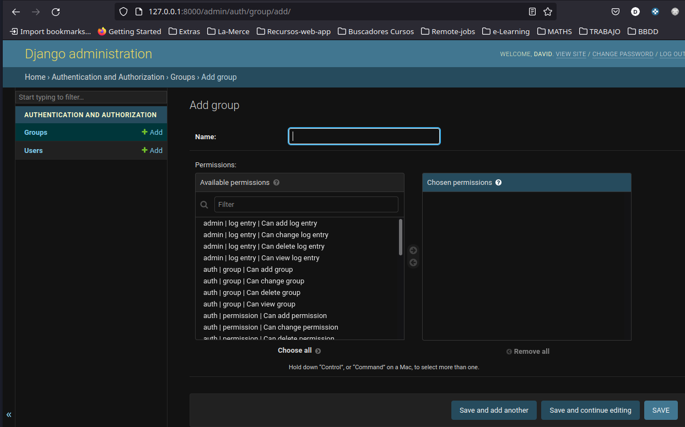

Cada vez que creamos un modelo y lo migramos django le atribuye 3 permisos de manera automática. Estos permisos son los de crear, modificar y eliminar el modelo. Por ejemplo en el proyecto biblioteca he creado una app Libro y en ella un modelo Autor, pues bien django crea 3 permisos relacionados con crear, leer,cambiar y editar un autor. 


Ahora puedo crear un grupo (Supervisor Autores) que tendrá esos permisos para poder crear/leer/modificar/borrar un autor. Y solo esos permisos.

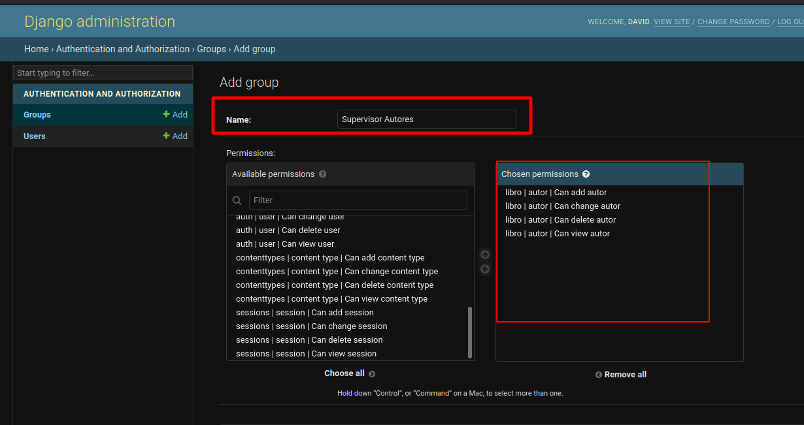

### Usuarios 

Es donde realiza la gestión de todos los users. Cuando creamos nuestro superuser por consola, para poder acceder al admin, aparecerá aquí.


y si entramos en él podremos ver sus características 


cosas a tener en cuenta de esta sección: 

- En la sección de password nos da la opción de modificarlo.
- la casilla staff-> cuando está clicada indica que el user puede entrar en el admin.

### Registro de un modelo 

Una vez creado un modelo para que este aparezca y lo podamos usar en el admin tenemos que registrarlo. Para ello debemos incluir el siguiente código en el archivo `admin.py` de la aplicación.

```python
from django.contrib import admin

from .models import Autor
# Register your models here.

admin.site.register(Autor)
```

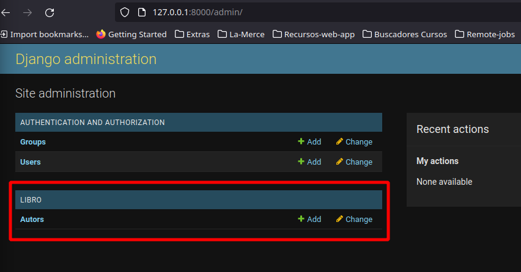

Una vez cargado el modelo podremos creat/leer/editar/borrar autores. 

### dunder method in django model 

#### def __str__ 

Cuando creamos objetos de un modelo estos los veremos en el admin de la siguiente manera: 


con esta visualización no podemos distinguir/reconocer que autor es así que para que la visualización del objeto sea más entendible podemos sobreescribir el método `__str__` del objeto 


```python
class Autor(models.Model):

    id = models.AutoField(primary_key=True)
    nombre= models.CharField('Nombres',max_length=200, blank=False,null=False)

    class Meta:
        verbose_name= 'Autor'
        verbose_name_plural = 'Autores'

    def __str__(self):
        return self.nombre 
```
el resultado de esta modificación es que ahora los objetos los visualizamos así:

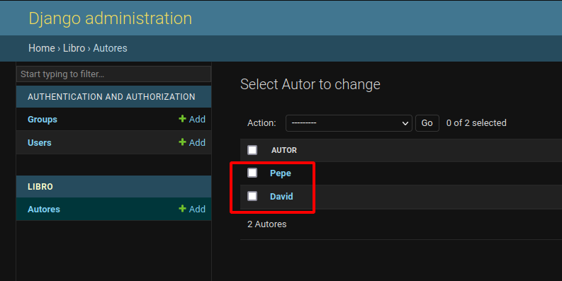

### class Meta de los modelos en django

```python

class Autor(models.Model):
    id = models.AutoField(primary_key=True)
    nombre= models.CharField(max_length=200, blank=False,null=False)
    apellidos = models.CharField(max_length=200, blank=False,null=False)
    nacionalidad = models.CharField(max_length=100, blank=False,null=False)
    apellidos = models.TextField(blank=False,null=False)
    
    class Meta:
        verbose_name= 'Autor'
        verbose_name_plural = 'Autores'
        ordering = ['nombre']
        abstract = True
        app_label = 'myapp' # add app name here
        proxy = True
        permissions = []
 
```
source https://docs.djangoproject.com/en/4.0/ref/models/options/

#### verbose_name / verbose_name_plural

Cuando creamos un modelo y lo registramos en el admin django lo pasa al plural, le añade una `s`. 


Para modificar este comportamiento de django debemos añaldir en el modelo una subclase `Meta`. Meta viene de metadatos, es decir datos extra que queremos añadir a nuestro modelo. 

Este `verbose_name` también se puede colocar en los campos y lo usamos para dar a los campos un nombre legible para los "humanos". NO MODIFICA EL NOMBRE DADO AL ATRIBUTO, SOLO QUE USARÁ EL VERBOSE_NAME CUANDO TENGA QUE MOSTRAR ESA INFO.

```python
descripcion= models.CharField(verbose_name = "Descripción", max_length=200, blank=False,null=False)
```

#### ordenar los objetos - ordering

A medida que vamos añadiendo objetos el primero en la lista es el más recientemente creado. Si queremos modificar ese comportamiento debemos añadir un campo `ordering` en la clase Meta.

si el ordering lo defino como `[-nombre]` lo ordena al revés

#### abstract

If abstract = True , this model will be an abstract  base class

#### app_label

If a model is defined outside of applications in INSTALLED_APPS, it must declare which app  it belongs to:

#### proxy

If we add proxy = True a model which subclasses another model will be treated as a proxy model

A proxy model is a subclass of a database-table defining model. Typically creating a subclass of a model results in a new database table with a reference back to the original model’s table - multi-table inheritance.

A proxy model doesn’t get its own database table. Instead it operates on the original table.


#### permissions

Extra permissions to enter into the permissions table when creating this object. Add, change, delete and view permissions are automatically created for each model.


## Relaciones entre django Models

Creamos otro modelo para establecer las distintas relaciones con autores. Este nuevo modelo será Libro.

### on_delete

Hace referencia a qué sucede cuando borramos el registro/objeto al cual hace referencia la FK. 
En nuestro caso el modelo Libro tiene una FK que hace referencia a Autor pues qué sucedería, con ese Libro, si borramos el Autor.

1. CASCADE -> se borraría tb el libro
   
2. PROTECT OR RESTRICT -> no permite que se borre un Autor que ya tiene un libro asociado
   
3. SET_NULL -> pondría como null el campo Autor por lo que existiria un Libro con autor=Null 
   
4. SET_DEFAULT OR SET(...) -> especificamos un Autor alternativo como defecto 
   
5. DO_NOTHING -> no sucedería nada pero ese libro tendría un campo Autor que hace referencia a un Autor q ya no existe en la bbdd 

### OneToOneField

En nuestro caso sería cuando un Libro solo puede tener un Autor y un Autor solo puede haber escrito un Libro.

Si establecemos una relación del tipo one-to-one usaremos un campo `OneToOneField` pero entonces estamos obligados a especificar dos atributos:

- modelo al cual hace referencia
- on_delete, qué sucede cuando borramos el registro/objeto al que hace referencia la `foreignKey`. 

```python
class Libro(models.Model):
    id = models.AutoField(primary_key=True)
    titulo = models.CharField('Titulo',max_length=255,blank=False,null=False)
    fecha_publicacion = models.DateField('Fecha de publicacion',blank=False,null=False)
    # RELACIONES ONE-TO-ONE
    autor_id  = models.OneToOneField(Autor, on_delete=models.CASCADE)
```
En este caso autor_id pasa a ser una `foreignKey` que hace referencia a un Autor, si se elimina el Autor al indicar `models.CASCADE` tb se eliminaría el libro pq es obligatorio que un libro tenga un autor. 

### one-to-many

En nuestro caso sería cuando un Libro solo puede tener un Autor pero  un Autor puede haber escrito más de un Libro.

Para establecer una relación one-to-many debemos utilizar el tipo de campo `ForeignKey` 

```python
autor_id  = models.ForeignKey(Autor, on_delete=models.CASCADE)
```

### many-to-many

En nuestro caso sería cuando un Libro puede tener más de un Autor y  un Autor puede haber escrito más de un Libro.

Para establecer este tipo de relaciones usaremos el tipo de campo `ManyToManyField` .

Con este tipo de relación no necesitamos el atributo on_delete.

```python
autor_id  = models.ManyToManyField(Autor) 
```

## forms.py

Para generar nuevos objetos de un modelo necesitamos un formulario para enviar datos a django. Con el objetivo de facilitarnos esta tarea django ya tiene una clase llamada Form, que crea los inputs y labels necesarios para cada campo del modelo que tengamos en lenguaje HTML, excepto la tag form, es decir crea todo el código que debería estar dentro de la etiqueta form.

Para crear un formulario debemos importar `from django import forms`. 

La mejor manera de hacer esto es crear un archivo `forms.py` en la app y genrar clases que hereden de `forms` o de `forms.ModelForm` para cada modelo del q necesitemos un CRUD.

```python
from django import forms
from .models import Autor,Libro


class AutorForm(forms.ModelForm):
    class Meta:
        model= Autor
        fields = ['nombre', 'apellidos','nacionalidad','descripcion']

```

otro ejemplo de crear formularios es el siguiente (del django-quick-project)

```python
# default django form to create users
from django.contrib.auth.forms import UserCreationForm
# para crear form para authentication
from django.contrib.auth.forms import AuthenticationForm
# user model by default 
from django.contrib.auth.models import User

# para poder usar los tipos de cada field, por ejmplo txt, number, password...
from django import forms

# este input permite importar los widgets, password input widgets and text import widget
from django.forms.widgets import PasswordInput,TextInput

# Create a user
class CreateUserForm(UserCreationForm):
    class Meta:
        model = User
        fields = ['username','password1','password2']


# login a user
class  LoginForm(AuthenticationForm):

    username = forms.CharField(widget=TextInput())
    password = forms.CharField(widget=PasswordInput())
```

## Gestión de las URL

Hay que tener algo claro y es que en django las urls tienen nombre (path('home/', Home, name='index'), este name lo puedo utilizar tanto en `views` como en `template`. Al tener nombre puedo utlizar en las views la sintaxis

```python
return redirect('libro:listar_autores')
```
o en las templates 

```HTML
<td><a href="">Editar</a></td>
```
en este caso la url le pasariamos el valor del parámetro autor.id `editar-autor/23`

### Enlazar la URL de una app con las URLs del proyecto

Para cada app creamos un archivo `urls.py` donde especificaremos todas las urls relacionadas con esa app y después importaremos ese archivo al urls.py global del proyecto.

Para poder hacer eso necesitamos, importar en el archivo global la función `include`, ésta nos permite incluir en la lista `urlpatterns` un archivo. Para ello pasaremos una tuple que consta de dos parámetros la ruta al archivo url que queremos incluir y un identificador.

#### archivo global de urls
```python
from django.contrib import admin
from django.urls import path, include

urlpatterns = [
    path('admin/', admin.site.urls),
    path('libro/',include(('apps.libro.urls','libro')))
]

```

El include acepta una tuple formada por la ruta a donde se encuentra el archivo urls de la aplicación y un nombre que representa a todas las urls de la aplicación libro. Esto nos sirve para poder construir urls de una manera muy sencilla. Por ejemplo podems hacer lo siguiente en un template:

```HTML 
<li class="nav-item">
    <a class="nav-link px-lg-3 py-3 py-lg-4" href="">Inicio</a>
</li>
```
libro:index, significa que de las urls de libro crea un enlace a la url index.

#### archivo urls de una app

Para que django reconozca un archivo de urls éste debe contener una lista llamada `urlpatterns`
Entonces creamos ese archivo en la aplicación, en mi caso Libro.

```python
from django.urls import path
from .views import Home

urlpatterns = [
    path('', Home, name= 'index')
]

```

esta lista urlpatterns debe contener rutas. Una ruta consta de tres partes:
1. una url
2. nombre de la vista que debe renderizar
3. un nombre o identificador de toda la url, solo funciona cuando usamos el sistema de plantillas de django

#### views 

Creamos una vista lo más sencilla posible. Las vistas siempre deben recibir un parámetro request. En este caso utilizamos una función para renderizar la vista. La función render acepta dos parámetros el request y la ruta dónde se encuentra nuestra template.

```python
from django.shortcuts import render

# Create your views here.

def Home(request):
    return render(request,'libro/index.html') 
```
#### templates 

Para poder renderizar un template debemos indicar en el archivo de configuración `settings.py` dónde django debe buscar las templates para ello. 

```python
TEMPLATES = [
    {
        'BACKEND': 'django.template.backends.django.DjangoTemplates',
        'DIRS': [os.path.join(BASE_DIR,'templates')],
        'APP_DIRS': True,
        'OPTIONS': {
            'context_processors': [
                'django.template.context_processors.debug',
                'django.template.context_processors.request',
                'django.contrib.auth.context_processors.auth',
                'django.contrib.messages.context_processors.messages',
            ],
        },
    },
]
```
ya que la estructura del proyecto sería así 


## Views en django

Django tiene dos tipos de vistas:

- function-based views (FBVs)
- class-based views (CBVs)

Inicialmente django solo tenía `function-views` y después surgió las `class-views` con el objetivo de crear templates para evitar repetir código. Tener en cuenta q las class-views no reemplazan las function-views

En el caso de las claa-views tenemos una serie de ellas ya pre-configuradas con las funcionalidades más habituales e incluso podemos extender una clase propia de ellas para customizarlas. Este tipo de class-views predefinidas se les llama `generic views`

Toda vista en django debe respetar lo siguiente:

1. Son invocables. Una vista puede ser una función o una vista basada en clases. Los CBV heredan el método as_view() que utiliza un método de dispatch() para llamar al método apropiado dependiendo del verbo HTTP (get, post, etc.)

2. Deben aceptar un objeto HttpRequest como primer argumento posicional.
3. Deben devolver un objeto HttpResponse o generar una excepción.


Algoritmo para escoger function o class based views


### pros y contras de function-views

Pros
    Simple to implement
    Easy to read
    Explicit code flow
    Straightforward usage of decorators
    good for one-off or specialized functionality
Cons
    Hard to extend and reuse the code
    Handling of HTTP methods via conditional branching. Es decir tenemos q gestionar en el cuerpo de la funci


### pros y contras de class-views

Pros
    Code reuseability — In CBV, a view class can be inherited by another view class and modified for a different use case.
    DRY — Using CBVs help to reduce code duplication
    Code extendability — CBV can be extended to include more functionalities using Mixins
    Code structuring — In CBVs A class based view helps you respond to different http request with different class instance methods instead of conditional branching statements inside a single function based view.
    Built-in generic class-based views
Cons
    Harder to read
    Implicit code flow
    Use of view decorators require extra import, or method override


### Generic class-based views

Se introdujeronm para cubrir los usos más habituales en el desarrollo web como crear nuevos objetos, gestionar formularios, listar objetos en una vistas, paginación,... Estas coses se encuentran en el Django core (`django.views.generic`)

Las generic class-base view más habituales son (agrupadas por funcionalidades)

source : https://ccbv.co.uk/


## Gestión de archvos staticos con django

por defecto django buscara archivos static (css, jspng,..) dentro del directorio de cada una de las apps que vayamos creando. También podremos guardar nuestros archivos html dentro de cada app. Para que esto funcione tiene que seguir una estructura.

```
nombre_app
         |
         static
              |
              nombre_app
                        |
                         -css
                         -js
```

si seguimos esa estructura podremos acceder directamente a los archivos static sin necesidad de especificar una ruta. Para ello ponemos al principio del archivo HTML ``. Luego accedemos a los archivos con:

```html
<link rel="stylesheet" href="" />
```

Pero lo recomendable es tener los archivos static fuera de las apps, concretamente en la raíz del proyecto para ello debemos especificar en settings.py dónde se encuentran. Para settear esta funcionalidad usamos `STATICFILES_DIRS`

```python

STATICFILES_DIRS = [
     os.path.join(BASE_DIR,'static')
]
```

una vez hecho esto debemos acceder a los archivos

```html
<link rel="stylesheet" href="" />
```

Tanto en desarrollo como en deploy el q tiene q estar sí o sí es `STATIC_URL`.

**STATIC_URL** is the URL location of static files located in
STATIC_ROOT

**STATICFILES_DIRS** tells Django where to look for static files in a Django project, such as a top-level static folder(additional location for static files)

**STATIC_ROOT** is the folder location of static files when collecstatic is run

**STATICFILES_STORAGE** is the file storage engine used when collecting static files with the collecstatic command.

## Ejemplo de proyecto Django - API con class-based views

Crearemos una API usando django únicamente para después ver las diferencias al usar django rest framework

En primer lugar instalamos django y pillow

```
pip install django pillow
```

creamos un file requeriments.txt

```
pip freeze > requirements.txt
```

1. iniciamos un proyecto django

```
django-admin startproject onlineStore

```

esto crea esta estructura

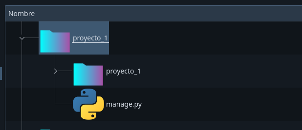

ahora bien puede ser que queramos crear directamente el proyecto dentro de un directorio para que no nos vuelva a repetir la carpeta el comando es

```
django-admin startproject onlineStore .

```

con el punto al final solo creará la carpeta proyecto_1 y manage.py

1. exportamos la bbdd

```
python manage.py migrate
```

con el comando migrate lo que hacemos es ejecutar todas las sentencias `sql` para generar un archivo tipo `.sqlite3` que contiene la bbdd, o podemos abrir con `dbeaver`

1. creamos el superuser para logearnos en el panel de django

```
python manage.py createsuperuser
```

4. corremos el servidor

```
python manage.py runserver
```

este server corre en `localhost:8000`

en `localhost:8000/admin` podemos entrar en el administrador de django con las credenciales del superuser creado anteriormente.

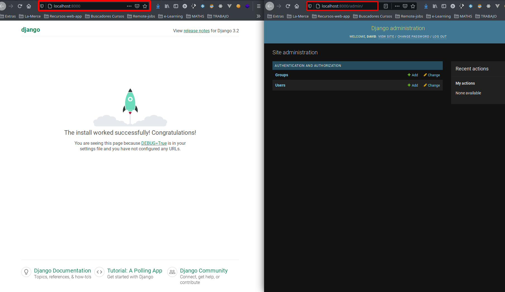

Hay una manera de correr el servidor más fácilmente que es en la sección debug de vsCode configurarlo para un proyecto django, esto nos creará un archivo launch.json para configurar dónde se encuentra el archivo manage.py y nos dará opciones de que comando ejecutar, podemos especificar q sea `runserver`


Ahora ya tenemos creado nuestro proyecto django a partir de aquí creamos todas aquellas aplicaciones que usarems en el proyecto, básicamnete los modelos(productos,users...)

Todas las django apps son pequeñas apps dentro de nuestro proyecto django. Cada una de estas apps pueden ser entendidas como objetos que jugaran un papel en nuestra app, cada una de estas apps genera una tabla en la bbdd.

Entre los archivos que contiene las apps tenemos el model.py que nos pemite definir que atributos tendrá ese objeto y métodos, posteriormente esos atributos se tranformaran en campos de la tabla en la bbdd y cada objeto creado será un regisro en la tabla.

1. Creamos app products

```
python manage.py startapp products
```

---

- TIP

Hasta aquí es lo habitual para crear un proyecto django. Cuando se crea el proyecto el asistente de django crea una carpeta, proyecto_1, la cual podemos cambiar el nombre sin más y dentro de ésta otra del mismo nombre proyecto_1 que es la que contiene los archivos de configuración.


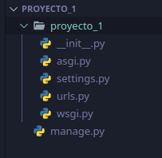

Para evitar confusiones podemos cambiar el nombre de la carpeta interna por otro, por ejemplo config. Si lo hacemos debemos entrar en el archivo de settings.py y en manage.py y cambiar en las rutas por el nombre nuevo.


Una vez hecho esto vamos a crear diferentes apps dentro de nuestro proyecto, para que quede todo más ordenado podemos hacer un directorio apps y guardarlas allí. Para ello primero debemos crear el directorio apps y dentro directorios vacíos con el nombre de las apps.

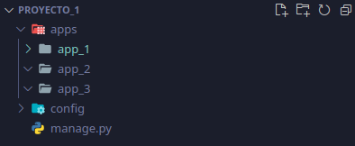

Ahora creamos las apps con django y le damos una ruta concreta, primero dando el nombre de la app y después el path.

```
python manage.py startapp app_1 apps/app_1
```

Ahora el directorio queda organizado de la siguiente manera

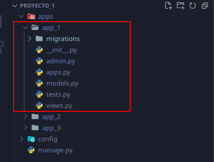

Para que django reconozca el directorio apps como un paquete y por tanto podamos importar el código a modo de módulos, hay que crear dentro un archivo `__init__.py` habitualmente este archivo puede estar vacío. Después para registrar estas apps en setting.py sería usando notaciónd e punto `apps.app_1`

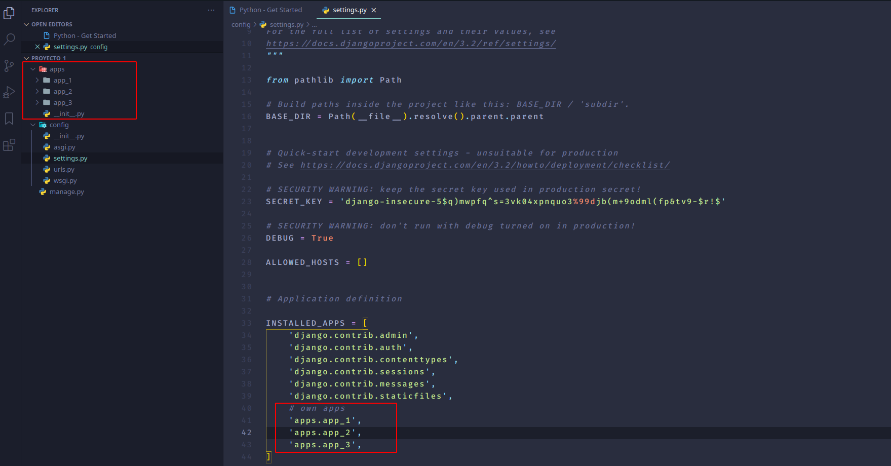

Finalmente hay que modificar el archivo `apps.py` de la app que menos creado y en el campo nombre añadir `app.nombreApp`


---

Creamos los modelos de esta app, necesitamos manufacturer y products
cuando creamos un product este tiene como FK (llave foranea) a Manufacturer

La diferencia entre textField y CharFIeld es que textFeld no tiene limitación de carcateres.

```python
from django.db import models

# Create your models here.

class Manufacturer(models.Model):
    name = models.CharField(max_length=255)
    location =models.CharField(max_length=255)
    active= models.BooleanField(default=True)

    def __str__(self):
        return self.name

class Product(models.Model):
    manufacturer = models.ForeignKey(Manufacturer,
                                    on_delete=models.CASCADE,
                                    related_name="products")
    name = models.CharField(max_length=255)
    description = models.TextField(blank=True, null=True)
    photo = models.ImageField(blank=True, null=True)
    price = models.FloatField()
    shipping_cost = models.FloatField()
    quantity = models.PositiveIntegerField()

    def __str_(self):
        return self.name
```

El atributo `related_name` nos permite hacer una query reversa, es decir desde una instancia de manufacturer sacar todos los products relacionados con esa instancia de manufacturer. **realmente crea un campo en el modelo de la foreigkey, con el nombre que le damos, en este caso products dentro de manufacturer**. En realidad este campo genera un query builder por lo q para acceder a los datos tenemos que utlizar sus  métodos como:

```
manufacturer1.products.all()

# <QuerySet [<Product: Product object (1)>, <Product: Product object (2)>]>
```

Para hacer la reversa tb lo podemos hacer en la clase que no tiene la foreign key añadimos el método:

```python
def get_items(self):
  return self.item_set.all()
# esto traerá todos los "item" objetos del otro modelo con el q está relacionado mi instancia.
```

Si no quisieramos crear este tipo de relación debemos especificarlo `related_name='+'`

Una vez hemos creado nuestros modelos en el apartado `INSTALLED_APPS` del archivo setting.py incluimos nuestro nueva app (products)

```python
INSTALLED_APPS = [
    'django.contrib.admin',
    'django.contrib.auth',
    'django.contrib.contenttypes',
    'django.contrib.sessions',
    'django.contrib.messages',
    'django.contrib.staticfiles',

    # our apps
    'products'
]
```

y actualizamos la bbdd mediante el comando

```
python manage.py makemigrations
python manage.py migrate
```

2. Creamos una vista para products

Una de las maneras más sencillas de crear vistas en django es utilizando los modulos `DetailViews y ListViews`

También creamos nuestras templates en formato html en un directorio templates dentro de la app products

En el archivo views.py de products

```python
# módulos para la creación de vistas
from django.views.generic.detail import DetailView
from django.views.generic.list import ListView

# importamos nuestro modelo
from .models import Products,Manufacturer

class ProductDetailView(DetailView):
    model = Products
    template_name = 'products/products_detail.html'

class ProductListView(ListView):
    model = Products
    template_name = 'products/products_list.html'
```

ahora creamos las templates

- product_detail.html

```html
<!DOCTYPE html>
<html lang="en">
  <head>
    <meta charset="UTF-8" />
    <meta http-equiv="X-UA-Compatible" content="IE=edge" />
    <meta name="viewport" content="width=device-width, initial-scale=1.0" />
    <title>{{object.name}}</title>
  </head>
  <body>
    <p>Product: {{object.name}}</p>
    <p>Manufacturar: {{object.manufacturer}}</p>
    <p>Quantity: {{object.quantity}}</p>
    <p>Description: {{object.description}}</p>
    <p>Price: {{object.price}}</p>
    <p>Shipping cost: {{object.shipping_cost}} €</p>

    
  </body>
</html>
```

en lugar de object.name puedo usar el nombre del modelo en minúscula `product.name`

- product_list.html

```html
<!DOCTYPE html>
<html lang="en">
  <head>
    <meta charset="UTF-8" />
    <meta http-equiv="X-UA-Compatible" content="IE=edge" />
    <meta name="viewport" content="width=device-width, initial-scale=1.0" />
    <title>Product list</title>
  </head>
  <body>
    
    <p>Product: {{product.name}}</p>
    <p>Manufacturar: {{product.manufacturer}}</p>
    <p>Price: {{product.price}}</p>
    
  </body>
</html>
```
en lugar de object_list puedo usar el nombre del modelo en minúscula `product_list`

3. ahora solo nos queda añadir la url, primero creamos un archivo `urls.py `dentro de products. Como la vista ProductDetail nos tiene que mandar un id de producto en la url le pasamos "/product/<int:pk>/", la vista productList se cargará como homePage por eso no especificamos nada

```python
from django.urls import path
from .views import ProductDetailView, ProductListView


urlpatterns = [
    path("", ProductListView.as_view(),name='product-list'),
    path("/product/<int:pk>/", ProductDetailView.as_view(),name='product-detail'),
]
```

una manera de agrupar las urls por app y que distintas apps tengan url iguales es usar la variable `apps_name` en el archivo de urls.py de cada aplicación así todos los paths irán precedidos de este valor

```python
from django.contrib import admin
from django.urls import path,include

from  .views import ProductList,ProductDetailView, Home
from . import apps

apps_name = apps.ProductConfig.name

urlpatterns = [
    path('',Home, name='home'),
    path('products/', ProductList.as_view(), name='product-list'),
    path('product/<int:pk>/', ProductDetailView.as_view(),name='product-detail')
]
```


y luego en la vista accedemos a la url de la siguiente manera

```html
    

    <a type='button' href="">
        <button>product-list</button>
    </a>

    
    
```


Ahora tenemos que ir al urls.py del proyecto principal y añadir las urls de products

```python
from django.contrib import admin
from django.urls import path, include

urlpatterns = [
    path('admin/', admin.site.urls),
    path("",include('products.urls'))
]

```

Como vamos a usar media files cuando hemos especificado los campos en el modelo no hemos concretado dónde se iban a guardar los archivos tipo imagen tenemos que hacerlo en el
urls.py del proyecto (no el de la app), el destino se fijará para entorno de desarrollo es decir cuando ejecutemos el mode DEBUG del proyecto para ello hacemos:

Aunque hay q tener en cuenta que actualmente se suele usar servicios en la nube, firebase, aws..., para servir archivos estáticos.

```python
from django.contrib import admin
from django.urls import path, include

from django.conf.urls.static import static
from django.conf import settings

urlpatterns = [
    path('admin/', admin.site.urls),
    path("",include('products.urls')),

]

if settings.DEBUG:
    urlpatterns+= static(settings.MEDIA_URL, document_root=settings.MEDIA_ROOT)
```

Estamos haciendo referencia a dos variables no especificadas en el archivo settings MEDIA_URL y MEDIA_ROOT así que lo añadimos al final del archivo

los static files son los que necesita la app tipo js, css e imagenes
y los media files son los que subirán los usuarios de la app como avatares, csv, pdf,...

Esta configuración 

```python
import os

STATIC_URL = '/static/'

STATICFILES_DIRS = [
     os.path.join(BASE_DIR,'static')
]

MEDIA_ROOT= os.path.join(BASE_DIR,'uploads')
MEDIA_URL= "/media/"
```

recordemos que BASE_DIR es el absolute path de nuestro proyecto (/home/david/Programacion/PYTHON/Proyectos/django-reports-project/src)
la constante `__file__` da la ruta hasta el archivo dnd se encunetra **file**

**STATIC_URL**: Es la localización URL base desde la cual se servirán los archivos estáticos, por ejemplo en una CDN. Se usa para variables de plantilla estáticas a las que se acceden en nuestra plantilla base (ver Django Tutorial Part 5: Creating our home page).

**STATIC_ROOT**: Es la ruta absoluta a un directorio en el que la herramienta "collectstatic" de Django reunirá todos los archivos estáticos referenciados en nuestras plantillas. Una vez recopilados, podrán ser cargados como un grupo a donde hayan de ser alojados.

**STATICFILES_DIRS**: Relaciona directorios adicionales en los que la herramienta collestatic de Django debería buscar archivos estáticos.

<!-- **************************************** -->

1.  Una vez hecho esto tenemos que reflejarlo en el archivo urls.py añadiendo las url patterns

```python
from django.contrib import admin
from django.urls import path,include

from django.conf import settings
from django.conf.urls.static import static

urlpatterns = [
    path('admin/', admin.site.urls),
]
# extendemo la list


urlpatterns+= static(settings.STATIC_URL, document_root=settings.STATIC_ROOT)
urlpatterns+= static(settings.MEDIA_URL, document_root=settings.MEDIA_ROOT)
```

19. Escribimos nuestra template base.html

`` : permite cargar los archivos staticos guardados en la carpeta static y nos permte usar los archivos sin tener que poner la ruta

```html

<!DOCTYPE html>
<html lang="en">
  <head>
    <!-- Required meta tags -->
    <meta charset="utf-8" />
    <meta name="viewport" content="width=device-width, initial-scale=1" />

    <!-- favicon -->
    <link rel="shortcut icon" href="" />

    <!-- Bootstrap CSS -->
    <link
      href="https://cdn.jsdelivr.net/npm/bootstrap@5.0.0-beta2/dist/css/bootstrap.min.css"
      rel="stylesheet"
      integrity="sha384-BmbxuPwQa2lc/FVzBcNJ7UAyJxM6wuqIj61tLrc4wSX0szH/Ev+nYRRuWlolflfl"
      crossorigin="anonymous"
    />

    <!-- jquery -->
    <script src="https://code.jquery.com/jquery-3.3.1.min.js" defer></script>

    <!-- Dropzone js -->
    <link rel="stylesheet" href="" />
    <script src="" defer></script>
  </head>
</html>
```

Finalemte en el archivo admin.py de products, que nos permite crear una instancia de products dese el admin panel de Django,

```python
from django.contrib import admin

# Register your models here.

from .models import Products, Manufacturer

admin.site.register(Products)
admin.site.register(Manufacturer)
```

Hasta aquí lo que hemos hecho es recuperr la info de la bbdd y pintarla en pantalla mediante el sistema de templates de Django.

Para transformar esto en un API lo que tenemos que hacer es devolver esa info en un formato de datos, nosotros elegimos JSON. De tal manera que tendremos dos end-points uno que nos devolverá una lista de ptroductos y otro que nos devolverá el detalle de cada producto.

Entonces ya no nocesitaremos las vistas, la clase DetailView ni ListView del archivo views.py de products. En su defecto necesitaremos implementar una clase `JsonResponse` que nos permite transformar los datos que vienen de la bbdd en un formato JSON.

Serializar es el proceso de convertir el estado de un objeto (los datos que contiene en un momento concreto) en un formato que permita almacenar esa info o enviarla por internet. Este formato puede ser archivos de texto, binarios. JSON,..El proceso opuesto se conoce como deserialización

Para adptar nuestro poroyecto modificamos los archivos de products:

- views.py

```python
from .models import Product, Manufacturer
from django.http import JsonResponse 

def productList(request):
    products = Product.objects.all()
    data = {"products": list(products.values())}# .values("pk","name")
    response = JsonResponse(data)
    return response
```

- urls

```python
from django.urls import path
from .views import productList

urlpatterns = [
    path('products/',productList,name="product-list"),
]

```

y normalmente cuando usamos una API la url del endpoint empieza por api/ así que modificamos el archivo urls.py del proyecto genral

```python
from django.contrib import admin
from django.urls import path, include

from django.conf import settings
from django.conf.urls.static import static

urlpatterns = [
    path('admin/', admin.site.urls),
    path("api/", include('apps.products.urls'))

]

urlpatterns+= static(settings.MEDIA_URL, document_root=settings.MEDIA_ROOT)
```

Creamos el segundo end-point, product-details

views.py, contendrá un response en caso que exista el id del producto con los detalles de éste y otra response en caso que el producto no exista. La respuesta de que no existe el recurso sigue una estructura básica:

1. status 404 (que informa al cliente que el recurso no existe)
2. un JSON con info legible con dos campos message y code

```python
def productList(request, pk):

    try:
        product = Product.objects.get(pk=pk)
        data = {"product":{
            "name"          : product.name,
            "manufacturer"  : product.manufacturer.name,
            "description"   : product.description,
            "photo"         : product.photo.url,
            "price"         : product.price,
            "shipping_cost" : product.shipping_cost,
            "quantity"      : product.quantity
        }}
        response = JsonResponse(data)
    except Product.DoesNotExist:
        response = JsonResponse({
            "error":{
                "code"      :404,
                "message"  : "product not found"
            }
        }, status=404)
    return response
```

ahora añadimos nuestra vista al urls.py

```python
from django.urls import path
from .views import productList,product_detail #ProductDetailView,ProductListView

urlpatterns = [
    path('products/',productList,name="product-list"),
    path('product/<int:pk>/',product_detail,name="product-detail"),

]
```

Creamos dos end-points más:

1. manufacturers/ para obteer todas las manufacturer activas
2. manufacturer/id/ para ver el detail de las manufacturer

```python
def manufacturer_list(request):
    manufacturer = Manufacturer.objects.filter(active=True)
    data = {"manufacturers": list(manufacturer.values())}# .values("pk","name")
    response = JsonResponse(data)
    return response

def manufacturer_detail(request, pk):
    try:
        manufacturer = Manufacturer.objects.get(pk=pk)
        data = {"manufacturer":{
            "name"          : manufacturer.name,
            "location"      : manufacturer.location,
            "active"        : manufacturer.active,
            "products"      : list(manufacturer.products.all().values())
        }}
        response = JsonResponse(data)
    except Manufacturer.DoesNotExist:
        response = JsonResponse({
            "error":{
                "code"      :404,
                "message"  : "manufacturer not found"
            }
        }, status=404)
    return response
```

```python
from django.urls import path
from .views import productList,product_detail, manufacturer_list, manufacturer_detail
urlpatterns = [
    path('products/',productList,name="product-list"),
    path('product/<int:pk>/',product_detail,name="product-detail"),

    path('manufacturers/',manufacturer_list,name="manufacturer_list"),
    path('manufacturer/<int:pk>/',manufacturer_detail,name="manufacturer_detail"),
]
```


## Function based views

### Crear un autor 

Para ello vamos a generar una vista basada en funciones. Lo primero que queremos distinguir es si el método que llama a esa función es POST o GET. En función de ello obtendremos los valores enviados por el formulario o pintaremos el formulario.

#### POST-is_valid-save

Si el método HTTP es del tipo POST recuperaremos esos datos y antes de guardarlos en la BBDD comprobaremos que son válidos. Para ello utilizamos una función propia de los formularios de django, `is_valid()`. 

`is_valid()` lo que hace es validar que los datos que envía el formulario son del mismo tipo que el definido en mi modelo de bbdd, si no excedo los caracteres max (max_length), etc... Si es válido guardamos el objeto en la bbdd.


```python
if request.method == 'POST':
        
        autor_form = AutorForm(request.POST)

        if autor_form.is_valid():
            autor_form.save()
            return redirect('index') # utilizamos el name de la url en lugar de la url completa
```
En el momento que hacemos `autor_form.is_valid()` se crea un dictionary en la instancia autor_form llamado cleaned_data, éste contiene todos los campos que pasan la validación.

```
print(autor_form.cleaned_data)

{
    'nombre': 'david-2',
    'apellidos': 'apellido2', 
    'nacionalidad': '.ui.iu.', 
    'descripcion': 'jkggtktyltylyt'
}
```

Para guardar el objeto en la bbdd utilizartemos el método `save()` que tiene todo modelo.

Una vez guardado el nuevo objeto en la bbdd debemos avisar al user que se ha realizado tal acción. Lo que haremos es q nos redireccione a home.


Cuando hacemos un render podemos pasarle 3 argumentos:
1. request
2. url
3. dict con datos, en este caso `autor_form`


```python
from django.shortcuts import redirect, render, redirect

from .forms import AutorForm

def crearAutor(request):
    if request.method == 'POST':
        autor_form = AutorForm(request.POST)
        print(autor_form)
        if autor_form.is_valid():
            autor_form.save()
            return redirect('index')# utilizamos el name de la url en lugar de la url completa
            #return redirect('/home/') #  escribiendo la url sería la alternativa 
    else:
        # si lo hacemos así AutorForm genera un HTML con el formulario en base al modelo Autor
        autor_form = AutorForm()
        print(autor_form)
    return render(request,'libro/crear_autor.html', {'autor_form':autor_form}) 
```
#### views

Para pintar el formulario necesito crear la tag form y un button. Para poder hacer uso de la variable `autor_form`debe ir entre dobre {}.

La variable autor_form acepta una función `as_p` que significa q cada campo estará dentro de un párrafo o tb puede aceptar `as_table`  q pinta cada campo como su fuera una columna (pone el form en una línea)

```HTML
<body>
    <form action="" method="post">
       {{autor_form.as_p}}
       <button type="submit">Enviar</button>
    </form>

</body>
```
#### CSRF middleware

Es un middleware que le confiere una capa de seguridad a django. Cuando queremos hacer una petición POST con django hay que añadir en el formulario la siguiente línea `{csrf_token}`

```python
<form action="" method="post">
    
    {{autor_form.as_p}}
    <button type="submit">Enviar</button>
</form>
```

### Listar autores 

#### views

```python
def listarAutor(request):
    autor_list = Autor.objects.all()
    return render(request,'libro/listar_autores.html', {'autores':autor_list}) 
```

#### urls 

```python
from django.urls import path
from .views import crearAutor, listarAutor

urlpatterns = [
    path('crear-autor/',crearAutor,name='crear_autor'),
    path('autores/',listarAutor,name='listar_autores')
]

```

#### templates 
```HTML


Listar autoresListar autores



    <table>
        <thead>
            <tr>
                <th>ID</th>
                <th>nombre</th>
                <th>Apellidos</th>
                <th>Nacionalidad</th>
                <th>Descripcion</th>
                <th>fecha creacion</th>
            </tr>
        </thead>
        <tbody>
            
                <tr>
                    <td>{{autor.id}}</td>
                    <td>{{autor.nombre}}</td>
                    <td>{{autor.apellidos}}</td>
                    <td>{{autor.nacionalidad}}</td>
                    <td>{{autor.descripcion}}</td>
                    <td>{{autor.fecha_creacion}}</td>
                </tr>
     
            

        </tbody>
    </table>


    <h1>No existen autores</h1>



```

si en un template tenemos que renderizar texto escrito en html debemos poner lo sigueinte 

```HTML 


    {{post_detail.contenido | safe}}


```

### editar autores 

#### views
```python
def editarAutor(request,pk):
    autor_form = None
    error = None
    try:
        autor = Autor.objects.get(id=pk)
        if request.method=='GET':
            autor_form = AutorForm(instance=autor) # añade en el form la info del autor recuperado
        else:
            autor_updated = AutorForm(request.POST, instance=autor) # al añadir instance modifica el autor existente si no le pusieramos instance crearía un nuevo autor
            if autor_updated.is_valid():
                autor_updated.save()
            return redirect('libro:listar_autores')
    except ObjectDoesNotExist as e:
        error = e 

    return render(request,'libro/crear_autor.html',{'autor_form':autor_form, 'error':error})
```
#### urls 

```python
path('editar-autor/<int:pk>', editarAutor, name='editar_autor')
```
#### templates 

Modificamos la vista de crear autor 

```HTML

Creación de un Autor



<form method="post">
    
    
        <h2>{{ error }}</h2>
        <a href="">Volver</a>
    
        {{autor_form.as_p}}
        <button type="submit">Enviar</button>
    
</form>

 
```

Tambié modificamos la template de listar_autores 

```HTML
<td><a href="">Editar</a></td>
```


### Eliminar autores 

Hay dos tipos de eliminación de datos en una webapp 

eliminación directa => elimina el registro de la bbdd 
eliminación lógica  => oculta esos datos al user, cambiamos el estado de una instancia en concreto así que deberíamos añadir un nuevo campo (bool) al autor.


- Eliminación lógica 
  
#### models

```python
    # añadimos el siguiente campo al modelo
    estado = models.BooleanField('estado',default=True) 
```

cuando listamos filtramos los autores por el campo `estado`

```python
def listarAutor(request):
    autor_list = Autor.objects.filter(estado=True)
    return render(request,'libro/listar_autores.html', {'autores':autor_list})
```


- eliminación directa 
  
#### views

Tenemos dos opciones, eliminamos el registro sin más:


```python
def eliminarAutor(request,pk):

    error = None

    try:
        autor = Autor.objects.get(id=pk)
        autor.delete()
        return redirect('libro:listar_autores')
    except ObjectDoesNotExist as e:
        error = e

    return render(request, 'libro/error-not-found.html', {'error':error,'id':pk})
```
o añadimos una confirmación 

```python
def eliminarAutorV2(request,pk):

    error = None

    try:
        autor = Autor.objects.get(id=pk)

        if request.method == 'POST':
            autor.delete()
            return redirect('libro:listar_autores')
    except ObjectDoesNotExist as e:
        error = e
        return render(request, 'libro/error-not-found.html', {'error':error,'id':pk})

    return render(request, 'libro/eliminar-autor.html', {'autor':autor})  
```

#### urls 

```python

    path('eliminar-autor/<int:pk>', eliminarAutor, name= 'eliminar-autor'),
    path('eliminar-autorv2/<int:pk>',eliminarAutorV2, name='eliminar-autorv2' ) 
```

#### templates 

```HTML




<form action=" "method="POST">
    
    <h2>seguro quieres eliminar el registro {{ autor.nombre}}</h2>
    <button type="submit">Eliminar</button>
    <a href="">CANCELAR</a>

</form>


 
```
### Personalizar forms 

No es necesario que utilicemos el código `{{autor_form.as_p}}` para pintar el formulario, podemos hacer uno propio con código HTML.

```python
<form method="post">
    
    
        <h2>{{ error }}</h2>
        <a href="">Volver</a>
    
        <label for="name">Nombre</label>
        <input type="text" name="nombre" id="nombre">
        <label for="apellidos">apellidos</label>
        <input type="text" name="apellidos" id="apellidos">
        <label for="nacionalidad">Nacionalidad</label>
        <input type="text" name="nacionalidad" id="nacionalidad">
        <label for="name">descripcion</label>
        <input type="text" name="descripcion" id="descripcion">
        <button type="submit">Enviar</button>
    
</form>
```
**El atributo name de los inputs debe coincidir con el field del modelo.**

Ahora, para poder recibir los datos en la vista tenemos que recordar que toda la info estará en el `request.POST`. Este objeto request.POST contiene los campos más el csrf_token. Cuando envio los datos el objeto request.POST contiene los siguientes datos:

```
<QueryDict: {
    'csrfmiddlewaretoken': ['FOgrtfeGmSb66KNIi87t804z7Hn71wORHY4igJwa1WevHvIQTLPVnTJQEex2QIch'],
    'nombre': ['David'],
    'apellidos': ['apellido'],
    'nacionalidad': ['.ui.iu.'],
    'descripcion': ['jkggtktyltylyt']
    }
>
```
una vez sé lo que envia para generar el objeto puedo asignar estos datos al AutorForm para que me genere el objeto 

#### utilizando AutorForm

```python
autor_form = AutorForm(request.POST)
        if autor_form.is_valid():
            autor_form.save()
            return redirect('index') # utilizamos el name de la url en lugar de la url completa 
```

#### creando un objeto manualmente

```python

    if request.method == 'POST':
        name = request.POST.get('nombre')  
        apellidos = request.POST.get('apellidos')  
        nacionalidad = request.POST.get('nacionalidad')  
        descripcion = request.POST.get('descripcion')  

        new_autor = Autor(nombre=name, apellidos= apellidos, nacionalidad = nacionalidad, descripcion = descripcion)
        new_autor.save()
        return redirect('index') # utilizamos el name de la url en lugar de la url completa 
```

En este caso no podemos hacer un is_valid() pq no es una instancia de AutorForm, debemos guardar el objeto directamente.

## Sistema de templates django

Django puede utilizar dos sistemas de plantillas por defecto usa `django.template` y tb es compatible con `jinja2`. Esto que configurado en el archivo settings. 

```python
TEMPLATES = [
    {
        'BACKEND': 'django.template.backends.django.DjangoTemplates',
        'DIRS': [os.path.join(BASE_DIR,'templates')],
        'APP_DIRS': True,
        'OPTIONS': {
            'context_processors': [
                'django.template.context_processors.debug',
                'django.template.context_processors.request',
                'django.contrib.auth.context_processors.auth',
                'django.contrib.messages.context_processors.messages',
            ],
        },
    },
] 
```

El proposito de django en cuanto a las plantillas es que no se escriba código repetido, como que todas las páginas tendran el mismo menú, tag body, ...

Se escribe este esqueleto básico y el resto de templates heredan del base. 

En las templates existe lo q se llama `tags` o `block`. Todo block tiene que tener una tag de obertura y otra de cierre.

```python
 
# tu código
 
```

Procedemos a realizar mi html base 

```HTML
<!DOCTYPE html>
<html lang="en">
<head>
    <meta charset="UTF-8">
    <meta http-equiv="X-UA-Compatible" content="IE=edge">
    <meta name="viewport" content="width=device-width, initial-scale=1.0">
    <title>
        Index
    </title>
    
    
</head>
<body>
    
    <h1>INDEX de mi proyecto biblioteca</h1>
    
</body>
</html>
```

Para hacer que otro HTML herede del base utilizamos la sintaxi ` `. Cuando hace la herencia toma todo el código de la template madre y lo pinta en el HTML hijo pero si el hijo ya tiene HTML lo sustituye así que si quiero incluir nuevo HTML tengo que meter ese código en los blocks

```python

Creación de un Autor



<form method="post">
    
    {{autor_form.as_p}}
    <button type="submit">Enviar</button>
</form>


```
Para pintar en la template una variable que vene de la vista utilizamos doble `{{ }}` por ejemplo cuando desde la vista mando 
```python
return render(request,'libro/crear_autor.html', {'autor_form':autor_form}) 
```

si queremos hacer una expresión utilizamos `` 

```python
 
    
    

```

## Consultas básicas

Se utiliza un ORM(Object Relational Mapping), capa de extracción que nos permite realizar queries sin tener que utilizar lenguaje SQL sino una sintaxi propia del lenguaje o framework del ORM. Este ORM está enlazado a todos los modelos creados en django. 

Debido al ORM cada modelo tiene asociado un atributo llamado `objects`, éste hace referencia a una clase llamada `ObjectManager` que se encarga de hacer las consultas a la bbdd. Esta clase ObjectManager se encuntra en todos los modelos creados, esto sucede en el momento que todos los modelos que creamos heredan de `models.Model`.

Resumiendo, cuando necesitemos hacer cualquier consulta a la bbdd utilizando el ORM de django, partiremos de la clase por ej Autor, accederemos al atributo `objects` y sobre ese realizamos la consulta.

Para ver cómo funciona podemos entrar en la shell de django del proyecto con `python manage.py shell` y probamos la sintaxi del ORM:

- consultar todos los autores

```
>>> from apps.libro.models import Autor
>>> 
>>> 
>>> Autor.objects.all()
<QuerySet [<Autor: David>, <Autor: David>]>
```
- crear un nuevo autor 

Al crear nuevo autor tenemos que tener en cuanta que los parámetros no pueden ser posicionales, xq recordemos que tenemos campos que se autocompletan como el id y la fecha de creación; así que si no especifico el nombre del parámetro me dará error.

```
>>> Autor.objects.create(nombre='autor-1',apellidos='apellido-1',nacionalidad='nacionalidad-1',descripcion='descripcion-1')
<Autor: autor-1>
>>> 
```
otra manera sería con save():

```
>>> nuevo = Autor(nombre='autor-2',apellidos='apellido-2',nacionalidad='nacionalidad-2',descripcion='descripcion-2')
>>> nuevo.save()
```

- recuperar todos los autores

```
>>> Autor.objects.all()
<QuerySet [<Autor: autor-1>, <Autor: autor-2>, <Autor: David>, <Autor: David>]>
>>> 
```

- filtrar por algún campo 

El resultado de un `filter`es un queryset, una lista.
```
>>> Autor.objects.filter(nacionalidad='esp')
<QuerySet [<Autor: David>]> 
```
podemos filtrar por más de un parámetro 

```
>>> Autor.objects.filter(nacionalidad='esp',id='23' )
<QuerySet [<Autor: David>]>
```

- recuperar un único objeto para editarlo posteriormente, podemos usar `objects.get() ` el problema del get es q si no encuentra/o encuentra más de un registro me devuelve un error.

El resultado de un `get`es el objeto

```
>>> Autor.objects.get(id=23)
<Autor: David>
```

- Consulta con filtros en campos que son ForeignKey

```python
Post.objects.filter(
    estado=True,
    categoria= Categoria.objects.get(nombre='General'))
) 
```
En este caso si yo filtrara por categoria debería poner el id de la categoria correspondiente pero en su lugar puedo recuperar todo el objeto. Entonces filtra directamente por ese objeto

## Enviar parámetros por URLs 

Hay dos maneras para crear una URL, con `path()` y con `re_path()` ésta última es en django 1.

Para enviar parámetros pr la URL con path 


```python
path('mi-url/<int:pk>) 
path('mi-url/<int:pk>/<slug:titulo>/<str:nombre>') 
```

con re_path se utilizan expresiones regulares

```python
re_path(r'^crear_autor/(?P<id>\d+)',crearAutor,name='crear_autor')
```

## Blog con function based views 

El campo slug sirve para no tener que exponer el id en la url y en su lugar poner un campo slug. Por ejemplo en el siguiente modelo

```python
class Post (models.Model):
    id = models.AutoField(primary_key=True)
    titulo = models.CharField('Titulo', max_length=90, null=False, blank=False)
    slug = models.CharField("Slug", max_length=100,null=False, blank=False) 
```

### Personalizar django Admin

Crearemos una clase en el archivo `admin.py` de nuestra app. El nombre de esta clase debe seguir una convención que es, el nombre de nuestro modelo seguido de admin. Por ejemplo en nuestro caso `CategoriaAdmin`. 

Para que esto funcione cuando registramos el modelo en el admin, la función register() admite dos parámetros uno obligatorio que el modelo y otro opcional que sería CategoriaAdmin. 

Queremos hacer lo siguiente:

1. añadir campo de búsqueda -> `search_fields` es una lista dnd podemos especificar todos los campos de búsqueda
2. modificar el nombre de la columna y q aparezca el verbose_name en su lugar -> `list_display` es una tupla
3. añadir botón de importar y exportar los datos en distintos formatos de archivos -> instalar la dependencia `pip install django-import-export`

Para que la libreria import-export funcione correctamente debemos:

1. incluirla en la sección de `installed_apps` de settings 

```python
INSTALLED_APPS = [
    'django.contrib.admin',
    'django.contrib.auth',
    'django.contrib.contenttypes',
    'django.contrib.sessions',
    'django.contrib.messages',
    'django.contrib.staticfiles',
    # own app
    'apps.blog',
    'import_export',
] 
```

2. en admin.py

```python
from django.contrib import admin

from .models import Autor, Categoria
from import_export import resources
from import_export.admin import ImportExportModelAdmin

class CategoriaResource(resources.ModelResource):

    class Meta:
        model = Categoria


class CategoriaAdmin(ImportExportModelAdmin, admin.ModelAdmin):
    # barra de búsqueda
    search_fields= ['nombre']
    list_display = ('nombre','estado','fecha_creacion')
    resource_class= CategoriaResource
```


### Añadir una sección de escritura y edición de textos 

Para ello utilizaremos una libreria de terceros. 

1. 
```
pip install django-ckeditor
```
2. añadirlo en installed_apps 

```python
INSTALLED_APPS = [
    'django.contrib.admin',
    'django.contrib.auth',
    'django.contrib.contenttypes',
    'django.contrib.sessions',
    'django.contrib.messages',
    'django.contrib.staticfiles',
    # own app
    'apps.blog',
    'import_export',
    'ckeditor'
]
```
3. incrementar las opciones del editor, añadir el código en settings.py

```python

CKEDITOR_CONFIGS = {

    'default':{
        'toolbar':'full'
    }
}
```

4. Añadirlo en mi modelo 

```python
from ckeditor.fields import RichTextField

class Post (models.Model):

    contenido = RichTextField("Contenido")

    class Meta:
        verbose_name = 'Post'
        verbose_name_plural = 'Posts'

    def __str__ (self):
        return self.titulo
 
```


### Añadir archivos estáticos

Los archivos estáticos son css, js e imagenes. Todo ello lo podremos usar en nuestras templates. Por ejemplo boostrap o materialize.

Lo primero que debemos hacer es crear la carpeta `static` en la raíz del proyecto (dnd se encuentra manage.py). 
Luego añadir el siguiente código en settings.py 

```python
STATICFILES_DIRS = [
    os.path.join(BASE_DIR,'static')
] 
```
y ahora debemos uncluir nuestros archivos estáticos en nuestros HTML 

```HTML 



<link href="" rel="stylesheet" />
<header class="masthead" style="background-image: url('')">
 <script src=""></script>
```

### Sistema de plantillas y categorias en templates


## Vistas basadas en clases

Es otra opción un poco más avanzada. La principal diferencia es que al usar class view no necesitamos validar el métodos del request (POST,GET,...). 

Las vistas basadas en clase lo que hacen es implementar patrones, una serie de métodos preestablecidos y que siguen un orden cuando se recibe la petición, es decir cuando hacemos un llamado a una url que a su vez llama a una vista basada en clases se siguen una serie de métodos preestablecidos como por ejemplo realiza las validaciones de los campos, si buscamos un pk q no existe la clase gestiona el error, etc... Siguiendo este principio se han creado numerosas clases que se adaptan a distintas funcionalidades como por ejemplo crear un nuevo registro en la bbdd tenemos la clase `CreateView` o si queremos editar registros tenemos `UpdateView` estas clases ya detectan qué metodo las llama, si es por POST o GET, y se adapta a ello. 

Con el uso de view class se reduce mucho las líneas de código. por ejempli en el caso de `UpdateView` quedaría así.

```python
class EditarAutor(UpdateView):
    model= Autor
    form_class = AutorForm
    template_name = 'libro/editar_autor.html'
    succes_url = reverse_lazy('index') # dnd me redirige cuando todo esté bien
```
por defecto si hay un error UpdateView genera una vista con la info del error.

Una pequeña diferencia más es en la url que debemos especificar q usaremos una clase como vista 

```python
path('editar-autor/<int:pk>', EditarAutor.as_view(), name='editarAutor') 
```


el método `.as_view()` indica a django que es una view class, as_view llama a un método `dispatch()` que es el método encargado de verificar y validar si esa request es un GET, POST,DELETE,PUT . Si no existe el método devuelve un error HttpResponseNotAllowed.


En view class estas siguen un orden en los métodos a los que llaman, es el siguiente :

1. as_view()
2. dispatch()
3. metodo HTTP 

Los bueno de las class view es que podemos sobreescribir todos estos métodos para adaptarlos a nuestras necesidades.